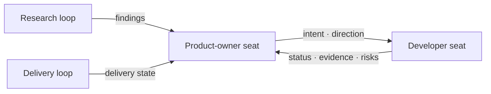
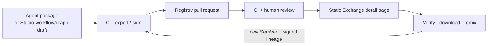
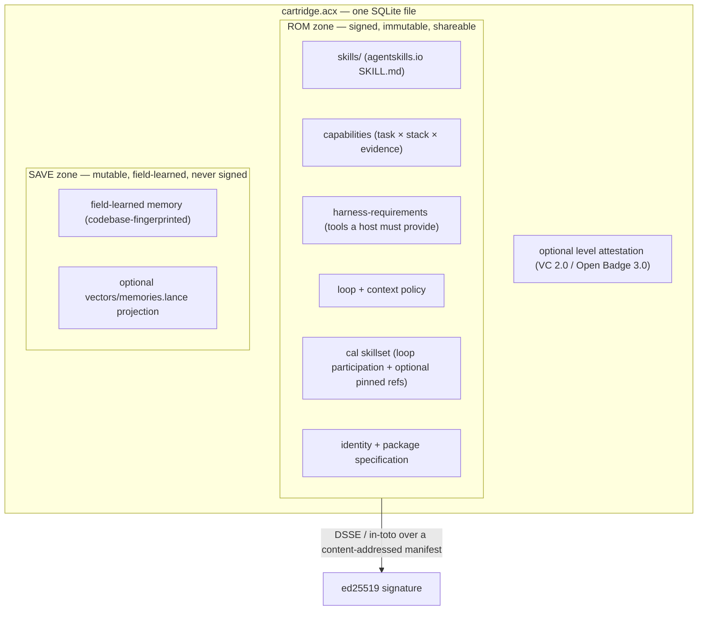

<div align="center">

# ACX · Agent Cartridge eXchange

**Portable agents and agent teams you can verify, remix, and share as files.**

ACX standardizes three complementary artifacts: a packaged **agent**, a reusable **workflow**, and an
**Agent Graph** for the team's information architecture. They travel as signed files, enter the public
registry through reviewed pull requests, and become static share pages — no ACX account or backend required.

[Explore Exchange](https://lboel.github.io/acx/exchange/) · [Remix in Studio](https://lboel.github.io/acx/exchange/studio/) · [Documentation](https://lboel.github.io/acx/) · [Spec](./SPEC.md) · [For AI agents](./AGENTS.md) · [Governance](./GOVERNANCE.md) · [Contributing](./CONTRIBUTING.md) · License: Apache-2.0

<sub>The standard is **ACX** (Agent Cartridge eXchange): a cartridge file is `.acx`, the CLI is `acx`, and the public draft uses the provisional, currently unregistered `application/vnd.acx.*` media names. ACX grew from ideas explored in **AGENTIBUS**, but the products are not automatically integrated today: AGENTIBUS exports its own package directories, and an operator can explicitly review one and pass it to the ACX CLI. AGENTIBUS does not currently export, import, or level `.acx` files itself.</sub>

</div>

---

> **Status: v0.1 public draft.** The normative spec ([`SPEC.md`](./SPEC.md)), schemas, reference
> implementation, signed workflow and Agent Graph examples, and conformance suite are ready for public review. The
> zero-dependency implementation in `src/` runs today on **Node ≥ 22.5.0**. The benchmark's *solver* is
> deterministic and pluggable; a production verifier substitutes a real sandboxed agent run without
> changing the protocol.

## Choose the artifact

| Artifact | The question it answers | What travels |
|---|---|---|
| **Agent Cartridge** `.acx` | **Who can do the work?** | One SQLite file with skills, capability claims, transferable memory, and a host contract; an independently verifiable level credential is optional. |
| **ACX Workflow** `.cal.json` | **What happens next?** | Role slots, tasks, a bounded control-flow graph, structured conditions, context requirements, and safety intent. |
| **Agent Graph** `.agent-graph.json` | **Who owns, informs, directs, and reports?** | Fuzzy team seats, knowledge modules, communication routes, response paths, and bounded convergence across loops. |

The three files solve different problems. Agents can fill workflow role slots by capability, level, and
stack; workflows can also pin a cartridge by ROM digest. An Agent Graph describes the durable information
architecture around one or more loops without copying their task graphs. The reference CLI validates,
signs, verifies, and shares these contracts; the receiving host still owns staffing, tools, permissions,
approvals, data access, and execution.

**See real, signed examples:** [Ada Ridge agent](https://lboel.github.io/acx/exchange/artifacts/agent/ada-ridge-4d6cabaa/) ·
[Ship a Feature workflow](https://lboel.github.io/acx/exchange/artifacts/workflow/ship-a-feature-ae10742c/) ·
[Product Delivery Agent Graph](https://lboel.github.io/acx/exchange/artifacts/agent-graph/product-delivery-6bca0dbd/)

## Getting started from a clean clone

The core CLI uses only Node's built-in SQLite and crypto modules. No `npm install` is required.

```bash
git clone https://github.com/lboel/acx.git
cd acx

# Node 22.5.0 or newer
node --experimental-sqlite src/cli.mjs --version

# Verify one bundled example of each artifact type
node --experimental-sqlite src/cli.mjs verify \
  registry/cartridges/io.github.ridgeworks/ada-ridge/1.0.0/cartridge.acx

node --experimental-sqlite src/cli.mjs workflow verify \
  registry/cals/io.github.lboel/ship-a-feature/1.0.0.cal.json

node --experimental-sqlite src/cli.mjs graph verify \
  registry/graphs/io.github.lboel/product-delivery/1.0.0.agent-graph.json

# Read the workflow and its separate information architecture
node --experimental-sqlite src/cli.mjs workflow inspect \
  registry/cals/io.github.lboel/ship-a-feature/1.0.0.cal.json

node --experimental-sqlite src/cli.mjs graph inspect \
  registry/graphs/io.github.lboel/product-delivery/1.0.0.agent-graph.json
```

All commands above exit successfully. The examples report `trust: portable`: their signatures are valid
and bind the verified artifact content to their included keys, but publisher namespace control becomes
**trusted** only when a trust registry resolves a valid namespace proof. Integrity and publisher
authorship are deliberately separate claims.

Run the full conformance suite whenever you want the deeper check:

```bash
npm test
```

## Make your first agent safely

Export the bundled source package into a temporary directory so the signed artifact and its private key
never land in your checkout:

```bash
mkdir -p /tmp/acx-demo

node --experimental-sqlite src/cli.mjs export \
  examples/sample-agent-package \
  /tmp/acx-demo/scenario-research-designer.acx \
  --publisher io.github.you

node --experimental-sqlite src/cli.mjs verify \
  /tmp/acx-demo/scenario-research-designer.acx

node --experimental-sqlite src/cli.mjs spec \
  /tmp/acx-demo/scenario-research-designer.acx

node --experimental-sqlite src/cli.mjs load \
  /tmp/acx-demo/scenario-research-designer.acx --print-only
```

`export` also creates `/tmp/acx-demo/scenario-research-designer.acx.key.pem`. That is a **private signing
key**: never commit, upload, or share it. `load --print-only` shows the receive card without installing
anything.

## How an Agent Graph routes implicit knowledge



Seats are fuzzy selectors, not pinned people. The graph makes ownership, direction, reporting returns,
and loop convergence reviewable; it does not execute tasks or grant runtime permission.

## How static sharing and remixing works



The Exchange and browser Studio are plain HTML, CSS, JavaScript, JSON, and downloadable artifacts. Studio
imports, remixes, and exports **unsigned workflow and Agent Graph JSON drafts** locally; private keys and
signing stay in the CLI. Every accepted artifact version receives a stable, pre-rendered detail URL bound
to its immutable coordinate and carrying social metadata. The public site has no upload endpoint and
never executes an agent or workflow.

Build the complete Exchange and preview it with any static HTTP server:

```bash
npm run build:exchange -- --site-url https://example.org/acx/
python3 -m http.server 8787 --directory dist/exchange
```

The output in `dist/exchange/` can be deployed to GitHub Pages, Cloudflare Pages, Netlify, S3-compatible
storage, or any ordinary static host. JavaScript modules require HTTP(S); opening `index.html` through
`file:` is not a supported preview mode.

To publish, preview the exact registry and pull-request surface with `acx share ... --dry-run`, then use a
reviewed PR:

```bash
node --experimental-sqlite src/cli.mjs share agent \
  /tmp/acx-demo/scenario-research-designer.acx --dry-run
```

`acx share` itself performs no commit, push, network write, PR creation, or merge. Use the equivalent
`share workflow` or `share graph` command for signed JSON. The bundled
[`$acx-share-agent`](./skills/acx-share-agent/SKILL.md) skill lets a SKILL.md-aware agent run the same
fail-closed verification, index, test, and PR-preparation flow without staging its private key or writing
to GitHub without human authority.

## What the standard enables

- **Learn without leaking local context.** The authoritative JSON memory baseline separates transferable
  ROM knowledge from mutable, environment-specific SAVE memory. A LanceDB projection is optional and
  rebuildable; public registry cartridges must be ROM-only.
- **Prove a level instead of merely claiming one.** A cartridge may carry an independently issued,
  ROM-bound and revocable level credential. The included solver is a deterministic, pluggable reference
  demo; a production verifier supplies the real sandboxed agent run.
- **Form teams without pinning every identity.** Workflows can staff fuzzy role slots by capability,
  independently resolved level, and stack, or pin a specific cartridge by ROM digest. Agent Graph actors
  use fuzzy role, capability, tag, and prose selectors.
- **Build bounded workflows.** Conditional Agentic Loops declare what happens next, under which structured
  conditions, and where execution stops. `acx init --from-code` scaffolds an agent set and TODO workflow;
  it does not pretend to understand or execute the project.

Signed artifacts distribute over git and the static Exchange today. ACX also specifies the OCI manifest,
media types, and Referrers layout; wrapping, pushing, and resolving OCI artifacts remains a host/CI
responsibility rather than a command implemented by this reference CLI.

The container, schemas, and reference implementation are Apache-2.0. Signed credentials can be
identity-bound and revoked; local SAVE memory remains mutable local state. ACX defines no payments,
entitlements, runtime permissions, or licensing enforcement.

## Everything for one agent in one `.acx`

A cartridge is a single **SQLite** database (`application_id` `ACX1`), openable by the stock `sqlite3`
CLI. Like a game cartridge it has a logically immutable **ROM** (the signed, shareable core) and a mutable
**SAVE** (local field learning — never signed). SAVE updates are excluded from the ROM manifest; any
change to ROM content invalidates verification. A `strip-to-ROM` re-export removes SAVE and proves that
the ROM manifest hash remains equal.



**The JSON memory baseline is authoritative and always present.** Optionally, `acx lance` materializes a
genuine **LanceDB** dataset (`acx.lance-memory/1`: 14 fixed columns +
`vector fixed_size_list<float, 128>`) into the SAVE zone and as a standalone `<file>.memories.lance/` that
any LanceDB runtime opens directly. That derived projection is unsigned and rebuildable on import; if it
disagrees with the JSON baseline, the projection is discarded and re-indexed. See the
[package and LanceDB format](docs-site/docs/format/packages.md) for the optional Python materializer.

## What's inside a cartridge

| Layer | What it is | Docs |
|---|---|---|
| **Skills** | `SKILL.md` bundles (agentskills.io format), extractable by stock `sqlite3`. | [Skills](docs-site/docs/format/skills.md) |
| **Capabilities** | Portable, evidence-referencing claims such as “build DAGs with Airflow + Snowflake”; maps to an A2A AgentCard skill. | [Capabilities](docs-site/docs/format/capabilities.md) |
| **Memory** | Transferable ROM records and quarantined field-learned SAVE records, with a fail-closed scrub gate and optional vectors. | [Memory](docs-site/docs/format/memory.md) · [Packages](docs-site/docs/format/packages.md) |
| **Harness requirements** | The machine-readable contract of tools and binaries a receiving host must provide. | [Harness requirements](docs-site/docs/format/harness-requirements.md) |
| **Loop + context policy** | The agent's declarative harness policy as signed data. | [Loop and context](docs-site/docs/format/loop-context.md) |
| **Provable level** | An optional, independently issued W3C VC / Open Badge bound to this ROM digest. | [Provable level](docs-site/docs/leveling/provable-level.md) |
| **CAL skillset** | The cartridge's declaration of loop participation and optional pinned agent references. | [Loops and CAL](docs-site/docs/format/loops-cal.md) |

Workflows and Agent Graphs are related signed ACX artifacts, not tables hidden inside the cartridge. See
[loop engineering](docs-site/docs/format/loops-cal.md) and
[team information architecture](docs-site/docs/format/agent-graph.md).

## Provable leveling

When present, a provable level is **earned, not asserted**: a benchmark with a sealed held-out slice → an
independent verifier re-runs the pinned ROM → TrueSkill σ-gating (`sigma < 1.5`, `games ≥ 30`,
`R = μ − 3σ`) → a signed **W3C VC 2.0 / Open Badges 3.0** credential bound to the ROM digest and subject
to revocation. Verification rejects self-issuance, transplantation onto a different ROM, invalid
signatures, and resolved revocation. Levels map to the 8 career tiers (`intern … legend`).

The reference `acx level` command exercises this protocol with a deterministic demo benchmark and a
fresh verifier key. A production verifier replaces that solver with a real sandboxed run and resolves
issuer trust plus revocation state; the cryptographic credential format and gate stay the same.

## Loop engineering — CAL + RAC

Multiple cartridges compose into a **Conditional Agentic Loop (CAL)** — a BPMN-like process where
participants are referenced **by content hash** (`romDigest`) or staffed **by role slot**:

- **Share metadata** (`id`, SemVer `version`, name, description, SPDX license, authors, tags) makes a loop
  discoverable and forkable.
- **Nodes** are tasks (an agent step with required skills/capabilities/context and a completion condition),
  gateways, and events.
- **Edges** carry closed, structured conditions rather than evaluated code. This removes an executable
  condition surface; the receiving host still controls task tools, side effects, approvals, and data.
- **Safety + termination** are explicit: tasks declare side effects/approval behavior, and every cyclic
  workflow must declare `limits.maxSteps`.
- **RAC (Required Available Context)** declares knowledge that must be present — an LLM wiki, terraform
  describing architecture, an API spec — as a **description only, never the content** (aligned with the
  Open Knowledge Format). This is what makes cartridges *content-agnostic*.
- Each cartridge carries a **CalSkillSet** so agents can reference and hand off to one another.
- The optional `integrity` block signs the RFC-8785/JCS canonical workflow digest with Ed25519 in a
  DSSE/in-toto envelope. Editing a task, condition, team slot, or limit after signing is detected.

Build loops on the command line (`acx workflow`) or in the same local-first Studio shipped by the static
Exchange (`acx builder` serves it locally; export remains a browser download and signing stays in the CLI).
Scaffold an agent set and TODO workflow from a codebase with `acx init --from-code`. `acx cal` remains an
alias for `acx workflow ready`.

`workflow lint` and `workflow verify` test a portable shared document. `workflow ready` is deliberately a
separate local-roster diagnostic: it exits non-zero whenever this machine lacks a cartridge, independently
resolved level, capability, or stack required by a role slot.

## Team information architecture — Agent Graph

**A CAL says what happens next. An Agent Graph says who owns the context, who can direct whom, where
reports return, and where separate loops meet.**

That separation keeps durable team structure out of individual task nodes. Product intent can remain
owned by a fuzzy `product-owner` seat, for example, while whichever developer agents are staffed receive
direction and return status, evidence, and risks through explicit routes. The graph remains reusable when
people, models, cartridges, or workflows change.

- **Actors** are logical seats — agents, humans, groups, services, or mixed teams — selected by fuzzy role,
  capability, tag, and prose hints rather than pinned identities.
- **Knowledge modules** describe intent, requirements, decisions, status, evidence, feedback, risk,
  context, artifacts, or tacit knowledge. They identify stewards and audiences but never embed the
  underlying content.
- **Routes** describe who informs, directs, requests, reports, advises, reviews, approves, escalates,
  coordinates, or observes. Event, interval, and manual triggers are structured; expected return routes
  make reporting explicit.
- **Loop bindings** connect this information architecture to signed CALs, external processes, or informal
  loops without copying or changing their task graphs.
- **Convergence points** state where knowledge from at least two distinct loops is synthesized, by whom,
  under which merge policy, and within bounded wait/round limits.

The prose descriptions, selectors, relationship labels, and route weights are deliberately fuzzy.
Identifiers, references, response routes, direction ownership, convergence reachability, and bounds are
machine-checkable. Reporting and feedback cycles are valid; conflicting or cyclic mandatory direction
for the same knowledge module is rejected.

An Agent Graph is signed with the same JCS + Ed25519 + DSSE/in-toto trust spine as a workflow. Its
signature proves provenance and integrity — **never runtime permission**. The receiving host still owns
staffing, event mapping, tool access, approvals, data access, and dispatch.

If a host operationalizes the graph, route events carry correlation/causation ids, the verified graph
digest, route id, hop count, and knowledge id + revision references — never knowledge content. Hosts
deduplicate event ids, enforce propagation/fan-out bounds, and never converge inputs from different
correlations. The reference CLI validates and shares this contract; it does not execute it.

## Distribution and immutable coordinates

Three transports can carry signed ACX artifacts. The artifact verifier, not the transport, decides
integrity and trust:

- **Git registry** (`registry/`) — fork, add a cartridge under
  `cartridges/<publisher>/<id>/<version>/cartridge.acx`, a
  workflow under `cals/<publisher>/<id>/<version>.cal.json`, or an Agent Graph under
  `graphs/<publisher>/<id>/<version>.agent-graph.json`, then open a PR; CI verifies every signed artifact
  and regenerates the index.
- **OCI** — ACX normatively specifies the `.acx` as one layer in an OCI image manifest
  (`artifactType application/vnd.acx.cartridge.v1`) with attestations attached through the Referrers API.
  A host or CI system performs wrapping, push, pull, and stock `cosign`/`oras` verification; this
  reference CLI does not ship an OCI runtime.
- **Static Exchange** (`platform/static/`) — a dependency-free discover → inspect → verify → download →
  remix → export → PR surface, built entirely as HTML, CSS, JavaScript, JSON, and downloadable artifacts.

[Explore the Exchange](https://lboel.github.io/acx/exchange/), [remix locally in Studio](https://lboel.github.io/acx/exchange/studio/),
or follow the [Share ACX](https://lboel.github.io/acx/share/) PR path. The static browser fully verifies
signed workflow and Agent Graph JSON. Browsers compare indexed `.acx` bytes and hashes, while live
SQLite/ROM verification remains local: run `acx verify` plus `acx spec` before loading a downloaded
cartridge.

Published agents, workflows, and Agent Graphs use the immutable identity
`artifact type + publisherId + id + version + digest`. Cartridges bind id and SemVer in signed ROM
metadata; any changed artifact gets a new SemVer and path. Signed `lineage` preserves fork/remix ancestry,
the status ledger records deprecation or supersession without mutating old bytes, and Agent Graph workflow
dependencies pin publisher, id, version, and digest.

## The `acx` CLI

```bash
node --experimental-sqlite src/cli.mjs <command>  # from this source checkout
npx agent-cartridge@latest <command>               # after the npm release
```

| | | |
|---|---|---|
| `acx ls` | roster overview | `acx workflow lint` | validate a portable workflow |
| `acx inspect` | meta, skills, caps, memory | `acx workflow inspect/digest` | inspect or hash a workflow |
| `acx verify` | cartridge trust taxonomy | `acx workflow sign/verify` | sign or verify a shared workflow |
| `acx spec` | validate package spec + LanceDB schema | `acx lance` | materialize a real LanceDB dataset |
| `acx check` | harness preflight (tools/binaries/skills) | `acx workflow ready` | staff team slots from cartridges |
| `acx load` | verify + install skills into a host | `acx level` | run the reference level-benchmark demo |
| `acx init [--from-code]` | scaffold an agent / team | `acx export` | package + sign a cartridge |
| `acx graph lint/sign/verify` | validate and sign team information architecture | `acx graph inspect/digest` | inspect or hash an Agent Graph |
| `acx share agent/workflow/graph` | prepare a verified registry change and PR body | `acx builder` | local-first workflow/graph authoring |

Agents drive it from [`AGENTS.md`](./AGENTS.md), the
[agent reference](docs-site/docs/reference/for-agents.md), and
[`llms.txt`](docs-site/docs/llms.txt).

## More examples and proofs

- [`examples/sample-agent-package/`](examples/sample-agent-package/) is the source package used by the
  safe `/tmp` export above.
- [`research-council@1.0.0`](registry/cals/io.github.lboel/research-council/1.0.0.cal.json) demonstrates a
  task-general parallel research, challenge, and synthesis loop.
- [`product-delivery@1.0.0`](registry/graphs/io.github.lboel/product-delivery/1.0.0.agent-graph.json)
  demonstrates fuzzy seats, explicit reporting returns, pinned workflow bindings, and bounded convergence.
- The [Share ACX guide](docs-site/docs/share.md) covers signing, immutable registry paths, PR review, and
  agent-prepared sharing.
- The [proof ledger](docs-site/docs/proofs.md) maps implementation claims to runnable tests and transcripts.

## Repository layout

```
SPEC.md            the normative specification
src/               zero-dependency reference implementation (node:sqlite + node:crypto)
schemas/           JSON Schemas for every block
examples/          a bundled sample agent-package
tools/             the git-registry indexer + the optional LanceDB materializer
platform/          the static Exchange, browser Studio, and noncanonical local reference code
registry/          immutable artifacts + templates + lifecycle ledger + deterministic discovery index
docs-site/         the documentation site (Zensical)
AGENTS.md          how AI agents install and drive the tool
```

## Documentation

Build the docs site locally:

```bash
cd docs-site && uv venv && uv pip install zensical && .venv/bin/zensical serve
```

Build the deployable docs plus Exchange:

```bash
cd docs-site && .venv/bin/zensical build && cd ..
npm run build:docs-social
node --experimental-sqlite tools/build-registry-index.mjs
node --experimental-sqlite tools/build-static-exchange.mjs --out docs-site/site/exchange
npm run check:site
```

The combined output hosts statically (GitHub Pages workflow included). Start with **Explore Exchange**,
then the **cartridge model**, **loop engineering (CAL)**, and **team information architecture (Agent
Graph)**.

## Contributing & license

Contributions welcome — the format is meant to be an open, vendor-neutral standard. Normative changes use
the public process in [`GOVERNANCE.md`](./GOVERNANCE.md); release history is in
[`CHANGELOG.md`](./CHANGELOG.md). Keep the core
dependency-free, keep the spec, schemas, and code consistent, and everything English and legally neutral.

Apache-2.0. See [`LICENSE`](./LICENSE).

---

## Release gate

The repository contains no owner/contact placeholders. Before tagging or publishing, run:

```bash
npm test
npm run smoke
node --experimental-sqlite scripts/prove-level.mjs
npm run build:exchange
npm run smoke:package                              # pack → install → execute the real tarball
cd docs-site && .venv/bin/zensical build && cd ..
npm run build:docs-social
npm run check:site
```

The repository-root ACX workflows run the suite/proofs, verify every published cartridge, workflow, and
Agent Graph, rebuild the registry index, build the static Exchange, install and execute the packed npm
CLI, and build the documentation. Confirm npm name ownership immediately before release; publishing and
production docs deployment require the maintainer's registry/hosting credentials.
