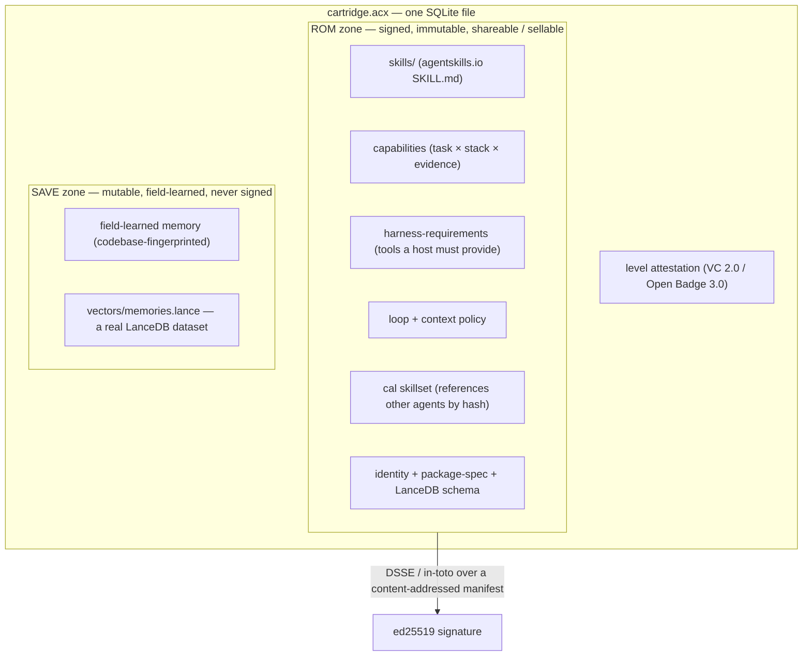

<div align="center">

# ACX · Agent Cartridge eXchange

**The open standard for portable, self-improving AI agents — cartridges that _learn_, _level up_,
_form teams_, and _run workflows_, packed into one `.acx` file and exchangeable like a cartridge.**

`single-file SQLite + LanceDB` · `ed25519 / DSSE signed` · `provable level` ·
`OCI-distributable` · `zero-dependency reference impl`

[Documentation](./docs-site) · [Spec](./SPEC.md) · [For AI agents](./AGENTS.md) · [Contributing](./CONTRIBUTING.md) · License: Apache-2.0

<sub>The standard is **ACX** (Agent Cartridge eXchange): a cartridge file is `.acx`, the CLI is `acx`, media types are `application/vnd.acx.*`. It pairs with **AGENTIBUS**, the studio that produces and levels up ACX cartridges.</sub>

</div>

---

An **Agent Cartridge** is a single file (`.acx`) that packages an AI agent — its skills, capability claims,
memory, runtime contract, loop/context policy, and a **cryptographically provable competence level** — into
one portable, signable, distributable artifact. Software engineering is the flagship use case, but the
format is task-general: any agent that has skills, accumulates knowledge, and runs a loop fits. An agent
that leveled up in one environment moves to another **unchanged**, keeps learning in the field, and can be
shared, sold, collected, and traded.

### Four ideas

- **🧠 Learn.** A cartridge *carries its knowledge*: transferable expertise (ROM) it takes everywhere, plus
  field-learned, environment-specific memory (SAVE) it accumulates on the job — packed as a real LanceDB
  dataset. Codebase/content-specific learning is quarantined and strippable, so the shareable core stays
  clean; what a loop needs from the outside world is declared as a *description*, never the content.
- **📈 Self-improve & level up.** Competence is *earned on real work*: a provable level is minted only after
  an **independent** re-run on a held-out benchmark, TrueSkill-gated and bound to the signed core. An agent
  gets measurably better — and can prove it, not just claim it.
- **👥 Form teams.** Cartridges reference each other by content hash and are staffed onto a project by role,
  level, and capability — a portable **roster** of agents you assemble like a team.
- **🔧 Build workflows.** Compose agents into **Conditional Agentic Loops** — who may do what, when, and
  under which conditions — through `acx workflow` (with `acx cal` as a compatibility alias) or in a visual drag-and-drop builder
  (`acx builder`). Generate a whole team from an existing project with `acx init --from-code`.

One signed file distributes over git, an OCI registry, or a live exchange — verifiable with stock tooling,
rejected if tampered.

The container and schemas are 100% open; the *value* — the signed level attestation, the verified
capability evidence, the field-learned memory — is the identity-bound, revocable asset carried inside that
open envelope. **Open envelope, priced contents.**

> **Status: v0.1 public draft.** The normative spec ([`SPEC.md`](./SPEC.md)), schemas, reference
> implementation, signed workflow examples, and conformance suite are ready for public review. The
> zero-dependency implementation in `src/` runs today on **Node ≥ 22**. The benchmark's *solver* is
> deterministic and pluggable; a production verifier substitutes a real sandboxed agent run without
> changing the protocol.

## Share an agent-team workflow in 60 seconds

An ACX Workflow is one readable `.cal.json` file: the team slots, graph, conditions, context requirements,
safety declarations, bounds, and signature travel together.

```bash
# from this source checkout; no dependency install is required
git clone https://github.com/lboel/acx.git
cd acx

# validate it as a portable, publishable workflow (no local agents required)
node --experimental-sqlite src/cli.mjs workflow lint my-loop.cal.json --publish

# sign the canonical workflow; the private key stays beside it and is never shared
node --experimental-sqlite src/cli.mjs workflow sign my-loop.cal.json \
  --publisher io.github.you --out my-loop.signed.cal.json

# recipient: verify authorship/integrity, inspect the team, then staff it
node --experimental-sqlite src/cli.mjs workflow verify my-loop.signed.cal.json
node --experimental-sqlite src/cli.mjs workflow inspect my-loop.signed.cal.json
node --experimental-sqlite src/cli.mjs workflow ready my-loop.signed.cal.json --cartridges ./roster
```

Try the bundled, signed examples: `registry/cals/ship-a-feature.cal.json` (engineering review loop) and
`registry/cals/research-council.cal.json` (parallel research, challenge, synthesis).

To submit a signed agent or workflow to the open registry, preview the exact PR surface first:

```bash
node --experimental-sqlite src/cli.mjs share agent my-agent.acx --slug my-agent --dry-run
node --experimental-sqlite src/cli.mjs share workflow my-loop.signed.cal.json --dry-run
```

The bundled [`$acx-share-agent`](./skills/acx-share-agent/SKILL.md) skill lets a SKILL.md-aware agent run
the same fail-closed verification, index, test, and PR-preparation flow without ever staging its private
key or writing to GitHub without human authority.

## Everything in one file

A cartridge is a single **SQLite** database (`application_id` `ACX1`), openable by the stock `sqlite3`
CLI. Like a game cartridge it has an immutable **ROM** (the signed, shareable/sellable core) and a mutable
**SAVE** (local field learning — never signed). Field learning can never mutate the ROM, and a
`strip-to-ROM` re-export **proves it by hash equality**.



**Memory is packed as a real LanceDB dataset.** The always-present JSON baseline is authoritative; on top of
it, `acx lance` materializes a genuine **LanceDB** dataset (`acx.lance-memory/1`: 14 fixed columns +
`vector fixed_size_list<float, 128>`) into the SAVE zone and as a standalone `<file>.memories.lance/` that
any LanceDB runtime opens directly. Vectors use a byte-reproducible `local-hash-128` embedding and are
re-indexed on import, so the file is portable across engines.

## What's inside a cartridge

| Layer | What it is | Docs |
|---|---|---|
| **Skills** | `SKILL.md` bundles (agentskills.io format), extractable by stock `sqlite3`. | `docs-site/docs/format/skills.md` |
| **Capabilities** | The sellable claim: *"great at building DAGs with Airflow + Snowflake"*, evidence-backed; maps to an A2A AgentCard skill. | `docs-site/docs/format/capabilities.md` |
| **Memory** | Two tiers — transferable (ROM) vs field-learned (SAVE) — with a fail-closed scrub gate; vectors as a real **LanceDB** dataset. | `docs-site/docs/format/memory.md`, `docs-site/docs/format/packages.md` |
| **Harness requirements** | The machine-readable contract of MCP tools / binaries a host must provide to boot the cartridge. | `docs-site/docs/format/harness-requirements.md` |
| **Loop + context policy** | The agent's harness as signed data (informed by Lilian Weng's harness engineering). | `docs-site/docs/format/loop-context.md` |
| **Provable level** | A W3C Verifiable Credential earned via independent held-out re-run. Unfakeable. | `docs-site/docs/leveling/provable-level.md` |
| **CAL skillset** | A cartridge's declaration of which loops it plays and which agents it references by hash. | `docs-site/docs/format/loops-cal.md` |

## Provable leveling

A level is **earned, not asserted**: a benchmark with a sealed held-out slice → an independent verifier
re-runs the pinned ROM → TrueSkill σ-gating (`sigma < 1.5`, `games ≥ 30`, `R = μ − 3σ`) → a signed **W3C
VC 2.0 / Open Badges 3.0** credential bound to the ROM digest, revocable. Forgery routes — self-issuance,
transplanting the level onto a mutated cartridge, a revoked credential — are all rejected. Levels map to the
8 career tiers (`intern … legend`).

## Loop engineering — CAL + RAC

Multiple cartridges compose into a **Conditional Agentic Loop (CAL)** — a BPMN-like process where
participants are referenced **by content hash** (`romDigest`) or staffed **by role slot**:

- **Share metadata** (`id`, SemVer `version`, name, description, SPDX license, authors, tags) makes a loop
  discoverable and forkable.
- **Nodes** are tasks (an agent step with required skills/capabilities/context and a completion condition),
  gateways, and events.
- **Edges** carry structured conditions (no evaluated code), so a shared loop is safe.
- **Safety + termination** are explicit: tasks declare side effects/approval behavior, and every cyclic
  workflow must declare `limits.maxSteps`.
- **RAC (Required Available Context)** declares knowledge that must be present — an LLM wiki, terraform
  describing architecture, an API spec — as a **description only, never the content** (aligned with the
  Open Knowledge Format). This is what makes cartridges *content-agnostic*.
- Each cartridge carries a **CalSkillSet** so agents can reference and hand off to one another.
- The optional `integrity` block signs the RFC-8785/JCS canonical workflow digest with Ed25519 in a
  DSSE/in-toto envelope. Editing a task, condition, team slot, or limit after signing is detected.

Build loops on the command line (`acx workflow`) or visually (`acx builder` opens a drag-and-drop editor
whose drafts stay outside the signed registry until you explicitly sign them).
Generate a whole agent set from your codebase with `acx init --from-code`. `acx cal` remains an alias for
`acx workflow ready`.

## Sharing & distribution

Three transports distribute signed ACX artifacts — each verifies integrity and refuses tampering:

- **Git registry** (`registry/`) — fork, add a cartridge under `cartridges/<publisher>/<name>/` or a
  workflow under `cals/`, then open a PR; CI verifies every signed artifact and regenerates the index.
- **OCI** — the `.acx` ships as one layer in an OCI image manifest (`artifactType application/vnd.acx.cartridge.v1`),
  attestations attached via the Referrers API, verifiable with stock `cosign`/`oras`.
- **HTTP exchange** (`platform/`) — a live browse / verify / trade gallery.

The static [Share ACX](https://acx.dev/share/) page turns these paths into a 60-second, human-readable
flow with copyable commands and the agent-native PR route.

## The `acx` CLI

```bash
node --experimental-sqlite src/cli.mjs <command>  # from this source checkout
npx agent-cartridge@latest <command>               # after the npm release
```

| | | |
|---|---|---|
| `acx ls` | roster overview | `acx workflow lint` | validate a portable workflow |
| `acx inspect` | meta, skills, caps, memory | `acx builder` | visual CAL/RAC editor |
| `acx verify` | cartridge trust taxonomy | `acx workflow sign/verify` | sign or verify a shared workflow |
| `acx spec` | validate package spec + LanceDB schema | `acx lance` | materialize a real LanceDB dataset |
| `acx check` | harness preflight (tools/binaries/skills) | `acx workflow ready` | staff team slots from cartridges |
| `acx load` | verify + install skills into a host | `acx level` | earn a provable level |
| `acx init [--from-code]` | scaffold an agent / team | `acx export` | package + sign a cartridge |
| `acx share agent/workflow` | prepare a verified registry PR | `acx builder` | visual workflow authoring |

Agents drive it from [`AGENTS.md`](./AGENTS.md) (and `docs/reference/for-agents.md` / `docs/llms.txt`).

## Quickstart

```bash
git clone https://github.com/lboel/acx.git
cd acx                                           # Node ≥ 22, zero dependencies

npm test                                          # 88 conformance, workflow, and sharing tests
node --experimental-sqlite scripts/smoke.mjs      # export → verify → strip → tamper
node --experimental-sqlite scripts/prove-level.mjs   # earn + verify a provable level

# make a cartridge from the bundled sample, then inspect / check / load it
node --experimental-sqlite src/cli.mjs export examples/sample-agent-package my.acx --publisher io.github.you
node --experimental-sqlite src/cli.mjs inspect my.acx

# optional: pack memory into a real LanceDB file
uv venv tools/lance/.venv --python 3.12 && uv pip install --python tools/lance/.venv pylance pyarrow numpy
node --experimental-sqlite src/cli.mjs lance my.acx
```

Every claim on the docs site is backed by a runnable proof — see `docs/proofs.md`.

## Repository layout

```
SPEC.md            the normative specification
src/               zero-dependency reference implementation (node:sqlite + node:crypto)
schemas/           JSON Schemas for every block
examples/          a bundled sample agent-package
tools/             the git-registry indexer + the optional LanceDB materializer
platform/          the HTTP exchange + the visual loop builder
registry/          the git registry (cartridges + signed workflows + templates + trust registry)
docs-site/         the documentation site (Zensical)
AGENTS.md          how AI agents install and drive the tool
```

## Documentation

Build the docs site locally:

```bash
cd docs-site && uv venv && uv pip install zensical && .venv/bin/zensical serve
```

It hosts statically (GitHub Pages workflow included). Start with **Overview**, then the **cartridge model**,
**how agents level up**, and **loop engineering (CAL)**.

## Contributing & license

Contributions welcome — the format is meant to be an open, vendor-neutral standard. Keep the core
dependency-free, keep the spec, schemas, and code consistent, and everything English and legally neutral.

Apache-2.0. See [`LICENSE`](./LICENSE).

---

## Release gate

The repository contains no owner/contact placeholders. Before tagging or publishing, run:

```bash
npm test
npm run smoke
node --experimental-sqlite scripts/prove-level.mjs
node --experimental-sqlite tools/build-registry-index.mjs
npm pack --dry-run
cd docs-site && .venv/bin/zensical build
```

The repository-root ACX workflow runs the suite/proofs, verifies every published cartridge and workflow,
rebuilds the registry index, checks the npm package, and builds the documentation. Confirm npm name
ownership immediately before release; publishing and production docs deployment require the maintainer's
registry/hosting credentials.
