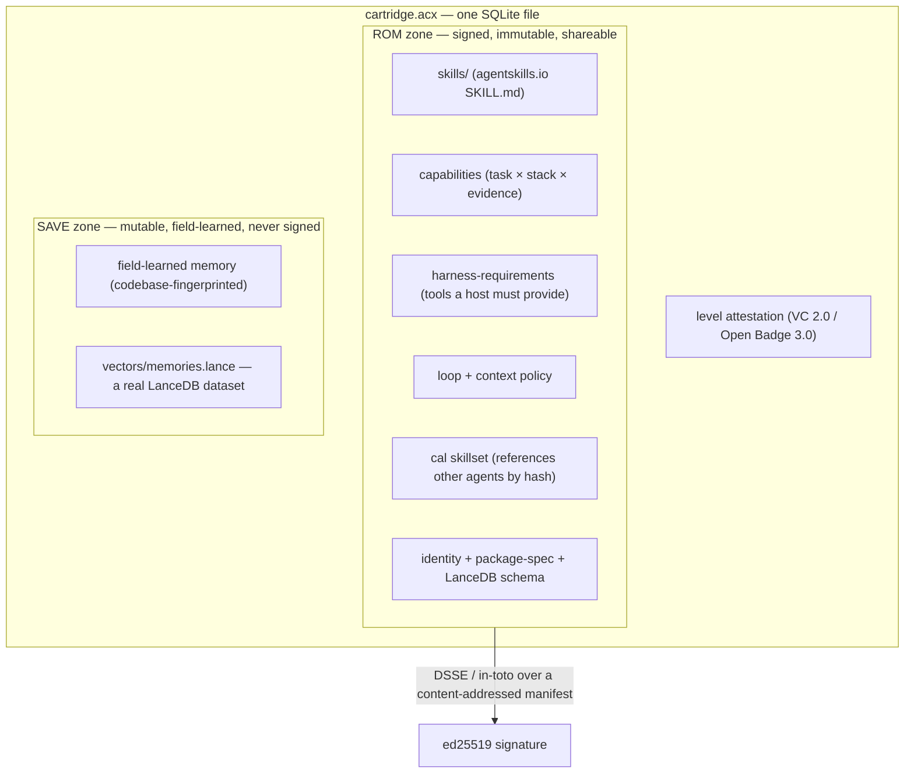

<div align="center">

# ACX · Agent Cartridge eXchange

**The open standard for portable, self-improving AI agents — cartridges that _learn_, _level up_,
_form teams_, and _run workflows_, packed into one `.acx` file and exchangeable like a cartridge.**

`single-file SQLite + LanceDB` · `ed25519 / DSSE signed` · `provable level` ·
`OCI-distributable` · `zero-dependency reference impl`

[Explore Exchange](https://lboel.github.io/acx/exchange/) · [Remix in Studio](https://lboel.github.io/acx/exchange/studio/) · [Documentation](https://lboel.github.io/acx/) · [Spec](./SPEC.md) · [For AI agents](./AGENTS.md) · [Governance](./GOVERNANCE.md) · [Contributing](./CONTRIBUTING.md) · License: Apache-2.0

<sub>The standard is **ACX** (Agent Cartridge eXchange): a cartridge file is `.acx`, the CLI is `acx`, and the public draft uses the provisional, currently unregistered `application/vnd.acx.*` media names. It pairs with **AGENTIBUS**, the studio that produces and levels up ACX cartridges.</sub>

</div>

---

An **Agent Cartridge** is a single file (`.acx`) that packages an AI agent — its skills, capability claims,
memory, runtime contract, loop/context policy, and a **cryptographically provable competence level** — into
one portable, signable, distributable artifact. Software engineering is the flagship use case, but the
format is task-general: any agent that has skills, accumulates knowledge, and runs a loop fits. An agent
that leveled up in one environment moves to another **unchanged**, keeps learning in the field, and can be
shared, verified, collected, and remixed.

### Four ideas

- **🧠 Learn.** A cartridge *carries its knowledge*: transferable expertise (ROM) it takes everywhere, plus
  field-learned, environment-specific memory (SAVE) it accumulates on the job — packed as a real LanceDB
  dataset. Codebase/content-specific learning is quarantined and strippable, so the shareable core stays
  clean; what a loop needs from the outside world is declared as a *description*, never the content.
- **📈 Self-improve & level up.** Competence is *earned on real work*: a provable level is minted only after
  an **independent** re-run on a held-out benchmark, TrueSkill-gated and bound to the signed core. An agent
  gets measurably better — and can prove it, not just claim it.
- **👥 Form teams.** Cartridges reference each other by content hash and are staffed onto a project by role,
  level, and capability. A shareable **Agent Graph** adds the team's information architecture: who owns
  context, who can direct whom, where reports return, and where separate loops meet.
- **🔧 Build workflows.** Compose agents into **Conditional Agentic Loops** — what happens next, under
  which structured conditions, and where execution stops — through `acx workflow` (with `acx cal` as a
  compatibility alias) or in the local-first static Studio (`acx builder`). Generate a whole team from an
  existing project with `acx init --from-code`.

Signed artifacts distribute over git, an OCI registry, or the static Exchange — verifiable from the
downloaded bytes and rejected if tampered.

The container, schemas, and reference implementation are open under Apache-2.0; signed level attestations, verified capability evidence, and
field-learned memory are identity-bound, revocable assets carried inside that open envelope. ACX itself
defines no payments, entitlements, or licensing enforcement.

> **Status: v0.1 public draft.** The normative spec ([`SPEC.md`](./SPEC.md)), schemas, reference
> implementation, signed workflow and Agent Graph examples, and conformance suite are ready for public review. The
> zero-dependency implementation in `src/` runs today on **Node ≥ 22.5.0**. The benchmark's *solver* is
> deterministic and pluggable; a production verifier substitutes a real sandboxed agent run without
> changing the protocol.

## Share an agent-team workflow in 60 seconds

An ACX Workflow is one readable `.cal.json` file: the team slots, graph, conditions, context requirements,
safety declarations, bounds, and signature travel together.

```bash
# from this source checkout; no dependency install is required
git clone https://github.com/lboel/acx.git
cd acx

# validate it as a portable, publishable workflow (no local agents required)
node --experimental-sqlite src/cli.mjs workflow lint my-loop.cal.json --publish

# sign the canonical workflow; the private key stays beside it and is never shared
node --experimental-sqlite src/cli.mjs workflow sign my-loop.cal.json \
  --publisher io.github.you --out my-loop.signed.cal.json

# recipient: verify integrity + the signed publisher claim, inspect the team, then staff it
# (publisher authorship becomes trusted only with a valid namespace proof)
node --experimental-sqlite src/cli.mjs workflow verify my-loop.signed.cal.json
node --experimental-sqlite src/cli.mjs workflow inspect my-loop.signed.cal.json
node --experimental-sqlite src/cli.mjs workflow ready my-loop.signed.cal.json --cartridges ./roster
```

Try the bundled, signed examples:
`registry/cals/io.github.lboel/ship-a-feature/1.0.0.cal.json` (engineering review loop) and
`registry/cals/io.github.lboel/research-council/1.0.0.cal.json` (parallel research, challenge, synthesis).

The same team can publish a separate Agent Graph without baking reporting and implicit knowledge flow into
tasks. Validate, sign, and inspect it with `acx graph`:

```bash
node --experimental-sqlite src/cli.mjs graph lint product-delivery.agent-graph.json --publish
node --experimental-sqlite src/cli.mjs graph sign product-delivery.agent-graph.json \
  --publisher io.github.you --out product-delivery.signed.agent-graph.json
node --experimental-sqlite src/cli.mjs graph verify product-delivery.signed.agent-graph.json
node --experimental-sqlite src/cli.mjs graph inspect product-delivery.signed.agent-graph.json
node --experimental-sqlite src/cli.mjs graph digest product-delivery.signed.agent-graph.json
```

Try the bundled signed graph at
`registry/graphs/io.github.lboel/product-delivery/1.0.0.agent-graph.json`: a product-owner seat
directs delivery, developers report status and evidence back, research and delivery loops export distinct
knowledge, and the product owner stewards their bounded convergence.

To submit a signed agent, workflow, or Agent Graph to the open registry, preview the exact PR surface first:

```bash
node --experimental-sqlite src/cli.mjs share agent my-agent.acx --slug my-agent --dry-run
node --experimental-sqlite src/cli.mjs share workflow my-loop.signed.cal.json --dry-run
node --experimental-sqlite src/cli.mjs share graph product-delivery.signed.agent-graph.json --dry-run
```

The bundled [`$acx-share-agent`](./skills/acx-share-agent/SKILL.md) skill lets a SKILL.md-aware agent run
the same fail-closed verification, index, test, and PR-preparation flow without ever staging its private
key or writing to GitHub without human authority.

## Everything in one file

A cartridge is a single **SQLite** database (`application_id` `ACX1`), openable by the stock `sqlite3`
CLI. Like a game cartridge it has an immutable **ROM** (the signed, shareable core) and a mutable
**SAVE** (local field learning — never signed). Field learning can never mutate the ROM, and a
`strip-to-ROM` re-export **proves it by hash equality**.



**Memory is packed as a real LanceDB dataset.** The always-present JSON baseline is authoritative; on top of
it, `acx lance` materializes a genuine **LanceDB** dataset (`acx.lance-memory/1`: 14 fixed columns +
`vector fixed_size_list<float, 128>`) into the SAVE zone and as a standalone `<file>.memories.lance/` that
any LanceDB runtime opens directly. Vectors use a byte-reproducible `local-hash-128` embedding and are
re-indexed on import, so the file is portable across engines.

## What's inside a cartridge

| Layer | What it is | Docs |
|---|---|---|
| **Skills** | `SKILL.md` bundles (agentskills.io format), extractable by stock `sqlite3`. | `docs-site/docs/format/skills.md` |
| **Capabilities** | The portable claim: *"great at building DAGs with Airflow + Snowflake"*, evidence-backed; maps to an A2A AgentCard skill. | `docs-site/docs/format/capabilities.md` |
| **Memory** | Two tiers — transferable (ROM) vs field-learned (SAVE) — with a fail-closed scrub gate; vectors as a real **LanceDB** dataset. | `docs-site/docs/format/memory.md`, `docs-site/docs/format/packages.md` |
| **Harness requirements** | The machine-readable contract of MCP tools / binaries a host must provide to boot the cartridge. | `docs-site/docs/format/harness-requirements.md` |
| **Loop + context policy** | The agent's harness as signed data (informed by Lilian Weng's harness engineering). | `docs-site/docs/format/loop-context.md` |
| **Provable level** | A W3C Verifiable Credential earned via independent held-out re-run. Unfakeable. | `docs-site/docs/leveling/provable-level.md` |
| **CAL skillset** | A cartridge's declaration of which loops it plays and which agents it references by hash. | `docs-site/docs/format/loops-cal.md` |
| **Agent Graph** | The team's signed communication, knowledge-stewardship, reporting, and loop-convergence architecture. | `docs-site/docs/format/agent-graph.md` |

## Provable leveling

A level is **earned, not asserted**: a benchmark with a sealed held-out slice → an independent verifier
re-runs the pinned ROM → TrueSkill σ-gating (`sigma < 1.5`, `games ≥ 30`, `R = μ − 3σ`) → a signed **W3C
VC 2.0 / Open Badges 3.0** credential bound to the ROM digest, revocable. Forgery routes — self-issuance,
transplanting the level onto a mutated cartridge, a revoked credential — are all rejected. Levels map to the
8 career tiers (`intern … legend`).

## Loop engineering — CAL + RAC

Multiple cartridges compose into a **Conditional Agentic Loop (CAL)** — a BPMN-like process where
participants are referenced **by content hash** (`romDigest`) or staffed **by role slot**:

- **Share metadata** (`id`, SemVer `version`, name, description, SPDX license, authors, tags) makes a loop
  discoverable and forkable.
- **Nodes** are tasks (an agent step with required skills/capabilities/context and a completion condition),
  gateways, and events.
- **Edges** carry structured conditions (no evaluated code), so a shared loop is safe.
- **Safety + termination** are explicit: tasks declare side effects/approval behavior, and every cyclic
  workflow must declare `limits.maxSteps`.
- **RAC (Required Available Context)** declares knowledge that must be present — an LLM wiki, terraform
  describing architecture, an API spec — as a **description only, never the content** (aligned with the
  Open Knowledge Format). This is what makes cartridges *content-agnostic*.
- Each cartridge carries a **CalSkillSet** so agents can reference and hand off to one another.
- The optional `integrity` block signs the RFC-8785/JCS canonical workflow digest with Ed25519 in a
  DSSE/in-toto envelope. Editing a task, condition, team slot, or limit after signing is detected.

Build loops on the command line (`acx workflow`) or in the same local-first Studio shipped by the static
Exchange (`acx builder` serves it locally; export remains a browser download and signing stays in the CLI).
Generate a whole agent set from your codebase with `acx init --from-code`. `acx cal` remains an alias for
`acx workflow ready`.

## Team information architecture — Agent Graph

**A CAL says what happens next. An Agent Graph says who owns the context, who can direct whom, where
reports return, and where separate loops meet.**

That separation keeps durable team structure out of individual task nodes. Product intent can remain
owned by a fuzzy `product-owner` seat, for example, while whichever developer agents are staffed receive
direction and return status, evidence, and risks through explicit routes. The graph remains reusable when
people, models, cartridges, or workflows change.

- **Actors** are logical seats — agents, humans, groups, services, or mixed teams — selected by fuzzy role,
  capability, tag, and prose hints rather than pinned identities.
- **Knowledge modules** describe intent, requirements, decisions, status, evidence, feedback, risk,
  context, artifacts, or tacit knowledge. They identify stewards and audiences but never embed the
  underlying content.
- **Routes** describe who informs, directs, requests, reports, advises, reviews, approves, escalates,
  coordinates, or observes. Event, interval, and manual triggers are structured; expected return routes
  make reporting explicit.
- **Loop bindings** connect this information architecture to signed CALs, external processes, or informal
  loops without copying or changing their task graphs.
- **Convergence points** state where knowledge from at least two distinct loops is synthesized, by whom,
  under which merge policy, and within bounded wait/round limits.

The prose descriptions, selectors, relationship labels, and route weights are deliberately fuzzy.
Identifiers, references, response routes, direction ownership, convergence reachability, and bounds are
machine-checkable. Reporting and feedback cycles are valid; conflicting or cyclic mandatory direction
for the same knowledge module is rejected.

An Agent Graph is signed with the same JCS + Ed25519 + DSSE/in-toto trust spine as a workflow. Its
signature proves provenance and integrity — **never runtime permission**. The receiving host still owns
staffing, event mapping, tool access, approvals, data access, and dispatch.

If a host operationalizes the graph, route events carry correlation/causation ids, the verified graph
digest, route id, hop count, and knowledge id + revision references — never knowledge content. Hosts
deduplicate event ids, enforce propagation/fan-out bounds, and never converge inputs from different
correlations. The reference CLI validates and shares this contract; it does not execute it.

## Sharing & distribution

Three transports distribute signed ACX artifacts. The artifact verifier, not the transport, decides
integrity:

- **Git registry** (`registry/`) — fork, add a cartridge under
  `cartridges/<publisher>/<id>/<version>/cartridge.acx`, a
  workflow under `cals/<publisher>/<id>/<version>.cal.json`, or an Agent Graph under
  `graphs/<publisher>/<id>/<version>.agent-graph.json`, then open a PR; CI verifies every signed artifact
  and regenerates the index.
- **OCI** — the `.acx` ships as one layer in an OCI image manifest (`artifactType application/vnd.acx.cartridge.v1`),
  attestations attached via the Referrers API, verifiable with stock `cosign`/`oras`.
- **Static Exchange** (`platform/static/`) — a dependency-free discover → inspect → verify → download →
  remix → export → PR surface, built entirely as HTML, CSS, JavaScript, JSON, and downloadable artifacts.

[Explore the Exchange](https://lboel.github.io/acx/exchange/), [remix locally in Studio](https://lboel.github.io/acx/exchange/studio/),
or follow the [Share ACX](https://lboel.github.io/acx/share/) PR path. The static browser verifies signed workflow and
Agent Graph JSON; download a cartridge and run `acx verify` plus `acx spec` locally before loading it.

Published agents, workflows, and Agent Graphs use the immutable identity
`artifact type + publisherId + id + version + digest`. Cartridges bind id and SemVer in signed ROM
metadata; any changed artifact gets a new SemVer and path. Signed `lineage` preserves fork/remix ancestry,
the status ledger records deprecation or supersession without mutating old bytes, and Agent Graph workflow
dependencies pin publisher, id, version, and digest.

## The `acx` CLI

```bash
node --experimental-sqlite src/cli.mjs <command>  # from this source checkout
npx agent-cartridge@latest <command>               # after the npm release
```

| | | |
|---|---|---|
| `acx ls` | roster overview | `acx workflow lint` | validate a portable workflow |
| `acx inspect` | meta, skills, caps, memory | `acx builder` | serve the local static Studio |
| `acx verify` | cartridge trust taxonomy | `acx workflow sign/verify` | sign or verify a shared workflow |
| `acx spec` | validate package spec + LanceDB schema | `acx lance` | materialize a real LanceDB dataset |
| `acx check` | harness preflight (tools/binaries/skills) | `acx workflow ready` | staff team slots from cartridges |
| `acx load` | verify + install skills into a host | `acx level` | earn a provable level |
| `acx init [--from-code]` | scaffold an agent / team | `acx export` | package + sign a cartridge |
| `acx graph lint/sign/verify` | validate and sign team information architecture | `acx graph inspect/digest` | inspect or hash an Agent Graph |
| `acx share agent/workflow/graph` | prepare a verified registry PR | `acx builder` | local-first workflow/graph authoring |

Agents drive it from [`AGENTS.md`](./AGENTS.md), the
[agent reference](docs-site/docs/reference/for-agents.md), and
[`llms.txt`](docs-site/docs/llms.txt).

## Quickstart

```bash
git clone https://github.com/lboel/acx.git
cd acx                                           # Node ≥ 22.5.0, zero dependencies

npm test                                          # conformance, graph, workflow, registry, and sharing tests
node --experimental-sqlite scripts/smoke.mjs      # export → verify → strip → tamper
node --experimental-sqlite scripts/prove-level.mjs   # earn + verify a provable level
node --experimental-sqlite tools/build-registry-index.mjs
node --experimental-sqlite tools/build-static-exchange.mjs  # -> dist/exchange/

# make a cartridge from the bundled sample, then inspect / check / load it
node --experimental-sqlite src/cli.mjs export examples/sample-agent-package my.acx --publisher io.github.you
node --experimental-sqlite src/cli.mjs inspect my.acx

# optional: pack memory into a real LanceDB file
uv venv tools/lance/.venv --python 3.12 && uv pip install --python tools/lance/.venv pylance pyarrow numpy
node --experimental-sqlite src/cli.mjs lance my.acx
```

Every claim on the docs site is backed by a runnable proof — see
[the proof ledger](docs-site/docs/proofs.md).

## Repository layout

```
SPEC.md            the normative specification
src/               zero-dependency reference implementation (node:sqlite + node:crypto)
schemas/           JSON Schemas for every block
examples/          a bundled sample agent-package
tools/             the git-registry indexer + the optional LanceDB materializer
platform/          the static Exchange, browser Studio, and noncanonical local reference code
registry/          immutable artifacts + templates + lifecycle ledger + deterministic discovery index
docs-site/         the documentation site (Zensical)
AGENTS.md          how AI agents install and drive the tool
```

## Documentation

Build the docs site locally:

```bash
cd docs-site && uv venv && uv pip install zensical && .venv/bin/zensical serve
```

Build the deployable docs plus Exchange:

```bash
cd docs-site && .venv/bin/zensical build && cd ..
npm run build:docs-social
node --experimental-sqlite tools/build-registry-index.mjs
node --experimental-sqlite tools/build-static-exchange.mjs --out docs-site/site/exchange
npm run check:site
```

The combined output hosts statically (GitHub Pages workflow included). Start with **Explore Exchange**,
then the **cartridge model**, **loop engineering (CAL)**, and **team information architecture (Agent
Graph)**.

## Contributing & license

Contributions welcome — the format is meant to be an open, vendor-neutral standard. Normative changes use
the public process in [`GOVERNANCE.md`](./GOVERNANCE.md); release history is in
[`CHANGELOG.md`](./CHANGELOG.md). Keep the core
dependency-free, keep the spec, schemas, and code consistent, and everything English and legally neutral.

Apache-2.0. See [`LICENSE`](./LICENSE).

---

## Release gate

The repository contains no owner/contact placeholders. Before tagging or publishing, run:

```bash
npm test
npm run smoke
node --experimental-sqlite scripts/prove-level.mjs
node --experimental-sqlite tools/build-registry-index.mjs
node --experimental-sqlite tools/build-static-exchange.mjs
npm run smoke:package                              # pack → install → execute the real tarball
cd docs-site && .venv/bin/zensical build && cd ..
npm run build:docs-social
npm run check:site
```

The repository-root ACX workflow runs the suite/proofs, verifies every published cartridge, workflow, and
Agent Graph, rebuilds the registry index, builds the static Exchange, installs and executes the packed npm
CLI, and builds
the documentation. Confirm npm name ownership immediately before release; publishing and production docs
deployment require the maintainer's registry/hosting credentials.
