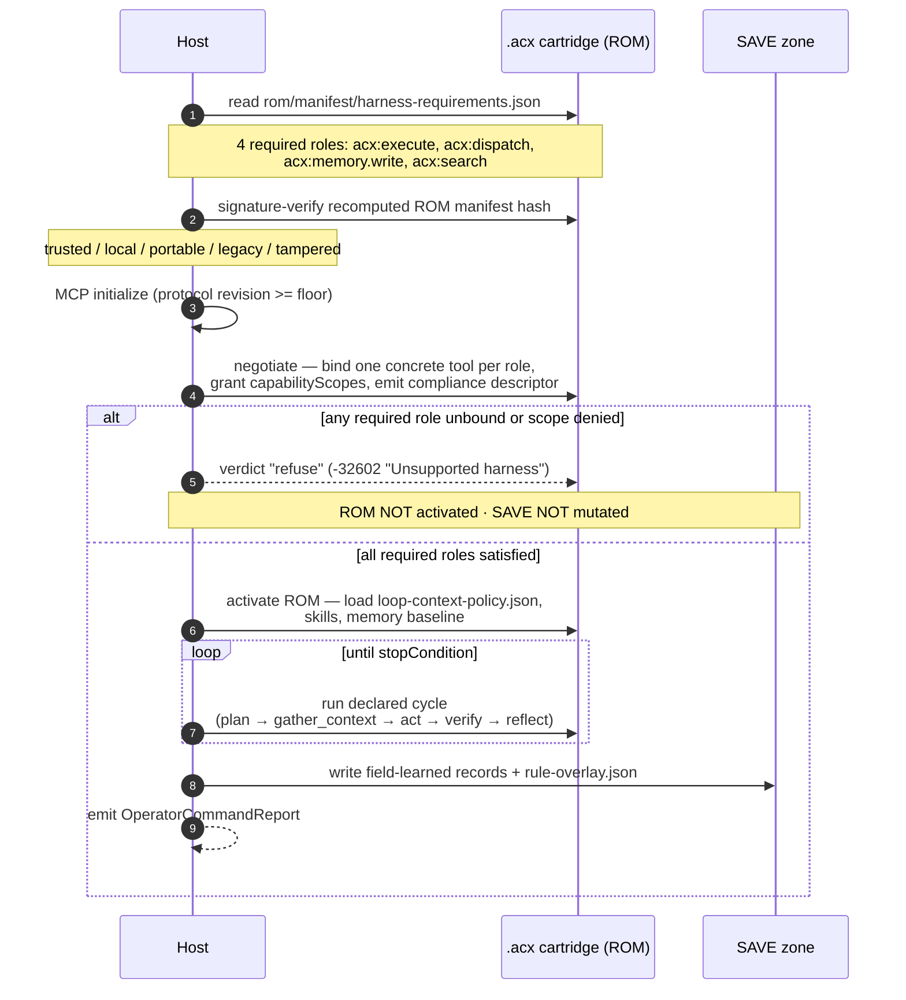

# Bundled loops & the agent OS

A cartridge is a self-contained, **signed harness** — an agent-OS image — that any host boots by reading the cartridge's harness requirements, negotiating tools, activating the ROM, and running the loop the cartridge itself declares.

Most agent formats ship a *prompt* and hope the surrounding scaffolding matches. An `.acx` cartridge ships the scaffolding too: the loop shape, the context policy, the skills, the tool contract, and the memory all travel as **one artifact**, sealed under one signature. This page explains why that bundle is best understood as a portable operating system for an agent, grounds the framing in Lilian Weng's harness-engineering work, and walks the boot sequence a host follows to run one.

It draws on SPEC §8 (harness requirements), §9 (loop + context policy), and §9.6 (harness-engineering alignment). For the two-zone split that makes the image signable see [the cartridge model](cartridge-model.md); for the tool contract in detail see [harness requirements](../format/harness-requirements.md).

---

## The harness *is* the product

!!! quote "Lilian Weng, *Harness Engineering for Self-Improvement* (2026-07-04)"
    A harness is "the system surrounding a base model that orchestrates execution and decides how the model thinks and plans, calls tools and acts, perceives and manages context, stores artifacts, and evaluates results."

    "The layer between the raw model and the real-world context seems to be as important as the model's raw intelligence."

    — [lilianweng.github.io/posts/2026-07-04-harness](https://lilianweng.github.io/posts/2026-07-04-harness/)

Read that list of responsibilities again — *plan, call tools, manage context, store artifacts, evaluate results* — and notice that it enumerates, almost field for field, what an `.acx` cartridge carries:

| Weng's harness responsibility | Where it lives in a cartridge | SPEC |
|---|---|---|
| decides how the model **thinks and plans** | `loop.cycle`, `loop.maxTurns`, `loop.stopConditions` | §9.2 |
| **calls tools and acts** | the four required tool-role contracts (`acx:execute`, `acx:dispatch`, `acx:memory.write`, `acx:search`) | §8.4 |
| **perceives and manages context** | `context.retrieval`, `context.compaction`, `context.toolResultTruncation` | §9.3 |
| **stores artifacts** | the memory partition + `context.memoryFiles` | §7, §9.3 |
| **evaluates results** | `loop.verification`, and (v1.1) `verification.regression` | §9.2, §9.6 |

The cartridge's contribution is not to invent this layer — it is to make it a **portable, signable object**. Weng's own warrant for treating the harness as a thing worth engineering is that an evolved harness *transfers* across benchmarks and tasks; if it transfers, it deserves to be packaged, versioned, and shipped. That is exactly what `.acx` does: it freezes the harness into the [ROM zone](cartridge-model.md), content-addresses it, and signs it.

!!! abstract "The one-sentence claim"
    An `.acx` cartridge is an **agent-OS image**: the loop, the context policy, the skills, the tool contract, and the memory are bundled into one signed file, and a host *boots* it rather than merely *reading a prompt from* it.

---

## Bundled loops: one artifact, not five files

"Bundled loops" is the design stance that these five layers must travel **together**, under **one integrity boundary**, or the guarantee dissolves.

Consider the alternative. If the loop policy lived in a repo, the skills in a package registry, the tool
list in a host config, and the memory in a database, then "this agent behaves the way its author intended"
would be an assertion about *four independently mutable things*. You could not sign, share, or reproduce
it as one unit. The cartridge collapses that into a single SQLite file where every behavior-defining part
is a `sqlar` row in the ROM zone, listed in the content-addressed integrity manifest, and covered by one
DSSE/ed25519 signature.

=== "What is bundled"

    - **The loop** — `rom/policy/loop-context-policy.json` (`schemaVersion: "acx.loop-context-policy/1"`), the declarative shape of the agentic cycle (SPEC §9.1).
    - **The context policy** — the `context` object inside that same document: retrieval strategy, compaction *intent*, tool-result truncation, memory-file references (§9.3).
    - **The skills** — `SKILL.md` bundles under `rom/skills/<name>/` in the `sqlar` table, extractable by [stock `sqlite3`](../format/skills.md) (§5).
    - **The tools contract** — `rom/manifest/harness-requirements.json`
      (`schemaVersion: "acx.harness.v1"`), four required roles plus an optional inventory (§8).
    - **The memory** — the always-present JSON baseline plus its zone partition (§7), the durable state the harness reads and writes.

=== "Why the bundle must be atomic"

    Every item above is a **ROM-zone** artifact. That means each is listed in the self-excluding `checksum.sha256` manifest and covered by the cartridge's detached DSSE signature over the recomputed ROM manifest hash. Mutating any one of them — the loop, a skill body, a tool contract — changes the manifest hash and flips trust to `tampered`:

    ```text
    verify (objects.oid tamper): invalid / tampered - ROM content diverges from signed manifest (object hash mismatch).
    verify (SKILL.md content tamper, oid stale): invalid / tampered - ROM content diverges from signed manifest (object hash mismatch).
    ```

    *(verbatim from PROOF 2 in the [proofs transcript](../proofs.md))*

Weng's discipline about **where durable state lives** is the same instinct at the file level:

!!! quote "Weng, on state"
    "A harness should not carry the entire workflow and all logs in context; instead, it should keep durable state in files."

The cartridge takes that literally: the workflow (loop), the notes (memory files), and the learned records (memory) are *files inside the image*, not context the model has to hold. The difference is that in an `.acx` those files are split by provenance — signed ROM versus mutable [SAVE](cartridge-model.md) — so the durable state is not just persisted, it is *attributable*.

---

## Weng's three patterns, mapped to cartridge features

Weng's post distills recurring harness structure into a small set of patterns. Three of them map cleanly onto concrete `.acx` fields — which is unsurprising, since the loop policy's v1.1 revision (SPEC §9.6) was written *from* this post.

### Pattern 1 — the workflow loop

!!! quote "Weng"
    The core loop is to "plan, execute, observe/test, improve, and execute again until the goal is achieved."

The cartridge encodes this as data, not code, in `loop.cycle`. The canonical v1 phases are `["gather_context", "act", "verify"]`; v1.1 (`acx.loop-context-policy/1.1`) additively permits `plan` and `reflect`, giving Weng's full five-beat loop:

```json
{
  "loop": {
    "maxTurns": 40,
    "cycle": ["plan", "gather_context", "act", "verify", "reflect"],
    "verification": {
      "commands": ["npm run lint", "npm test -- --changed"],
      "scope": "touched",
      "passIntent": "lint+types+touched tests green",
      "blockOnFailure": true
    },
    "stopConditions": [
      { "when": "completed", "action": "stop" },
      { "when": "blocked",   "action": "handoff" },
      { "when": "max_turns", "action": "handoff" }
    ]
  }
}
```

!!! note "This is a contract, not a runtime"
    SPEC §9.1 requires hosts to **evaluate the policy as data** — no recompilation to change loop behavior. The reference implementation validates and signs this document; the *loop-policy evaluator that acts on it is specified, host-side*, and is not part of the zero-dependency reference impl. The cartridge declares the loop; the host runs it.

Weng's "observe/test" beat is the cartridge's `verify` phase, and her acceptance criterion for self-improvement is the same one the [provable-level protocol](../leveling/provable-level.md) enforces cryptographically:

!!! quote "Weng, on acceptance"
    "Candidates are accepted only if they have no regression on both held-in and held-out data."

v1.1 adds `loop.verification.regression` `{heldInSuite, heldOutSuite, acceptIf}` to encode exactly that rule. A **level** (SPEC §10) is that same held-out-regression acceptance made into a signed, revocable credential — a strong agent earns it only after an independent re-run clears the σ-gate:

```text
strong agent (competence 33): ISSUED ✅  | mu=33.03 sigma=1.232 games=90 passRate=60% R=29.34 => acxLevel=29 tier=principal
```

*(PROOF 3; the reference solver that stands in for the graded agent run is deterministic and pluggable — a production verifier plugs in a real sandboxed agent.)*

### Pattern 2 — file-system as memory

!!! quote "Weng"
    "A harness should not carry the entire workflow and all logs in context; instead, it should keep durable state in files."

This is the [memory partition](../format/memory.md) and `context.memoryFiles`. Durable state lives in the `.acx` file, not the context window. Two features make it more than a flat file:

- **Provenance split** — every record carries a mandatory `portable` boolean; `portable: true` records are signed ROM, `portable: false` records carry a privacy-preserving `codebaseFingerprint` and stay in SAVE (SPEC §7.1). Field-learned records are quarantined by default:

  ```text
  field-learned:  quarantined (default)
  ```
  *(PROOF 4)*

- **Portable baseline over vectors** — `memory-records.json` is the always-present source of truth; vectors are tagged with the `embeddingEngine` id and **re-indexed on import**, never trusted (§7.6). The reference impl uses a plain table here; `vec0` vectors are specified but host-side.

The `context` policy also declares *how* the harness spends its window without dictating a vendor algorithm: `context.compaction` is expressed as `{preserve[], discard[], targetTokenBudget}` **intent** over a fixed `ContextCategory` vocabulary, and `targetTokenBudget` is a target, not a trigger (§9.3). Anything vendor-specific — the summarization algorithm, KV-cache signals, context-editing strategy ids — is confined to an ignorable `hints{}` object, which brings us to Weng's forward-looking split:

!!! quote "Weng, on what endures"
    "Many harness improvements will be internalized into core model behavior, but the interface with external context and tools should remain."

That prediction *is* the §9.5 design: the durable interface (retrieval strategy, compaction intent, the outcome contract) is normative and declarative; the volatile model-specific mechanics live in `hints{}`, which a conformant host may ignore entirely and still run the loop.

### Pattern 3 — explicit sub-agents

!!! quote "Weng"
    "Make parallelism explicit and inspectable."

The cartridge declares sub-agents as data in `loop.subAgents`, reusing the Agent SDK `{description, prompt, tools}` triple as `{id, description, promptRef, tools[], concurrency, ...}` (§9.2). Two safety rules come straight from the pattern:

- Sub-agents that **write or make design decisions** default to `concurrency: "single_threaded"`; only read-only fan-out (search, review) may set `parallel`.
- v1.1 adds `subAgents[].mode` `{sync | backend}` for a monitorable long-running-job lifecycle — the "inspectable" half of Weng's rule.

Dispatching a sub-agent is itself a required tool role, `acx:dispatch` (scope `dispatch`), so a host that cannot spawn sub-agents fails the handshake rather than silently degrading (§8.4). Inspectability is backed by `observability` `{tracer, decisionLog, pillars}`, which ties runs to the repo audit log.

---

## The boot sequence

Because the cartridge declares its own harness requirements, a host can treat it like a bootable image: read the requirements, negotiate a compliant environment, activate the signed ROM, run the declared loop, and let field learning write to SAVE. The handshake and the loop evaluator are **specified normatively (§8.5); their runtime is host-side** — the reference impl validates the manifests and the signature, not the live negotiation.



Two properties of this sequence are worth naming:

!!! warning "Refuse before activate — and never mutate SAVE on refusal"
    Per SPEC §8.5, if any of the four required roles is unbound or a required scope is denied, the host sets `verdict: "refuse"`, emits the compliance descriptor and a JSON-RPC `-32602 "Unsupported harness"` error, and **must not activate the ROM or mutate the SAVE zone**. A cartridge also carries a preflight self-check that aborts if the persisted descriptor shows any required binding with `satisfied: false`. Boot is fail-closed.

!!! tip "Roles, not tool names"
    Authored ROM content invokes tools by **role** (`acx:execute`), never by a host-specific name (§8.2). The host maps one concrete tool onto each role at handshake time. This is what lets the same signed cartridge boot on different hosts — the reference tools `agentibus_add_memory` / `agentibus_search_memory` are just one possible binding for `acx:memory.write` / `acx:search`.

The host's own `resource-limits.yaml` always wins over the cartridge's `budget` defaults (§9.5): enforcement order is **host policy > cartridge default**, so a downloaded cartridge can never raise a consuming org's token or concurrency ceilings.

---

## Why this is an operating system, precisely

The OS analogy is load-bearing, not decorative. An operating-system image (1) presents a stable **syscall interface** to programs, (2) is **immutable and signed** as shipped, and (3) writes runtime state to a **separate mutable partition**. A cartridge does all three:

- The **syscall interface** is the four `acx:` tool roles plus the loop/context contract — the stable surface authored ROM content depends on, negotiated at boot.
- The **signed image** is the ROM zone: content-addressed, DSSE-signed, and re-exportable to the identical manifest hash even after use.

  ```text
  rom hash before strip: sha256:f479be021b8ea2e55cc6e3e33b95df9d151196548dfc854dedbe578be7120642
  rom hash after  strip: sha256:f479be021b8ea2e55cc6e3e33b95df9d151196548dfc854dedbe578be7120642
  hash-equality proof:   EQUAL (ROM intact; SAVE removed)
  ```
  *(PROOF 7 — the boot image is provably untouched by a full run.)*

- The **mutable partition** is the SAVE zone that the loop writes field-learned memory and `save/policy/rule-overlay.json` to, quarantined from the signed core.

And like an OS image, it distributes as one immutable blob — the `.acx` is a single layer in an [OCI image manifest](../lifecycle/distribution.md) (`artifactType: application/vnd.acx.cartridge.v1`), verifiable with stock cosign/oras (SPEC §11; the OCI *push runtime* is specified, host-side).

!!! example "The whole bundle, in one `inspect`"
    ```text
    == meta ==
      acx.cartridge_id = io.github.agentibus/scenario-research-designer@025edd67-...
      acx.rom_manifest_hash = sha256:f479be021b8ea2e55cc6e3e33b95df9d151196548dfc854dedbe578be7120642
    == ROM objects ==
      total: 21  (memory:1, cartridge:9, sqlar:11)
    == skills (acx_skill) ==
      - expertise-designer: Specialized designer expertise on research, ux, benchmarking...
    == capabilities ==
      - build-dag[pkg:generic/snowflake+pkg:pypi/apache-airflow+pkg:pypi/dbt-core]  verified=false
    == memory (by zone) ==
      rom: 1
    ```
    *(PROOF 5 — one file: loop policy, skills, tool contract, capabilities, and memory, all under one signed ROM manifest hash. `io.github.agentibus` is an illustrative publisher handle.)*

---

## See also

- [The cartridge model (ROM / SAVE)](cartridge-model.md) — the two-zone split that makes the image signable.
- [Harness requirements](../format/harness-requirements.md) — the four tool-role contracts and the negotiation handshake in full (SPEC §8).
- [Skills](../format/skills.md) — the `SKILL.md` bundles the loop draws on (SPEC §5).
- [Memory partition](../format/memory.md) — the file-system-as-memory layer (SPEC §7).
- [Provable level](../leveling/provable-level.md) — held-out regression acceptance turned into a signed credential (SPEC §10).
- [Distribution](../lifecycle/distribution.md) — shipping the agent-OS image over OCI (SPEC §11).
- [Proofs](../proofs.md) — the verbatim transcript every code block on this page is quoted from.
