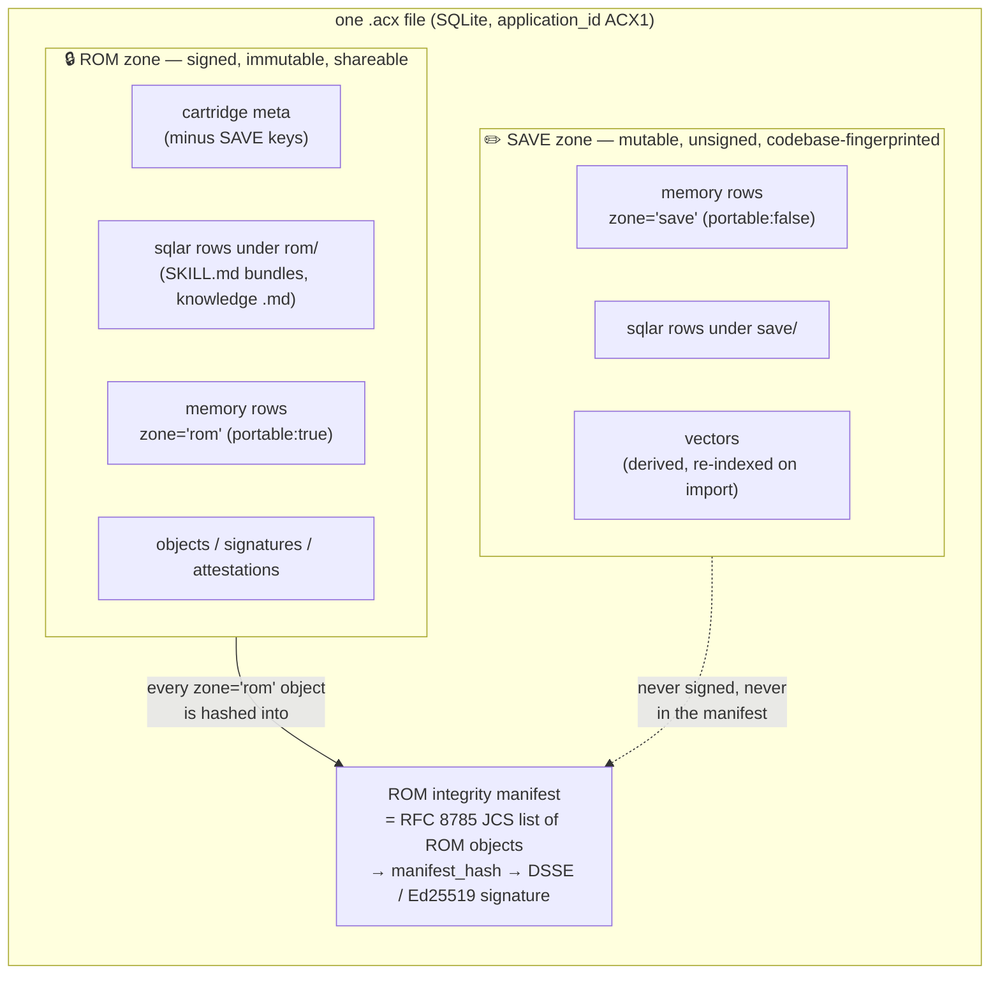
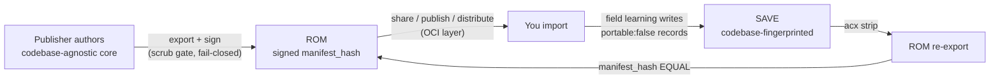

# The cartridge model (ROM / SAVE)

A cartridge is a single `.acx` file split into two zones — a **signed, immutable ROM** you can share and
verify, and a **mutable, codebase-specific SAVE** that field learning writes to — where stripping the SAVE
away is *provably* a no-op on the ROM.

The name is deliberate. Think of a game cartridge: a masked ROM chip that ships identically to every
recipient, plus a battery-backed SAVE that records *your* playthrough. The ROM is what the publisher
signed; the SAVE is what your codebase taught it. The whole point of the `.acx` format is to make that
boundary cryptographic rather than aspirational.

!!! abstract "The one-sentence claim"
    ROM is the signed core; SAVE is local memory; and `strip-to-ROM` re-export reproduces the **exact same signed `manifest_hash`** — so you can prove, by hash equality, that field learning never touched the thing you signed.

This page covers the metaphor in depth, the two zones and what lives in each, and the hash-equality proof that ties them together. It draws on SPEC §2 (terminology), §3.4 (the ROM/SAVE boundary), and §7 (memory partition). For the byte-level container and the manifest algorithm see [the container format](../format/container.md); for the signature itself see [signing & trust](../format/signing-trust.md).

---

## Why two zones at all

Every attempt to package a "specialized agent" runs into one tension:

- A **base** worth sharing must be **codebase-agnostic**. If it carries your repo names, your paths, or
  your private conventions, it is not safely portable.
- A base worth *using* accumulates **field-learned specificity**. An agent that has debugged your monorepo for three months knows things no generic base could — and that knowledge is intrinsically about *your* codebase.

These two goals pull in opposite directions. Most formats resolve it by picking one: either a frozen distributable with no learning, or a personal memory store that can never be safely shared. The cartridge model refuses the choice by **partitioning** rather than collapsing.

> Lilian Weng, in *Harness Engineering for Self-Improvement* (2026-07-04), frames the surrounding system this way: "A harness should not carry the entire workflow and all logs in context; instead, it should keep durable state in files." The cartridge takes that literally — durable state lives in the `.acx` file, and it is split by *provenance*: what the publisher vouches for (ROM) versus what this installation learned (SAVE).

The resolution: **`portable` is a property of every record, and it decides the zone.** A memory that is codebase-agnostic (`portable: true`) lives in ROM and is signed. A memory that is codebase-specific (`portable: false`) lives in SAVE, carries a privacy-preserving `codebaseFingerprint`, and is excluded from re-share by default (SPEC §7.1). Same file, two provenance classes, one signature boundary between them.

---

## The two zones



### What lives in ROM

The ROM zone is "the signed, immutable, shareable core" (SPEC §2). It comprises:

| Content | Where it lives | Notes |
|---|---|---|
| Cartridge metadata | `cartridge` table (minus SAVE keys) | `acx.spec_version`, `acx.cartridge_id`, `acx.rom_manifest_hash`, `acx.embedding_engine`, … |
| Skill bundles | `sqlar` rows named `rom/skills/<name>/SKILL.md` | Extractable with stock `sqlite3 file.acx -Ax`; see [skills](../format/skills.md) |
| Portable knowledge | `sqlar` rows under `rom/` | Knowledge `.md` files |
| Transferable memory | `memory` rows with `zone='rom'` | `portable: true`, `codebaseFingerprint` MUST be `null` |
| Integrity + provenance | `objects`, `signatures`, `attestations` | The manifest, the DSSE envelope, any level VCs |

Everything here is content-addressed into the **ROM integrity manifest** and covered by one Ed25519 signature.

### What lives in SAVE

The SAVE zone is "the mutable, unsigned, codebase-fingerprinted field-learning store" (SPEC §2):

| Content | Where it lives | Notes |
|---|---|---|
| Field-learned memory | `memory` rows with `zone='save'` | `portable: false`, non-null `codebaseFingerprint` |
| Local knowledge files | `sqlar` rows under `save/` | Never signed |
| Vectors | `vectors` (vec0) with `zone='save'` | Derived embeddings; **never** signed; re-indexed on import |

!!! note "SAVE is unsigned on purpose"
    The whole-file SHA-256 is deliberately **not** what gets signed. SQLite churns header and page bytes on every write — the file change counter (offset 24), freelist pages, `VACUUM` rewrites, WAL checkpoints — so any SAVE write alters the file digest while the ROM is logically untouched (SPEC §3.3). Signing the file would make field learning look like tampering. Signing a *manifest of ROM objects* makes field learning invisible to the signature by construction.

!!! tip "Fail-closed scrub gate protects the boundary"
    Field-learned records are quarantined by default — excluded from export unless you pass `--include-field-learned`. On export a scrub gate scans every string field, every knowledge `.md`, and every skill body, and **blocks export (non-zero exit)** on any secret match rather than silently redacting (SPEC §7.5). In the proof run it catches AWS keys, PEM private keys, and GitHub tokens, and passes clean input. See [the memory partition](../format/memory.md) for the codebase-fingerprint scheme.

---

## The strip-to-ROM hash-equality proof

Here is the mechanism that turns "we kept them separate" into "we can *prove* we kept them separate."

**Strip-to-ROM re-export** removes everything in the SAVE zone and recomputes the signature manifest. If the ROM was never mutated by field learning, the recomputed `manifest_hash` MUST equal the original signed hash, and the existing `signatures` row re-verifies unchanged. That equality is the machine-checkable proof (SPEC §3.4).

The strip is exactly this, verbatim from the spec:

```sql
DELETE FROM memory  WHERE zone='save';
DELETE FROM sqlar   WHERE name GLOB 'save/*';
DELETE FROM vectors WHERE zone='save';
DELETE FROM objects WHERE zone='save';
-- clear acx.save_codebase_fingerprint; clear flags bit0; VACUUM;
```

### Why equality is guaranteed (and load-bearing)

The signed object is the **ROM integrity manifest**: take every `objects` row where `zone='rom'`, sort ascending by `(kind, source_ref)` under Unicode codepoint order, emit `[{sourceRef, oid, canon, sz}, …]`, canonicalize with **RFC 8785 (JCS)**, and set `manifest_hash = "sha256:" || hex(sha256(that))` (SPEC §3.3).

Nothing in that computation reads a SAVE row. So deleting every SAVE row — and even running `VACUUM`, which rewrites every b-tree page and bumps the file change counter — cannot change the manifest. Verification recomputes each `oid` from `source_ref` + `canon`, rebuilds the manifest, and checks the DSSE. It is deterministic and **independent of container byte layout**. That independence is precisely what makes the equality meaningful: if a byte of ROM content had actually changed, an `oid` would change, the manifest would change, and the hash would diverge.

### The proof, run for real

From the verified proof transcript (`docs/_assets/proofs-transcript.txt`), the `acx strip` command prints the ROM hash before and after:

```text
########## PROOF 7: CLI strip (ROM-intact proof) ##########
rom hash before strip: sha256:f479be021b8ea2e55cc6e3e33b95df9d151196548dfc854dedbe578be7120642
rom hash after  strip: sha256:f479be021b8ea2e55cc6e3e33b95df9d151196548dfc854dedbe578be7120642
hash-equality proof:   EQUAL (ROM intact; SAVE removed)
wrote:                 /tmp/demo.rom.acx
exit=0
```

The smoke proof states the same equality directly, and — crucially — pairs it with the tamper cases that must *fail*:

```text
########## PROOF 2: smoke (export->verify->strip->tamper) ##########
strip-to-ROM equal: true (before==after: true )
verify (objects.oid tamper):            invalid / tampered - ROM content diverges from signed manifest (object hash mismatch).
verify (SKILL.md content tamper, oid stale): invalid / tampered - ROM content diverges from signed manifest (object hash mismatch).
```

And the test suite pins the invariant twice — once as a property and once on a real exported cartridge:

```text
✔ §3.4 strip-to-ROM: manifest hash equal when only SAVE rows are removed
✔ strip-to-ROM on the exported cartridge preserves the manifest hash
✔ a ROM tamper on the exported cartridge is detected
```

!!! example "Reproduce it yourself"
    The reference implementation is zero-dependency — Node ≥ 22 with the builtin `node:sqlite` and `node:crypto`. Run everything with `--experimental-sqlite`:

    === "Strip a cartridge"

        ```bash
        node --experimental-sqlite src/cli.mjs strip demo.acx
        # or, via the bin alias: acx strip demo.acx
        ```

    === "Verify the signature"

        ```bash
        node --experimental-sqlite src/cli.mjs verify demo.acx
        # status: warning / portable  — signature valid, signer not in your trust registry
        ```

    === "Run the proof suite"

        ```bash
        npm test          # current suite, 0 fail
        node --experimental-sqlite scripts/smoke.mjs
        ```

The two tamper lines are the contrapositive that gives the equality its teeth. Rewriting signed `sqlar` content while leaving a stale `objects.oid` behind, or flipping a capability's proficiency to `verified` with a stale oid, is caught as `tampered` — the ROM content diverges from the signed manifest (test cases `C1`). Equality after a strip is only impressive because *inequality* after a real mutation is reliably detected.

---

## How this resolves "agnostic base vs field-learned specificity"

Put the pieces together and the tension from the top of the page dissolves:



- **The base stays agnostic and provable.** ROM carries only `portable: true` records, whose `codebaseFingerprint` and `repoId` MUST be `null` (SPEC §7.1). On export, transferable records are hard-stripped — `repoId = null`, `repoLabel`/`projectLabel` replaced with the sentinel `"portable-core"` (SPEC §7.4). A malformed record (`portable:true` with a fingerprint, or `portable:false` without one) is rejected at import. The test `field-learned records are quarantined by default (no repoId leaks into ROM memory)` guards this.

- **Specificity accumulates without contaminating the base.** Field learning writes `portable: false` records into SAVE, each carrying `"cbf1_" + HMAC-SHA-256(installationSalt, canonicalRepoIdentity)` truncated to 40 hex chars (SPEC §7.2). The salt is a ≥ 256-bit org-scoped secret held *outside* the bundle and never exported, so the fingerprint is dictionary-resistant and non-correlatable across orgs — that non-correlatability *is* the quarantine boundary. Even when you opt in with `--include-field-learned`, foreign records stay quarantined under their imported fingerprint and MUST NOT be re-projected onto your codebase (SPEC §7.4).

- **The boundary is auditable at any moment.** Because strip-to-ROM reproduces the signed hash, anyone
  holding your working `.acx` can re-derive the exact bytes the publisher signed and confirm the signature
  still covers them — regardless of how much your local agent has learned. The ROM you can share and the
  memory you field-learned coexist in one file, with a hash proving they never leaked into each other.

!!! note "This is the harness's held-out discipline, one layer down"
    Weng notes that "candidates are accepted only if they have no regression on both held-in and held-out data." The cartridge applies the same "prove it, don't assert it" instinct to *state*: the ROM is accepted as unchanged only if a mechanical re-derivation reproduces the signed digest. The [provable level](../leveling/provable-level.md) makes the analogous claim about *capability* — a level is issued only after an independent re-run on a sealed held-out slice, bound to the ROM digest.

---

## What this enables downstream

| Because the ROM/SAVE boundary is cryptographic… | …you get |
|---|---|
| ROM is one signed, content-addressed manifest | Stock `cosign`/`oras` verification; a portable signature that survives local writes ([signing & trust](../format/signing-trust.md)) |
| SAVE is quarantined and fingerprinted | Safe field learning that never contaminates a shareable base ([memory](../format/memory.md)) |
| The whole ROM is one OCI layer | Distribution through any registry with zero code change ([distribution](../lifecycle/distribution.md)) |
| The ROM digest is a stable anchor | A level VC can bind to it, unforgeably ([provable level](../leveling/provable-level.md)) |

The cartridge is, in the end, a **self-contained signed harness** — an agent-OS image that a host boots via the harness-requirements handshake (see [the agent-OS view](agent-os.md)) — and the ROM/SAVE split is what lets that image be simultaneously *distributable* and *alive*.

!!! warning "Honesty about scope"
    The crypto, the manifest, the strip-to-ROM equality, and the scrub gate all run today in the zero-dependency reference implementation. Some surrounding machinery is **specified normatively but host-side / not yet implemented**: OCI push at runtime, live DNS-TXT / GitHub-OIDC namespace-proof verification, the host handshake runtime, and `vec0` vectors (a plain table stands in). Where this page says a step is "host-side" or points at distribution, read it as *specified*, not *running in the reference impl*. See the [proofs page](../proofs.md) for exactly what is executed end-to-end.
