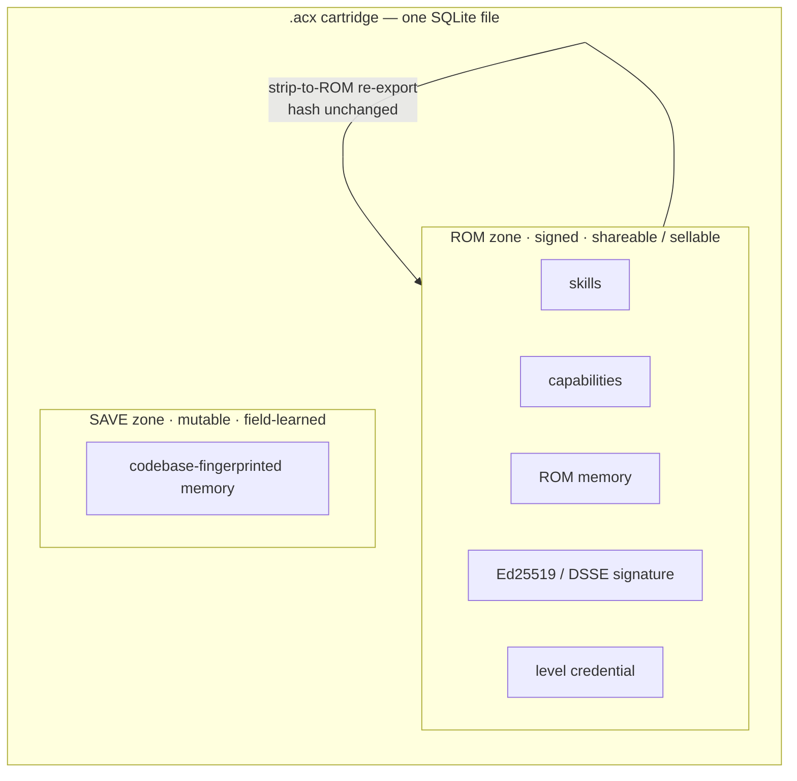

# Overview

An **Agent Cartridge** (`.acx`) is a single SQLite database that packages an AI agent — its skills, capability claims, memory, runtime contract, loop/context policy, and a cryptographically provable competence level — into one portable, signable, distributable artifact. Software engineering is the flagship use case, but the format is task-general: any agent that has skills, **learns**, and runs a loop fits — and cartridges **level up**, **form teams**, and **run workflows** together.

!!! tip "Where cartridges come from"
    A cartridge is the portable *output* of a company of agents. In [the studio](studio.md) (AGENTIBUS),
    agents emerge from real work, get staffed onto projects, and level up — then export as cartridges.
    See the full [hire → cartridge → re-hire loop](../lifecycle/company-loop.md).

## What an Agent Cartridge is

A cartridge is a self-describing SQLite ≥ 3.37 database, extension `.acx`, that an agent "trained" (leveled up) in one environment can be **shared, sold, verified, and re-hosted** in another with deterministic integrity guarantees and no host lock-in (SPEC §1).

It is branded at the file-header level so `file(1)` recognizes it from a 72-byte read, with no page cache and no schema query:

```console
$ file /tmp/demo.acx
/tmp/demo.acx: SQLite 3.x database, application id 1094932529, user version 16777472, ...
```

- `application_id = 1094932529` is the magic `0x41435831` — the ASCII bytes `A C X 1`, stored at header offset 68.
- `user_version = 16777472` (`0x01000100`) packs `[spec_MAJOR][spec_MINOR][vec0_storage_format][flags]` at offset 60.

Everything else — skills, capabilities, memory, signatures, credentials — lives in ordinary tables inside that one file. Because it is stock SQLite, stock tools work on it unchanged:

```console
$ sqlite3 /tmp/demo.acx -Ax        # extract the sqlar archive
rom/skills/expertise-designer/SKILL.md
```

!!! info "Two zones, one file"
    Every cartridge splits into a **ROM zone** (signed, immutable, shareable/sellable core) and a **SAVE zone** (mutable, field-learned, codebase-specific memory). The ROM is signed once; SAVE mutates locally; derived vectors are always rebuilt by the consumer. See [The cartridge model](cartridge-model.md).

## A cartridge is a signed harness

Lilian Weng's 2026 post *["Harness Engineering for Self-Improvement"](https://lilianweng.github.io/posts/2026-07-04-harness/)* defines a **harness** as "the system surrounding a base model that orchestrates execution and decides how the model thinks and plans, calls tools and acts, perceives and manages context, stores artifacts, and evaluates results." She argues that "the layer between the raw model and the real-world context seems to be as important as the model's raw intelligence."

An Agent Cartridge is exactly that harness, captured as a **self-contained, signed, portable artifact — an agent-OS image** — that any compliant host can boot. The harness-requirements manifest is the boot contract; the loop/context policy encodes Weng's loop of "plan, execute, observe/test, improve, and execute again until the goal is achieved." See [The agent OS](agent-os.md).

## The problem it solves

Today a specialized agent is trapped where it was built. Three properties are missing:

| Property | Status quo | What breaks |
| --- | --- | --- |
| **Portable** | Identity binds to a hostname-derived `instanceId`; memory binds to a local repo. | Move the agent and its trust, memory, and behavior fall apart. |
| **Sellable** | An agent's earned expertise is co-mingled with codebase-specific secrets and local paths. | You cannot hand someone the valuable core without leaking the private field data. |
| **Provable** | "Level 20 agent" is a self-asserted string in a config file. | A buyer has no way to check the claim; anyone can fake it. |

The cartridge fixes each of these by construction, and the fix is machine-checkable rather than promised.

!!! example "Provable, not asserted — from the real proof transcript"
    A level is never self-declared. It is earned by an **independent verifier re-running the pinned ROM on a sealed held-out slice**, then σ-gated. A weak agent is rejected; a strong one earns a credential bound to the ROM digest:

    ```text
    weak agent   (competence 14): NOT ISSUED — gating failed: sigma=2.230 (<1.5?) ...
    strong agent (competence 33): ISSUED ✅  mu=33.03 sigma=1.232 games=90 R=29.34 => acxLevel=29 tier=principal
    anti-transplant — VC on mutated ROM: REJECTED ✅ [ 'ROM digest binding mismatch' ]
    ```

    This is Weng's "candidates are accepted only if they have no regression on both held-in and held-out data" — made cryptographic. See [Provable level](../leveling/provable-level.md).

## The five design goals

The standard is governed by five goals (SPEC §1):

1. **Portable.** Identity, trust, and behavior bind to a reverse-DNS publisher (e.g. `io.github.agentibus/scenario-research-designer`) and a **content-addressed ROM manifest** — never to a hostname. A cartridge verifies and runs unchanged across machines, orgs, and hosts.
2. **Codebase-agnostic base, but field-learning.** Every memory record is partitioned into a **TRANSFERABLE** tier (generalizable, signed, shareable) and a **FIELD-LEARNED** tier (codebase-specific, pseudonymously namespaced, quarantined). The agent keeps learning in the field without contaminating its shareable core.
3. **Shareable / sellable.** The immutable **ROM zone** is the sellable core; the mutable **SAVE zone** holds local learning. A `strip-to-ROM` re-export proves, **by hash equality**, that field learning never mutated the core:

    ```text
    rom hash before strip: sha256:f479be021b8ea2e55cc6e3e33b95df9d151196548dfc854dedbe578be7120642
    rom hash after  strip: sha256:f479be021b8ea2e55cc6e3e33b95df9d151196548dfc854dedbe578be7120642
    hash-equality proof:   EQUAL (ROM intact; SAVE removed)
    ```

4. **Provable level.** An agent's level is a **W3C Verifiable Credential 2.0** embedding an **Open Badges 3.0** achievement, issued by an independent verifier only after held-out re-execution, TrueSkill σ-gated (`sigma < 1.5`, `gamesPlayed >= 30`, conservative rating `R = mu - 3*sigma`), bound to the ROM digest, and revocable.
5. **Open envelope, priced contents.** The container format, schemas, and descriptive layer are 100% open and unencumbered. The *value* — the signed level attestation, the verified capability evidence, and field-learned memory — is the sellable, revocable, identity-bound asset carried **inside a fully open envelope**.



## What is inside a cartridge

Each part of the cartridge has its own format page:

- **[Container format](../format/container.md)** — the SQLite header brand, the exact table schema (`cartridge`, `sqlar`, `memory`, `objects`, `signatures`, `attestations`, `vectors`), the ROM/SAVE boundary, and strip-to-ROM (SPEC §3).
- **[Signing & trust](../format/signing-trust.md)** — Ed25519 in a DSSE / in-toto envelope over a content-addressed ROM manifest recomputed from live bytes, plus the `local / trusted / portable / legacy / tampered` trust taxonomy (SPEC §4).
- **[Skills](../format/skills.md)** — `SKILL.md` files under `rom/skills/<name>/` in the `sqlar` table, using agentskills.io frontmatter and extractable with stock `sqlite3 -Ax` (SPEC §5).
- **[Capabilities](../format/capabilities.md)** — structured claims `{taskType, stack (purl), domain, proficiency (TrueSkill), evidenceRefs}` that map to an A2A AgentCard; `verified: true` only when a level attestation resolves (SPEC §6).
- **[Memory](../format/memory.md)** — the two-tier partition, mandatory `portable` + `codebaseFingerprint` on every record, and the fail-closed secret-scrub gate on export (SPEC §7).
- **[Harness requirements](../format/harness-requirements.md)** — the four required tool-roles (`acx:execute`, `acx:dispatch`, `acx:memory.write`, `acx:search`), the MCP protocol floor, and the host capability-negotiation handshake (SPEC §8).
- **[Loop & context policy](../format/loop-context.md)** — the `cycle [plan, gather_context, act, verify, reflect]`, verification with held-in/held-out regression gating, budgets, sub-agents, and observability (SPEC §9).

And beyond one cartridge:

- **[Conditional Agentic Loops](../format/loops-cal.md)** — signed, bounded execution graphs that bind
  agent slots, required context, conditions, and completion contracts (SPEC §14).
- **[Agent Graph](../format/agent-graph.md)** — the signed information architecture around those loops:
  who owns context, who directs or reports to whom, and where separate loops converge (SPEC §16).
- **[Provable level](../leveling/provable-level.md)** — how a level is earned by re-run and verified as unfakeable (SPEC §10).
- **[Distribution](../lifecycle/distribution.md)** — the `.acx` file as one layer in an OCI image manifest (`artifactType application/vnd.acx.cartridge.v1`), verifiable with stock cosign/oras (SPEC §11).

!!! note "About the reference implementation"
    The reference implementation is **zero-dependency** — Node ≥ 22's built-in `node:sqlite` and `node:crypto` — and runs with `node --experimental-sqlite`. Its cartridge crypto, Agent Graph and workflow signing, structural bounds, safe sharing path, σ-gating, and credential machinery are fully real (113 tests pass; see [Proofs](../proofs.md)). The benchmark's reference solver is **deterministic and pluggable** — a production verifier plugs in a real sandboxed agent run. OCI push, live namespace-proof verification (DNS-TXT / GitHub-OIDC), the host handshake runtime, the loop-policy evaluator, and `vec0` vectors are **specified normatively and are host-side** — they are not exercised by the reference impl.
