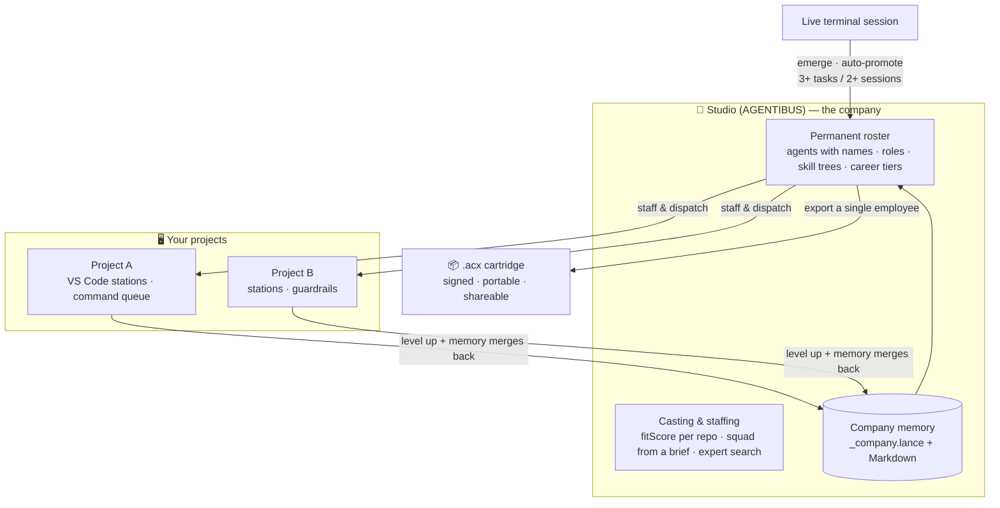
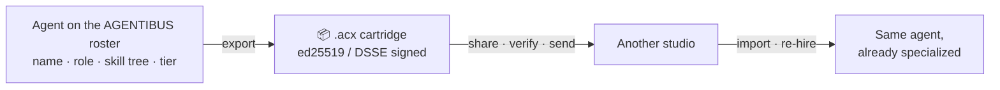

# The studio: a company of agents

A **studio** is a company where AI agents are the employees — they emerge from real work, get hired onto a permanent roster, are staffed and dispatched onto your projects, and level up as they ship; **AGENTIBUS** is the reference studio, and a [cartridge](overview.md) is how one of its employees becomes portable.

The rest of this site describes the `.acx` *file*. This page describes where that file comes from: a visible, running company of agents. Everything below is a mechanic in the reference studio (AGENTIBUS) that the cartridge standard was extracted from — with real field names and thresholds — so you can see what a cartridge is a *snapshot of*.



## Agents *emerge* from work — they aren't hired blank

In a studio, agents are **not** provisioned from a template. Every live terminal session becomes a temporary `GameAgent` (`createGameAgentFromLive`), starting at `level: 1`, `xp: 0`, `careerTier: intern`, with an empty skill tree and `promotionStatus: 'temporary'`.

As that session does real work, progress accrues. On every successful task run (`exitCode === 0`) the agent gains XP by outcome quality (`excellent: 100, good: 60, mixed: 30, poor: 10`), its `successfulTasks` counter increments, and the inferred domain of the work is folded into `consistentDomains`.

!!! example "The auto-promotion rule"
    A temporary spawn becomes a **permanent employee** the moment:

    ```text
    successfulTasks >= 3  &&  sessionCount >= 2  &&  consistentDomains.length > 0
    ```

    i.e. **3+ successful tasks across 2+ sessions with consistent domain overlap.** On promotion, `promotionStatus` flips to `permanent`, `promotedAt` is stamped, and — if the agent is still carrying a shell name like `zsh` or `claude` — it is given a real name from a fixed pool (`Nova, Echo, Sage, Flux, Iris, Bolt, Aria, …`) and a deterministic pixel avatar derived from its fingerprint.

A promoted agent is a durable team member: a **name**, one of **20 roles** (`backend_dev`, `architect`, `security_expert`, `qa_engineer`, `cto`, `tenx_engineer`, …), a **skill tree** (`unlockedSkills` + `techStack`) that persists across sessions, and one of **8 career tiers**:

| Tier | Reached at level |
|---|---|
| `intern` | < 5 |
| `junior` | ≥ 5 |
| `mid` | ≥ 10 |
| `senior` | ≥ 15 |
| `staff` | ≥ 20 |
| `principal` | ≥ 25 |
| `distinguished` | ≥ 30 |
| `legend` | ≥ 35 |

These are the same 8 tiers a cartridge's [provable level](../leveling/provable-level.md) maps onto — but here the tier is game-state, self-asserted; there it is earned by re-run. Hold that thought.

## You *staff* them onto projects

Once you have a roster, the studio helps you put the right agents on the right work. Three mechanisms:

=== "Casting (per repo)"

    `scoreAgent` → `rankAgentsForProject` computes a **`fitScore` (0–100)** for each agent against a specific repository, summing capped components:

    | Component | What it rewards | Cap |
    |---|---|---|
    | skillScore | matched skills × confidence | 0–35 |
    | techScore | overlap with the repo's stack | 0–25 |
    | experienceScore | completed projects + level | 0–20 |
    | availabilityScore | free vs busy vs burned-out | 0–15 |
    | teamworkBonus | collaboration stat | 0–5 |

    Candidates are ranked by `fitScore` descending — "who is the best fit for *this* repo, right now."

=== "Staffing (from a brief)"

    `buildRecommendation` turns a free-text **brief** into a squad. `inferTargetCapabilities` matches the brief against a 19-tag `CAPABILITY_VOCABULARY` (`api, backend, frontend, database, infra, tests, design, ux, product, docs, research, agent, memory, visual, security, monitoring, migration, delivery, review, knowledge`), then scores each agent on tag matches, role/provider bias, repo affinity, autonomy, learning velocity and memory strength.

    Output is a ranked `suggestedTeam` — index 0 = `primary`, 1 = `support`, rest = `specialist` — capped at **3 by default, 5 max**, plus a per-phase provider/model `toolPlan`.

=== "Expert search"

    "Who knows PostgreSQL best?" is answered the same way casting is — by scoring the roster's skills, tech stacks and memory evidence against the query and returning the top-ranked expert, rather than by asking an agent to self-declare.

!!! note "Casting scores are studio game-state"
    `fitScore`, the staffing score, XP and tier are all **self-asserted numbers the studio computes about its own employees**. They are excellent for running a roster — and they are *not* the credential you'd trust from a stranger's agent. That distinction is the whole reason the cartridge [provable level](../leveling/provable-level.md) exists.

## They are *dispatched* to your projects

Staffing decides *who*; dispatch actually puts them to work. The operator loop is **web → VS Code command queue → stations → outcome reports → guardrails**:

- **Stations.** Each connected VS Code window is a **station** (`OperatorStation`). Work is queued with `queueOperatorCommand` and polled by the extension.
- **Guardrails.** Dispatch is bounded. `queueOperatorCommand` is idempotent (an existing `idempotencyKey` returns the prior record, never a duplicate) and every queue writes a `command.queue` audit event with a fresh `traceId`. Resource limits (`checkDispatchAllowed`) enforce token spend (`dailyPerProject: 50`, `dailyGlobal: 200` USD), concurrency (`maxCommandsPerStation: 3`, `maxGlobalInFlightCommands: 12`) and timeouts, with a global `killSwitch` and per-project/-station pause — a caller over budget gets a 429.
- **Outcome → guardrail signals.** Each `OperatorCommandReport` (`{outcome, quality, confidence, blockers[], nextAction}`) is converted into mission guardrail signals of kind `milestone | checkpoint | question | blocked | stop`, so a destructive change or a missing spec makes the agent **stop and ask** rather than plow ahead.

When an agent is dispatched to a repo (`dispatchAgentToRepo`) it carries a **portable copy of its package and skills** into `<repo>/.agentibus/agents/<id>/package/` — the same portable-package machinery that is the direct ancestor of the `.acx` cartridge.

## They *level up* — and carry *memory* back

Completed work pays out XP (`pr-merged: 130`, `bug-fixed: 95`, `project-completed: 260`, …), which raises the agent's level and career tier and grants skill points — and can auto-unlock new skills from accumulated memory evidence.

Crucially, when a dispatched agent **returns**, its field-learned [memory](../format/memory.md) merges back into the company store (`mergeReturnedPortableMemories`) using an idempotent, content-addressed two-key merge (by memory `id`, then by `artifactFingerprint`). That is the line the studio lives by:

!!! quote ""
    "When they return, the memory merges back. **The company gets smarter.**"

Every project makes the whole studio smarter, because every project's learnings flow back into the shared roster the next casting decision draws from.

## The payoff: a cartridge is a portable employee

All of the above lives *inside* one studio. A **cartridge is how a single employee leaves the building** —
`exportAgentPackage` (upgraded to the `.acx` container) freezes one agent's skills, capabilities, memory
and loop policy into a **single signed SQLite file** you can share or send to another studio, where it is
re-hired already specialized.



The [ROM zone](cartridge-model.md) carries the portable, shareable core; the SAVE zone carries
codebase-specific learning that can be stripped before re-sharing. See the full round-trip —
[**from hire to cartridge and back**](../lifecycle/company-loop.md).

## Honest boundary: studio game-state vs. the provable credential

The single most important thing to understand about a studio:

| | Studio level (XP / tier / fitScore) | Cartridge provable level |
|---|---|---|
| Where it lives | Inside the studio, as game-state | In the cartridge, as a signed credential |
| Who vouches for it | The studio itself — **self-asserted** | An **independent verifier** (cryptographic) |
| How it's earned | XP from completed tasks; auto-promotion | Held-out re-run of the pinned ROM, σ-gated |
| Travels across studios? | No — local game numbers | **Yes** — bound to the ROM digest, revocable |
| Good for | Casting, staffing, dispatch, morale | Selling, lending, trusting an agent you didn't train |

Both use the **same 8 career tiers** (`intern … legend`). The studio's XP, levels and casting scores are self-asserted game-state — perfect for running a roster, worthless as a promise to a stranger. To make an employee's standing *portable and trustworthy across studios*, the cartridge earns a [**provable level**](../leveling/provable-level.md): a W3C Verifiable Credential minted only after an independent, held-out re-run, bound to the exact ROM bytes it grades. Local progression, cross-studio proof.

## Where to go next

- **[Overview](overview.md)** — what an `.acx` cartridge is as a file.
- **[The studio loop](../lifecycle/company-loop.md)** — the full hire → dispatch → return → export cycle.
- **[Capabilities](../format/capabilities.md)** — the portable claim an agent carries, `verified` only
  when an attestation resolves.
- **[Memory](../format/memory.md)** — the transferable vs field-learned partition that merges back.
- **[Provable level](../leveling/provable-level.md)** — how self-asserted tier becomes a cross-studio credential.
