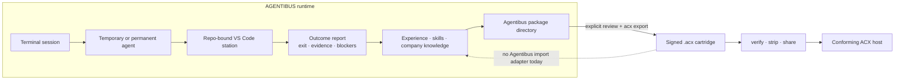

# The studio: where agent work happens

A **studio** is a runtime that staffs agents, sends work to execution environments, observes outcomes,
and retains company knowledge. AGENTIBUS is the studio that inspired much of ACX's vocabulary. ACX is a
separate portability standard for signed agents, workflows, and information graphs.

!!! warning "Current integration boundary"
    AGENTIBUS does **not** currently emit, import, boot, or level `.acx` files. It exports its own signed
    package **directory**. The ACX CLI can explicitly convert a compatible, reviewed directory into a
    signed `.acx`, but that is a manual operator step and a new snapshot — not a built-in runtime adapter.



## What AGENTIBUS does today

### Agents emerge from observed work

A live terminal session can create a temporary `GameAgent`. Repeated successful work contributes to its
experience, skill evidence, and domain history. A temporary agent becomes eligible for automatic
promotion after at least three successful tasks across at least two sessions with consistent domain
overlap.

Names, roles, XP, career tiers, casting scores, and promotion state are local AGENTIBUS game-state. They
help one company route work; they are not independent proof that another party should trust the agent.

### Staffing is fuzzy; execution is exact

AGENTIBUS can rank agents against a repository or infer a small team from a free-text brief. Those
recommendations are deliberately fuzzy. Execution has a harder boundary:

- the project is a remote reference in the registry;
- an existing local checkout is opened by a trusted VS Code station;
- the station reports its exact repository id and workspace;
- commands, Git operations, verification, and artifact reads are dispatched only through that binding;
- if the station or binding is missing, AGENTIBUS fails closed.

AGENTIBUS does not clone managed projects, create server-side project worktrees, or copy a portable agent
package into the checkout. The station owns the terminal, checkout, credentials, and agent CLI.

### Outcomes feed the local company

The station reports command-correlated output, exit status, quality signals, blockers, and next actions.
AGENTIBUS uses those observations for local task history, guardrails, agent progression, and company
knowledge. This learning remains runtime state governed by AGENTIBUS's stores and policies.

It is useful source material for a portable artifact, but it does not automatically become ACX ROM or
SAVE data. The operator still has to choose what is transferable, review it for secrets and
project-specific content, and invoke the ACX export boundary.

### Agentibus exports a package directory

`POST /api/game/agents/:id/export` calls `exportAgentPackage` and writes an Agentibus package directory.
That directory can contain a manifest, Markdown knowledge files, JSON memory records, checksums, an
Agentibus package signature, and optional derived memory data.

The Agentibus package format and an `.acx` cartridge are different artifacts with different trust
surfaces:

| Agentibus package directory | ACX cartridge |
| --- | --- |
| Runtime exchange format used by AGENTIBUS | Portable ACX standard artifact |
| Multiple files in a directory | One branded SQLite file |
| Agentibus checksum/signature model | ROM manifest + DSSE/in-toto signature |
| Can be imported by current AGENTIBUS package APIs | Not currently importable by AGENTIBUS |
| May contain runtime-derived material | Export scrub gate and ROM/SAVE partition apply |

## The explicit ACX conversion step

After exporting and reviewing an Agentibus package directory, an operator can run:

```bash
acx export /path/to/agent-package ./my-agent.acx --publisher io.github.example
acx spec ./my-agent.acx
acx verify ./my-agent.acx
```

The ACX exporter reads the package manifest, selected knowledge files, and memory records; derives ACX
skills, capabilities, harness requirements, and loop policy; quarantines field-learned records by
default; runs the scrub gate; and signs the resulting ROM. The result is a new ACX artifact signed by the
ACX publisher key, not an in-place upgrade of the Agentibus package signature.

Before public sharing, use `acx strip` when SAVE data is present and review the generated discovery
metadata. The bundled proof fixture demonstrates this conversion shape without calling a live Agentibus
server; see [Proofs](../proofs.md).

## Local levels and portable proof are separate

| | AGENTIBUS progression | ACX provable level |
| --- | --- | --- |
| Purpose | Route and grow a local roster | Carry independently verifiable evidence |
| Authority | The studio's own observations | An independent verifier |
| Binding | Local agent state | Exact ACX ROM digest |
| Portability | Not a cross-studio credential | Signed, revocable credential |

Running `acx level` is an explicit ACX verification action. AGENTIBUS does not currently invoke it or
translate its internal career tier into an ACX credential.

## What is not shipped yet

A complete AGENTIBUS↔ACX adapter would still need to define and implement:

- deterministic mapping from Agentibus package fields to every ACX ROM/SAVE object;
- operator review and scrub policy before export;
- publisher identity and key ownership across the two trust systems;
- `.acx` verification and tool-role negotiation inside AGENTIBUS;
- safe translation from a verified cartridge into a local agent without treating signatures as runtime
  permission;
- provenance for subsequent learning and re-export.

Until that exists, describe the relationship as **conceptual ancestry plus an explicit CLI conversion**,
not automatic export/import or cross-studio re-hiring.

## Where to go next

- [Cartridge overview](overview.md) — what the portable `.acx` file contains.
- [From station outcome to cartridge](../lifecycle/company-loop.md) — the honest current handoff.
- [Memory](../format/memory.md) — transferable ROM versus field-learned SAVE.
- [Signing and trust](../format/signing-trust.md) — what an ACX signature proves.
- [Provable level](../leveling/provable-level.md) — independent evidence bound to ROM bytes.
