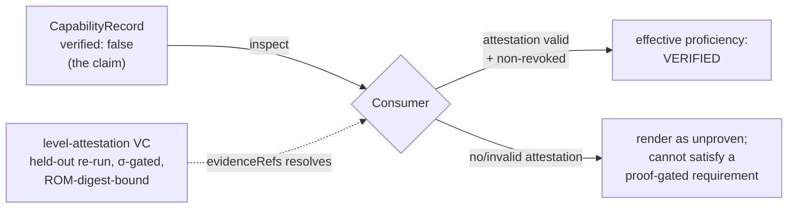

# Capabilities & portable claims

A **CapabilityRecord** is the discovery claim for a cartridge — a signed, ROM-resident assertion that
"this agent performs well at *taskType* on *stack* for *domain*" — and it is only *proven* when an
independent level attestation resolves.

Everything on this page is normatively defined in **SPEC §6** and implemented in [`src/builders.mjs`](../reference/cli.md). Capabilities live in the immutable **ROM zone** alongside [skills](skills.md), so every claim is covered by the [ROM integrity manifest and signature](signing-trust.md).

---

## The discovery card

When a host inspects a cartridge, the capabilities block says what the agent claims to do, on which
stack, and with what evidence state. Here is the real block from the reference cartridge, taken from
[Proof 5 (`acx inspect`)](../proofs.md):

```text
== capabilities ==
  - implement-feature[pkg:generic/benchmarking+pkg:generic/research+pkg:generic/ux]  verified=false
  - build-dag[pkg:generic/snowflake+pkg:pypi/apache-airflow+pkg:pypi/dbt-core]  verified=false
```

Two records, both `verified=false`. That default is the whole point: an open discovery record says *what is
claimed*; only a resolved attestation says whether it is *proven*. The Exchange never upgrades a claim
from a stored boolean or popularity signal.

!!! note "Where records live"
    Records are stored one JSON row per capability in the ROM table
    `capabilities(id TEXT PRIMARY KEY, json TEXT, content_hash TEXT)` (SPEC §6.1). A record **MUST NOT** be
    minted from a memory artifact whose `portable` flag is false — a codebase-specific war story never
    becomes a portable claim. See [Memory partition](memory.md).

---

## The record

Every record carries `schemaVersion: "acx.capability/1"` and the fields below. The full contract is [`schemas/capability-sellable-claim.schema.json`](../reference/schemas.md).

| Field | Required | What it is |
|---|---|---|
| `id` | yes | `cap-<sha256_16>` over `sha256(taskType + "|" + sortedStack.join(",") + "|" + domain)`. Deterministic, so re-export and two-key merge reuse the same row. |
| `taskType` | yes | One token from the seed vocabulary, or a reverse-DNS-namespaced extension token. |
| `stack` | yes (MAY be empty) | Normalized **Package URL (purl, ECMA-427)** identifiers. Order-insensitive; sorted before hashing. |
| `domain` | yes | One AGENTIBUS `SkillDomain` verbatim: `frontend`, `backend`, `infrastructure`, `testing`, `architecture`, `leadership`, `product`. |
| `proficiency` | yes | `{ scale: "acx.proficiency/trueskill-1", mu, sigma, score, confidence, verified }`. |
| `evidenceRefs` | yes | `{ kind, ref }[]`; non-empty when `verified:true`. Proficiency is only as good as what these resolve to. |
| `sampleCount` | yes | Integer ≥ 0. |
| `lastDemonstratedAt` | yes | RFC 3339 timestamp. |
| `license` | optional | SPDX expression; default `LicenseRef-acx-proprietary`. |
| `createdAt` / `updatedAt` | yes | RFC 3339 timestamps. |

The `id` is deterministic, so the same `(taskType, stack, domain)` triple always hashes to the same row — that determinism is what makes idempotent re-export and order-independent merge safe.

---

## The seed taskType vocabulary

`taskType` matches `^[a-z0-9]+(-[a-z0-9]+)*$` and, unless namespaced, **MUST** come from the v1 seed set (`TASK_TYPES` in `src/builders.mjs`):

=== "Seed tokens (v1)"

    ```text
    build-dag            write-migration      design-api
    implement-feature    refactor             debug
    review               test-authoring       optimize-performance
    harden-security      write-docs           deploy
    incident-response    data-modeling        schema-design
    prompt-engineering   dependency-upgrade
    ```

=== "Private / extension tokens"

    A private task type **MUST** use a reverse-DNS prefix + colon:

    ```text
    dev.acx.x:generate-terraform
    ```

    Namespaced tokens **MUST** be accepted on import. Unknown *seed-shaped* (non-namespaced) tokens **MUST** be rejected — the builder enforces exactly this:

    ```js
    if (!TASK_TYPES.has(taskType) && !taskType.includes(':')) {
      throw new Error(`unknown seed taskType '${taskType}' ` +
        `(use a reverse-DNS-prefixed token for private types)`)
    }
    ```

!!! tip "Why a closed seed set"
    A shared, small vocabulary makes listings comparable across publishers: `build-dag` means the same thing on every shelf. Namespacing is the escape hatch for anything the seed set does not yet name, without polluting the common namespace.

---

## purl normalization

`stack` entries are normalized **Package URLs** of the form `pkg:type/namespace/name@version?qualifiers#subpath`. Free-form tech tokens are run through an alias table (`PURL_ALIASES`) so that `airflow`, `Airflow`, and `apache-airflow` all collapse to the same identifier:

```js
export function toPurl(token) {
  const t = String(token).trim().toLowerCase()
  if (t.startsWith('pkg:')) return t             // already a purl → passthrough
  if (PURL_ALIASES.has(t)) return PURL_ALIASES.get(t)
  return 'pkg:generic/' + t.replace(/[^a-z0-9._-]+/g, '-')  // fallback
}
```

The shipped alias table maps, among others:

| Input token | Normalized purl |
|---|---|
| `airflow`, `apache-airflow` | `pkg:pypi/apache-airflow` |
| `dbt` | `pkg:pypi/dbt-core` |
| `snowflake` | `pkg:generic/snowflake` |
| `postgres`, `postgresql` | `pkg:generic/postgresql` |
| `react` | `pkg:npm/react` |
| `nuxt` | `pkg:npm/nuxt` |
| `typescript` | `pkg:npm/typescript` |
| `python` | `pkg:generic/python` |

Rules that fall out of this (SPEC §6.2):

- **Services with no package** use `pkg:generic/<name>` (e.g. Snowflake).
- **Order-insensitive**: consumers **MUST** sort `stack` before hashing — the builder does (`stack.map(toPurl).sort()`), which is why the `build-dag` record above lists `snowflake` before `apache-airflow` before `dbt-core`.
- Implementations **MUST** ship an alias table and **MUST NOT** invent purl types outside the registered set.

That normalization is exactly how the free-form input `["snowflake", "airflow", "dbt"]` becomes the canonical `build-dag[pkg:generic/snowflake+pkg:pypi/apache-airflow+pkg:pypi/dbt-core]` you saw in the inspect output.

---

## `verified:true` is earned, never declared

This is the load-bearing rule of capability discovery and staffing.

!!! warning "The one gate"
    `proficiency.verified` **MAY** be `true` in signed source only when an `evidenceRefs` entry of
    `kind:"level-attestation"` is expected to resolve. A consumer still **MUST** resolve a **valid,
    non-revoked**, ROM-bound W3C VC issued after an **independent held-out re-run** (§10). Until that full
    check succeeds, both `verified:true` and `verified:false` source records are rendered unproven and
    **MUST NOT** satisfy proof-gated staffing, ranking, or policy.

`proficiency.score` is advisory and **MUST** be treated as unverified unless the evidence resolves. The
builder refuses to mint a `verified:true` record without an evidence reference, while the reader performs
the stronger cryptographic resolution:

```js
if (verified && evidenceRefs.length === 0)
  throw new Error('verified capability requires evidenceRefs')
```

### Resolving the real claim — without breaking the signature

The ROM is signed. If you flipped `verified` to `true` **inside** a signed capability row, you would change the ROM bytes and the signature would (correctly) break — this is the **C1 integrity guarantee**, and the test `C1: rewriting a capability proficiency to verified with a stale oid is tampered` proves it.

So verified proficiency is not written back into the ROM. It is **derived** by resolving the attestation, which lives in a separate, ROM-digest-bound credential. From [Proof 3 (`prove-level`)](../proofs.md), against ROM digest `sha256:1726cf1e6025c166e06dc839a5cbae6c900f0ffa3e0b1235be8b78e88ee09943`:

```text
benchmark acx-bench-dag-de@2026.07.1: 160 tasks, held-out slice digest sha256:d16bf83a37c399775…

strong agent (competence 33): ISSUED ✅
  mu=33.03 sigma=1.232 games=90 passRate=60% R=29.34 => acxLevel=29 tier=principal

capability build-dag effective proficiency (resolved from attestation):
  VERIFIED tier=principal mu=33.03 sigma=1.232
ROM signature after attaching attestation: warning / portable (intact ✅)
```

The `build-dag` claim that shipped as `verified=false` now resolves to **VERIFIED, tier=principal** — and
the ROM signature is still intact, because attestations are attached, not baked into the signed manifest.
The open claim and independently checked evidence remain cleanly separated.



The anti-gaming properties of the attestation itself — no self-issuance, ROM-digest binding, σ-gate, sealed held-out slice, revocation — are documented in [Provable level](../leveling/provable-level.md). This mirrors Lilian Weng's harness rule that "candidates are accepted only if they have no regression on both held-in and held-out data"; the provable level is that held-out re-run made cryptographic.

---

## A2A AgentCard mapping

A cartridge advertises itself as an **A2A agent (Protocol v1.0)** by emitting an **AgentCard**, with **one `AgentSkill` per CapabilityRecord** (SPEC §6.3):

| CapabilityRecord | A2A AgentSkill |
|---|---|
| `id` | `id` |
| `taskType` + `stack` | `name` ← `"<taskType> · <stack display>"` |
| — | `description` ← generated one-liner |
| `taskType`, `domain`, purl names | `tags` ← `[taskType, domain, ...purl names]` |
| backing task titles | `examples` |

Because the A2A `AgentSkill` type has no proficiency or evidence field, the **full record** — including verified proficiency and `evidenceRefs` — **MUST** be attached through an extension on the card:

```json
{
  "capabilities": {
    "extensions": [
      {
        "uri": "https://acx.dev/a2a/ext/capability/v1",
        "required": false,
        "params": { "records": [ /* …CapabilityRecord… */ ] }
      }
    ]
  }
}
```

Extension-aware consumers read verified proficiency; plain A2A clients still get discoverable skills. `provider = {organization, url}` comes from the reverse-DNS identity, `version` is the cartridge semver, and `signatures` is a JWS over the card, emitted as camelCase JSON in the well-known `agent-card.json`.

!!! note "Status: specified, host-side"
    The record model, purl normalization, `taskType` gating, and the verified-via-attestation resolution are all implemented and tested in the zero-dependency reference (Node ≥ 22, `node --experimental-sqlite`). The A2A AgentCard **emission** is specified normatively in SPEC §6.3; it is a host-side integration and is not part of the reference CLI today.

---

## Where to go next

- [Signing & trust](signing-trust.md) — how the ROM manifest that covers these records is signed and how tampering is detected (the C1 guarantee).
- [Skills](skills.md) — the sibling ROM block; `SKILL.md` bundles versus portable claims.
- [Memory partition](memory.md) — why only `portable` artifacts can back a capability.
- [Provable level](../leveling/provable-level.md) — the held-out re-run, σ-gate, and revocable VC that make `verified:true` unfakeable.
- [Proofs](../proofs.md) — the verbatim transcript behind every value on this page.
