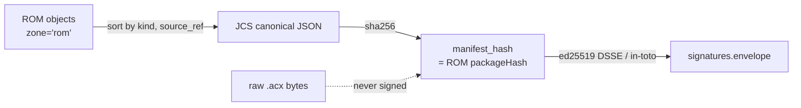

# Container format

An Agent Cartridge (`.acx`) is a **single SQLite database** that brands itself in two header words, carries files in a stock SQLite Archive, and stakes its integrity on a content-addressed object graph — never on the raw database bytes.

This page covers the on-disk format normatively defined in **SPEC §3** and implemented in [`src/container.mjs`](https://github.com/agentibus/agent-cartridge). For how the manifest is signed and how trust is decided, see [signing & trust](signing-trust.md).

## Why one SQLite file

A cartridge is a self-contained, signed harness — the agent-OS image a host boots. Lilian Weng's harness post frames the reason a durable, inspectable container matters at all:

!!! quote "Lilian Weng — *Harness Engineering for Self-Improvement* (2026-07-04)"
    "A harness should not carry the entire workflow and all logs in context; instead, it should keep durable state in files."

SQLite gives that durable state a queryable, transactional, single-file home: skills, knowledge, memory, capabilities, signatures, and attestations all live in one file that `file(1)`, `sqlite3`, and any SQLite binding can open with zero bespoke tooling.

## File identity (§3.1)

Two header words brand every `.acx` and **MUST** be set. Both are plain `PRAGMA`s in [`Cartridge.create`](https://github.com/agentibus/agent-cartridge); the constants live at the top of `src/container.mjs`.

| Header word | `PRAGMA` value | Hex | Header offset | Encoding | Meaning |
|---|---|---|---|---|---|
| `application_id` | `1094932529` | `0x41435831` | **68** (4 bytes, big-endian) | ASCII `A C X 1` = `0x41 0x43 0x58 0x31` | Magic brand; makes `.acx` detectable by `file(1)`/libmagic from a 72-byte range read |
| `user_version` | `16777472` | `0x01000100` | **60** (4 bytes, big-endian) | `[spec_MAJOR][spec_MINOR][vec0_storage_format][flags]` | Version + storage pins |

The `user_version` bytes decode as:

- `spec_MAJOR = 1` — a bump breaks readers.
- `spec_MINOR = 0` — additive changes only.
- `vec0_storage_format = 1` — pins the sqlite-vec on-disk format; an importer whose engine differs **MUST** drop and re-index `vectors` (see [the vec0 deviation](#the-vec0-deviation-scoped) below).
- `flags` — bit0 (`FLAG_SAVE_PRESENT = 0x01`) = SAVE zone present.

`1094932529 < 2^31`, so the signed 32-bit `PRAGMA application_id` accepts it without overflow.

!!! note "`open` rejects anything that isn't ours"
    `Cartridge.open` reads `PRAGMA application_id` and throws unless it equals `0x41435831` — the test `§12.1 Cartridge.open rejects a non-.acx file (wrong application_id)` pins this.

### The magic is real: `file(1)` output

Running stock `file(1)` on the shipped example cartridge (Proof 10 of the [proofs](../proofs.md)):

```console
$ file examples/research-designer.acx
examples/research-designer.acx: SQLite 3.x database, application id 1094932529,
  user version 16777472, last written using SQLite version 3053002, file counter 14,
  database pages 35, cookie 0xa, schema 4, UTF-8, version-valid-for 14
```

No `.acx`-aware tooling is involved — libmagic reads `application id 1094932529` and `user version 16777472` straight from the header offsets above.

## Table schema (§3.2)

The DDL is normative and verbatim. Nine tables carry everything:

```sql
CREATE TABLE cartridge (        -- meta key/value store
  key   TEXT PRIMARY KEY NOT NULL,
  value TEXT NOT NULL
) WITHOUT ROWID;

CREATE TABLE sqlar (            -- EXACT stock SQLite Archive schema
  name TEXT PRIMARY KEY,        -- zone by prefix: 'rom/...' | 'save/...'
  mode INT, mtime INT,
  sz   INT,                     -- sz == length(data) => uncompressed; else Deflate
  data BLOB
);

CREATE TABLE memory (
  id                   TEXT PRIMARY KEY NOT NULL,
  zone                 TEXT NOT NULL CHECK (zone IN ('rom','save')),
  artifact_fingerprint TEXT NOT NULL,
  codebase_fingerprint TEXT,            -- NULL iff zone='rom'
  payload              TEXT NOT NULL,   -- canonical JSON (RFC 8785) of the artifact
  oid                  TEXT NOT NULL,   -- 'sha256:'||hex(sha256(payload))
  created_at           TEXT NOT NULL
) WITHOUT ROWID;
CREATE INDEX memory_zone_fp ON memory(zone, artifact_fingerprint);

CREATE TABLE vectors (         -- derived, NEVER signed, re-indexed on import (see §3.5)
  memory_id            TEXT PRIMARY KEY,
  zone                 TEXT NOT NULL,
  embedding            BLOB NOT NULL,
  artifact_fingerprint TEXT
);

CREATE TABLE objects (         -- content-addressed integrity units
  oid        TEXT PRIMARY KEY NOT NULL,  -- 'sha256:'||hex(sha256(canonical_bytes))
  kind       TEXT NOT NULL CHECK (kind IN ('sqlar','memory','cartridge','skill','attestation')),
  source_ref TEXT NOT NULL,              -- sqlar name | 'memory:'||id | 'cartridge:'||key
  canon      TEXT NOT NULL,              -- 'raw' | 'jcs-rfc8785'
  zone       TEXT NOT NULL CHECK (zone IN ('rom','save')),
  sz         INTEGER NOT NULL
) WITHOUT ROWID;

CREATE TABLE signatures (
  sig_id         TEXT PRIMARY KEY NOT NULL,
  target         TEXT NOT NULL DEFAULT 'rom-manifest',
  manifest_hash  TEXT NOT NULL,          -- 'sha256:...' over ROM objects
  envelope       TEXT NOT NULL,          -- clean DSSE {payloadType,payload,signatures}
  keyid          TEXT NOT NULL,          -- ed25519:<hex>
  public_key_pem TEXT,                   -- SPKI PEM held OUT of the envelope
  alg            TEXT NOT NULL DEFAULT 'ed25519',
  created_at     TEXT NOT NULL
) WITHOUT ROWID;

CREATE TABLE attestations (
  att_id      TEXT PRIMARY KEY NOT NULL,
  type        TEXT NOT NULL,             -- 'openbadge-3.0' | 'vc-2.0' | 'in-toto-provenance'
  subject_oid TEXT,                      -- NULL = whole ROM
  media_type  TEXT NOT NULL,
  document    TEXT NOT NULL,
  status_url  TEXT,
  created_at  TEXT NOT NULL
) WITHOUT ROWID;

CREATE TABLE acx_skill (       -- SPEC §5.3 derived skill index (re-derivable cache)
  sqlar_path     TEXT PRIMARY KEY,       -- authoritative identity: the SKILL.md path
  name           TEXT NOT NULL,
  description    TEXT NOT NULL,
  license        TEXT, compatibility TEXT, skill_version TEXT,
  body_tokens    INTEGER,
  content_sha256 TEXT NOT NULL,
  resources      TEXT NOT NULL,
  ext            TEXT,
  schema_version TEXT NOT NULL
);

CREATE TABLE capabilities (    -- SPEC §6.1 capability records (ROM zone)
  id           TEXT PRIMARY KEY NOT NULL,
  json         TEXT NOT NULL,
  content_hash TEXT NOT NULL
);
```

=== "Meta & files"

    - **`cartridge`** — the meta key/value store. Required keys include `acx.spec_version`, `acx.cartridge_id` (reverse-DNS + uuid), `acx.created_at`, `acx.embedding_engine` (id + dim), `acx.rom_manifest_hash`, `acx.vec0_format`, and the nullable `acx.save_codebase_fingerprint`. See the real dump under [inspect output](#what-inspect-reports).
    - **`sqlar`** — the stock SQLite Archive holding skills, knowledge, and assets as files. Details in [sqlar](#sqlar-skills-and-knowledge-as-files).

=== "Learned state"

    - **`memory`** — one row per learned artifact, partitioned into `rom`/`save` zones with a mandatory `artifact_fingerprint` and a `codebase_fingerprint` that is `NULL` iff the record is ROM. See [memory](memory.md).
    - **`vectors`** — a derived, never-signed embedding index re-built on import. See [the vec0 deviation](#the-vec0-deviation-scoped).

=== "Integrity & claims"

    - **`objects`** — the content-addressed integrity graph (below).
    - **`signatures`** — the DSSE/in-toto envelope over the ROM manifest. See [signing & trust](signing-trust.md).
    - **`attestations`** — level credentials, provenance, Open Badges. See [provable level](../leveling/provable-level.md).

=== "Derived indexes"

    - **`acx_skill`** — a re-derivable index over the `SKILL.md` files in `sqlar`; the sqlar file is authoritative, this table is a cache. See [skills](skills.md).
    - **`capabilities`** — the ROM-zone capability records mapped to A2A AgentCard skills. See [capabilities](capabilities.md).

## `sqlar`: skills and knowledge as files

The `sqlar` table is the **exact stock SQLite Archive schema** — no zone column, no extra fields — so any
SQLite binary can extract it. Zoning is carried entirely by the file-name prefix:
[`zoneOf`](https://github.com/agentibus/agent-cartridge) classifies `rom/…` and `save/…` and rejects any
unprefixed name.

Every stored name is also an extraction-safety boundary: it must be a relative path of at least two
non-empty ASCII segments, start with exactly `rom` or `save`, and use only
`[A-Za-z0-9][A-Za-z0-9._-]{0,127}` per segment. Absolute paths, `.`, `..`, empty segments, backslashes,
NUL, and platform-specific or traversal forms are invalid. `acx spec` checks every live SQLAR row before
a cartridge can be accepted.

- Skills live at `rom/skills/<name>/SKILL.md` with agentskills.io frontmatter.
- Knowledge lives under `rom/knowledge/…`.
- `putFile` Deflate-compresses when it helps, using the stock sqlar convention: `sz == length(data)` means stored uncompressed, otherwise the blob is raw-Deflate. The content-addressed `oid`, though, is always computed over the **uncompressed** bytes (`canon='raw'`), so Deflate nondeterminism never affects integrity.

### Interop: extract skills with stock `sqlite3`

Because `sqlar` is unmodified, a plain `sqlite3` binary lists and extracts the archive. Proof 9 from the [proofs](../proofs.md):

```console
$ sqlite3 examples/research-designer.acx -Ax
rom/skills/expertise-designer/SKILL.md
```

You can list without extracting the same way:

```console
$ sqlite3 examples/research-designer.acx -Atv
?rw-r--r--  564  1970-01-01 00:00:00  rom/skills/expertise-designer/SKILL.md
?rw-r--r--   56  1970-01-01 00:00:00  rom/knowledge/SKILLS.md
```

!!! tip "No cartridge tooling required to read the payload"
    The whole skill/knowledge corpus is portable through 20-year-old, ubiquitous tooling. That is the point of keeping `sqlar` byte-for-byte stock.

## The content-addressed `objects` table

`objects` is the heart of cartridge integrity. Every signable unit — a sqlar file, a memory payload, a cartridge meta value, a skill, an attestation — gets one row whose primary key is its content hash:

```
oid = "sha256:" || hex(sha256(canonical_bytes))
```

The `canon` column records *how* those canonical bytes are derived:

- `canon='raw'` — hash the uncompressed bytes verbatim (sqlar files).
- `canon='jcs-rfc8785'` — hash the RFC 8785 (JCS) canonical JSON of the `payload`/`value` (memory, capabilities, cartridge meta). JCS makes the hash independent of key insertion order (test: `JCS is independent of key insertion order`).

`source_ref` says where the bytes came from (`<sqlar name>` | `memory:<id>` | `cartridge:<key>`), and `zone` mirrors the `rom`/`save` partition. On the shipped example, `inspect` counts 21 ROM objects: `memory:1, cartridge:9, sqlar:11`.

This layer is what makes tampering detectable even through the stock `sqlar` back door: rewriting a `SKILL.md` blob but leaving a stale `objects.oid` is caught as `tampered` (tests `C1: rewriting signed sqlar content with a stale objects.oid is detected as tampered` and Proof 2's *SKILL.md content tamper* case).

## Why the raw database bytes are never signed (§3.3)

!!! warning "The whole-file SHA-256 is not stable and MUST NOT be signed"
    SQLite mutates header and page bytes independently of logical content.

The signed object is the **ROM integrity manifest**, not the file. SQLite rewrites bytes that have nothing to do with your ROM:

- the **file change counter** (offset 24) increments on every unlock-after-write, and **version-valid-for** (offset 92) tracks it;
- the **in-header page count** (offset 28), **first-freelist-trunk-page** (offset 32), and **total-freelist-pages** (offset 36) shift as rows churn — and freelist reuse yields *different physical bytes for identical content*;
- **VACUUM** rewrites every b-tree page and bumps the change counter;
- `SQLITE_VERSION_NUMBER` (offset 96) changes when a different library writes;
- WAL checkpointing reorders pages.

Any SAVE-zone write therefore changes the file digest while the ROM is untouched. So instead of hashing the file, verification:

1. takes every `objects` row where `zone='rom'`,
2. sorts ascending by `(kind, source_ref)` under Unicode codepoint order,
3. emits `[{sourceRef, oid, canon, sz}, …]` and canonicalizes it with RFC 8785 (JCS),
4. sets `manifest_hash = "sha256:" || hex(sha256(that))`.

This is a hash-of-hashes: `manifest_hash` **is** the ROM `packageHash` that the DSSE envelope signs. Verification recomputes each `oid` from `source_ref` + `canon`, rebuilds the manifest, and checks the signature — fully independent of container byte layout. In the smoke run the ROM manifest hash is:

```text
rom_manifest_hash: sha256:1726cf1e6025c166e06dc839a5cbae6c900f0ffa3e0b1235be8b78e88ee09943
```



### Strip-to-ROM: the machine-checkable proof (§3.4) { #strip-to-rom }

Because integrity is anchored to the manifest, you can *prove* field learning never touched the ROM. Strip-to-ROM re-export deletes the SAVE partition and re-exports:

```sql
DELETE FROM memory  WHERE zone='save';
DELETE FROM sqlar   WHERE name GLOB 'save/*';
DELETE FROM vectors WHERE zone='save';
DELETE FROM objects WHERE zone='save';
-- clear acx.save_codebase_fingerprint; clear flags bit0; VACUUM;
```

The recomputed `manifest_hash` **MUST** equal the original signed hash, and the existing `signatures` row **MUST** re-verify unchanged. That hash equality is the proof — Proof 7:

```text
rom hash before strip: sha256:f479be021b8ea2e55cc6e3e33b95df9d151196548dfc854dedbe578be7120642
rom hash after  strip: sha256:f479be021b8ea2e55cc6e3e33b95df9d151196548dfc854dedbe578be7120642
hash-equality proof:   EQUAL (ROM intact; SAVE removed)
```

(Test: `§3.4 strip-to-ROM: manifest hash equal when only SAVE rows are removed`.)

## What `inspect` reports

The CLI reads the same tables described here. Proof 5's `inspect` on a freshly exported cartridge:

```text
== meta ==
  acx.cartridge_id = io.github.agentibus/scenario-research-designer@025edd67-...
  acx.embedding_engine = {"id":"local-hash-128","dim":128}
  acx.rom_manifest_hash = sha256:f479be021b8ea2e55cc6e3e33b95df9d151196548dfc854dedbe578be7120642
  acx.vec0_format = 1
== ROM objects ==
  total: 21  (memory:1, cartridge:9, sqlar:11)
== skills (acx_skill) ==
  - expertise-designer: Specialized designer expertise on research, ux, benchmarking...
== capabilities ==
  - implement-feature[pkg:generic/benchmarking+pkg:generic/research+pkg:generic/ux]  verified=false
  - build-dag[pkg:generic/snowflake+pkg:pypi/apache-airflow+pkg:pypi/dbt-core]  verified=false
```

!!! note "`io.github.agentibus` is an illustrative handle"
    Publisher ids in these examples are demonstration handles, not real organizations.

## The vec0 deviation (scoped)

!!! warning "Reference implementation deviates from the normative DDL here — honestly"
    SPEC §3.2 declares `vectors` as a `vec0` **virtual table**:

    ```sql
    CREATE VIRTUAL TABLE vectors USING vec0(
      memory_id TEXT PRIMARY KEY,
      zone TEXT partition key,
      embedding float[384] distance_metric=cosine,   -- dim is a TEMPLATE (§3.5)
      +artifact_fingerprint TEXT
    );
    ```

    The zero-dependency reference implementation (Node ≥ 22.5.0 builtin `node:sqlite`) **cannot load the sqlite-vec extension**, so it uses a plain, derived `vectors` table instead (see the constant comment in `src/container.mjs`).

This is safe *by construction*, not by luck: the spec (§3.5, §7.6) declares `vectors` **derived, never signed, and always re-indexed on import**, so the concrete storage engine is a local materialization detail that cannot affect ROM integrity. The `embedding float[384]` dimension is likewise a **template** — the real dimension comes from `acx.embedding_engine.dim` (here `128`, engine `local-hash-128`), not the literal in the DDL.

Production hosts SHOULD template `CREATE VIRTUAL TABLE vectors USING vec0(...)` from `acx.embedding_engine.dim`. **`vec0` is specified; the vector engine is host-side** — it is not exercised by the reference implementation today.

## Related pages

- [Signing & trust](signing-trust.md) — the DSSE/in-toto envelope over `manifest_hash`, keyids, and the `local/trusted/portable/legacy/tampered` taxonomy.
- [Skills](skills.md) — the `sqlar` `SKILL.md` layout and the `acx_skill` index.
- [Capabilities](capabilities.md) — the `capabilities` table and A2A AgentCard mapping.
- [Memory](memory.md) — the `memory`/`vectors` zoning, fingerprints, and scrub gate.
- [Proofs](../proofs.md) — the verbatim transcript these examples are drawn from.
