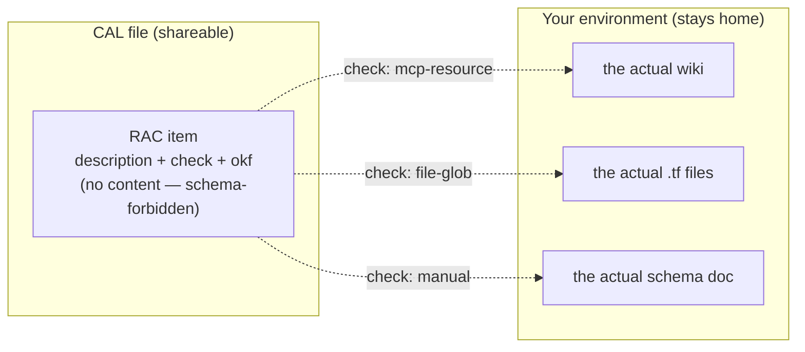
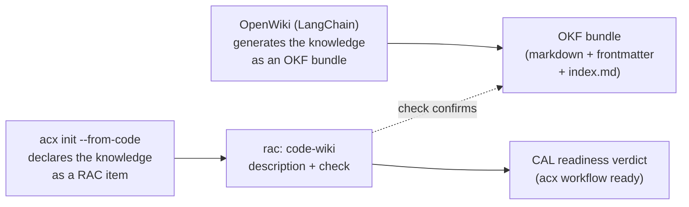

# Required context & the Open Knowledge Format

RAC — **Required Available Context** — is how a [conditional agentic loop](loops-cal.md) declares the knowledge that must exist before agents run: always a *description* of that knowledge (an LLM wiki, a Terraform-described architecture, an API spec), **never the content itself** — a rule the [Open Knowledge Format](https://github.com/GoogleCloudPlatform/knowledge-catalog/tree/main/okf) states as its own central premise, which is why the two compose cleanly.

The data model is `$defs.racItem` in `schemas/cal.schema.json`; the enforcement and the readiness checklist live in `src/cal.mjs`.

## What a RAC item is

A CAL connects multiple cartridges into a process, and its tasks assume things about the world: *there is a wiki describing this codebase*, *the infrastructure is described by Terraform*, *the warehouse schema is documented somewhere*. A RAC item makes each assumption explicit, checkable, and portable:

```json
{
  "id": "infra-arch",
  "kind": "terraform",
  "required": true,
  "description": "Terraform modules describing the network + IAM architecture (structure only, not the .tf contents).",
  "check": { "type": "file-glob", "hint": "infra/**/*.tf" }
}
```

*(from the shipped sample,
`registry/cals/io.github.lboel/ship-a-feature/1.0.0.cal.json`)*

| Field | Type | Meaning |
|---|---|---|
| `id` | string (required) | Referenced by task nodes via `requires.rac: ["infra-arch"]` and by edge conditions via `{"racAvailable": "infra-arch"}` |
| `kind` | enum (required) | What sort of knowledge this is — see the table below |
| `description` | string (required) | Human/agent-readable statement of the knowledge that must be present |
| `required` | boolean, default `true` | Optional items render as `·` instead of `□` in the readiness checklist and don't block |
| `check` | object | *How to confirm* availability: `{type, hint}` |
| `okf` | object | Optional [Open Knowledge Format](#the-open-knowledge-format) descriptor of the required knowledge artifact — metadata only |

There is deliberately **no `content` field** — the schema forbids one outright:

```json
"not": { "required": ["content"] }
```

and the linter in `src/cal.mjs` enforces the same invariant at validation time:

```js
if ('content' in r) issues.push(`rac ${r.id} MUST NOT carry content — description only`)
```

### RAC kinds

| `kind` | Describes | Example description |
|---|---|---|
| `wiki` | An LLM-readable knowledge map of a codebase | "modules, data flows, conventions (structure only)" |
| `code-map` | A structural index of source layout | "which packages own which domains" |
| `infra` | Infrastructure/environment knowledge | "the staging cluster topology" |
| `terraform` | Architecture as described *by* Terraform | "network + IAM structure, not the `.tf` contents" |
| `api-spec` | An interface contract | "target warehouse schema — table names + grains, not the data" |
| `dataset` | Knowledge *about* a dataset | "row grain, refresh cadence, known quality caveats" |
| `runbook` | Operational procedure knowledge | "the incident escalation runbook exists and is current" |
| `custom` | Anything else | — |

### Check types

The `check` object says how a host (or a human) confirms the described knowledge is actually available. It verifies *presence*, not content:

| `check.type` | Confirmed by | `hint` example |
|---|---|---|
| `file-glob` | Files matching a glob exist | `infra/**/*.tf` |
| `url` | A URL resolves | `https://wiki.internal/project` |
| `mcp-resource` | An MCP resource is served | `wiki://project/overview` |
| `manual` | A human says so | `confirm the DE team shared the schema doc` |

## Why descriptions only

!!! note "The invariant, in one sentence"
    A CAL file, a cartridge, and everything they carry must remain safe to publish — so the knowledge a process *needs* is declared by reference and description, and the knowledge itself stays wherever it lives.

Three reasons, each load-bearing:

1. **Portability.** A CAL that embedded a wiki dump or `.tf` files would only be valid for one repo at one moment. A CAL that *describes* the required knowledge ("Terraform describing the network + IAM architecture") is reusable across any environment that can satisfy the check.
2. **Safety / no data exfiltration.** RAC items travel inside CAL files and alongside cartridges designed
   to be shared. Descriptions of infrastructure can travel; the infrastructure code itself cannot. This
   is the same posture as the [memory partition](memory.md)'s fail-closed scrub gate: the export path
   refuses to ship secrets, and the RAC schema refuses to even have a place to put them.
3. **The open-envelope principle.** The standard keeps the descriptive layer fully open while protected
   knowledge remains in its authoritative environment (SPEC §1, goal 5). RAC sits squarely in that
   descriptive layer: reading a CAL tells you *what knowledge a process needs* without leaking *what
   anyone knows*. ACX does not define payment or entitlement semantics.

The same boundary, drawn as a picture:



### RAC vs transferable memory

RAC and the [memory partition](memory.md) answer complementary questions:

| | Transferable memory (`portable: true`) | Required Available Context (RAC) |
|---|---|---|
| Lives | *Inside* the cartridge (ROM zone) | *Inside* the CAL, as a declaration |
| Content | Yes — codebase-agnostic lessons, scrub-gated on export | **Never** — description only |
| Question answered | "What does this agent know everywhere?" | "What must the environment know for this process to run?" |
| Guard | Scrub gate + `portable`/`codebaseFingerprint` invariants | `not: {required: ["content"]}` + linter |

An agent's field-learned, repo-specific memory (`portable: false`) is quarantined behind a fingerprint match and stripped on ROM export — which is exactly *why* RAC exists: the repo-specific knowledge a process depends on cannot ride along in the cartridge, so the CAL declares it as required external context instead.

## The readiness checklist, live

`acx workflow ready` validates the structure, resolves participants, and prints the RAC checklist. The
checklist shape from the shipped sample looks like this (`acx cal` is the compatibility alias; the final
readiness verdict depends on the receiving roster's resolved proofs):

```console
$ node --experimental-sqlite src/cli.mjs cal \
    registry/cals/io.github.lboel/ship-a-feature/1.0.0.cal.json \
    --cartridges registry/cartridges
CAL: Ship a data-pipeline feature  (5 nodes, 3 participants)
...
Required Available Context (RAC — descriptions only, confirm before running):
  □ infra-arch       [terraform] Terraform modules describing the network + IAM architecture (structure only, not the .tf contents).  (check: file-glob infra/**/*.tf)
  □ code-wiki        [wiki] An LLM-readable wiki / knowledge map of the codebase: modules, data flows, conventions.  (check: mcp-resource wiki://project/overview)
  · warehouse-schema [api-spec] A description of the target Snowflake warehouse schema (table names + grains, not the data).  (check: manual confirm the DE team shared the schema doc)
```

`□` marks required items; `·` marks optional ones (`required: false`). Tasks reference these by id (`requires: {rac: ["infra-arch", "code-wiki"]}`), and edge conditions can branch on availability with the structured condition `{"racAvailable": "warehouse-schema"}` — no expression eval anywhere. The full node/edge/participant model is on the [conditional agentic loops](loops-cal.md) page.

## The Open Knowledge Format

The [Open Knowledge Format (OKF)](https://cloud.google.com/blog/products/data-analytics/how-the-open-knowledge-format-can-improve-data-sharing) is an open, vendor-neutral specification (v0.1, published by Google Cloud in the `GoogleCloudPlatform/knowledge-catalog` repo) for the exact problem RAC dances around: organizational knowledge — schemas, metric definitions, runbooks, deprecation notices — scattered across catalogs, wikis, and heads, unreachable by agents. Its design principles are "just markdown, just files, just YAML frontmatter": no SDK, no account, no backend.

OKF v0.1 in brief:

- A **Knowledge Bundle** is "a self-contained, hierarchical collection of knowledge documents" — a directory tree of markdown files, the unit of distribution.
- A **Concept** is one unit of knowledge, one markdown document; its **Concept ID** is the file's bundle-relative path minus `.md` — *path = identity*.
- Reserved filenames: `index.md` (a per-directory listing enabling progressive disclosure — agents navigate one level at a time) and `log.md` (chronological update history).
- Frontmatter: `type` is **required** (a short non-empty string; conformance = every non-reserved `.md` has valid frontmatter with a non-empty `type`); `title`, `description`, `resource` (URI of the underlying asset), `tags`, `timestamp` are optional.
- Concepts cross-link with ordinary markdown links; consumers **must tolerate broken links**. The links form a knowledge graph.

!!! tip "The shared premise"
    OKF's central rule is that a bundle carries **metadata and context about** data and systems — never the raw data itself. That is the RAC invariant, arrived at independently and turned into a portable file format. A RAC item and an OKF concept are two views of the same discipline: describe the knowledge, don't ship it.

### The `rac.okf` field

Every RAC item may carry an `okf` object — in the current schema a free-form object documented as an "optional Open Knowledge Format descriptor of the required knowledge artifact (metadata only)". The natural convention is to mirror OKF frontmatter, in one of two shapes:

=== "Embedded descriptor"

    Inline OKF frontmatter for the one concept the RAC item describes. `type` maps naturally from the RAC `kind`; `resource` names the same asset the `check` verifies.

    ```json
    {
      "id": "code-wiki",
      "kind": "wiki",
      "description": "An LLM-readable wiki / knowledge map of the codebase.",
      "check": { "type": "mcp-resource", "hint": "wiki://project/overview" },
      "okf": {
        "type": "Code Wiki",
        "title": "Project knowledge map",
        "description": "LLM-readable knowledge map of the codebase",
        "tags": ["codebase"]
      }
    }
    ```

=== "Bundle reference"

    Point at an existing OKF bundle instead of embedding — a bundle root plus an optional **Concept ID** (bundle-relative path, no `.md`):

    ```json
    {
      "id": "warehouse-schema",
      "kind": "api-spec",
      "description": "Description of the target warehouse schema.",
      "okf": {
        "bundle": "https://github.com/acme/data-wiki",
        "concept": "warehouse/orders"
      }
    }
    ```

The RAC `description` stays authoritative for the CAL; `okf.description` is the interoperable copy for OKF tooling. And because an OKF descriptor is metadata-only *by definition*, attaching one can never violate the no-content rule — the schema's `not: {required: ["content"]}` applies to the item regardless.

Suggested `kind` → `okf.type` mapping:

| RAC `kind` | `okf.type` (illustrative) |
|---|---|
| `wiki` / `code-map` | `Code Wiki` |
| `terraform` / `infra` | `Terraform Module` |
| `api-spec` | `API` |
| `dataset` | `Dataset` |
| `runbook` | `Runbook` |

!!! warning "Scope honesty"
    Today `okf` is validated only as *an object* — the shapes above are a documented convention, not schema-enforced. No OKF import/export command exists in the reference implementation. What **is** implemented and tested: the descriptions-only invariant (schema + linter), the `acx workflow ready` readiness checklist, and the `--from-code` generator below.

### Where OKF meets `acx init --from-code`

[LangChain's OpenWiki](https://langchain.com/blog/openwiki-0-2-adds-okf-support) is an open-source CLI that generates and maintains an LLM-readable wiki for a codebase; version 0.2 adopted OKF as its output convention — frontmatter on every page, generated per-directory `index.md` summaries, a changelog. The stated benefit is that OKF's hierarchy and index files make large wikis navigable by agents while reducing token consumption.

`acx init --from-code` (see [generating an agent set](../lifecycle/init-agent-set.md)) sits on the *other* side of the same handshake. It analyzes a codebase — heuristically, with **no LLM involved** (`package.json` dependencies, `*.tf` files, Dockerfile/CI, test layout, python markers, `SECURITY.md`) — and generates an agent set, a CAL, and RAC items *describing* the code knowledge the loop will need. Dogfooded on this very repository:

```console
$ node --experimental-sqlite src/cli.mjs init --from-code . --out /tmp/agentset
Analyzed .
Generated an agent set in /tmp/agentset:
  • backend_dev      caps=implement-feature  (node package.json present)
  • devops_engineer  caps=deploy  (Dockerfile / CI workflows)
  • qa_engineer      caps=test-authoring  (test files/dir)
Required Available Context (descriptions only):
  □ code-wiki      [wiki] An LLM-readable knowledge map / wiki of the codebase: modules, data flows, conventions (structure only).
```

That `code-wiki` RAC item describes precisely the artifact OpenWiki produces. The division of labor:



One tool *produces* codebase knowledge in an open format; the other *declares and verifies* that such knowledge is required and present. Neither ships the knowledge inside the process definition — both formats forbid it by design.

!!! example "Honest scope of the generator"
    `--from-code` is a scaffold: the role detection is heuristic, the generated task actions read `TODO: <role> step`, and the README it writes tells you to fill in each package, export it to a signed cartridge, and re-run `acx workflow ready` for the readiness verdict. It gets the *structure* right so you only fill in the specifics — it does not pretend to understand your codebase.

### Cartridge knowledge as an OKF bundle

A cartridge's transferable memory records already carry OKF-shaped metadata — `title`, `summary`, `tags`, `timestamp`, `sourceType` (see [memory](memory.md)). Mapping them to an OKF bundle is mechanical: one concept file per `portable: true` record (frontmatter `type` from `sourceType`, `description` from `summary`), `index.md` per topic group, `log.md` from the record timeline — while `portable: false` records stay out, exactly as the memory partition's quarantine rule already demands. **No such `acx export --okf` command exists today**; the point is that the two formats' invariants compose without friction, because both were built on *describe, don't ship*.

## Related pages

- [Conditional agentic loops](loops-cal.md) — the full CAL model that RAC items live in: participants, nodes, structured conditions, the per-cartridge skill set.
- [Generating an agent set from code](../lifecycle/init-agent-set.md) — `acx init` and `--from-code` end to end.
- [Memory partition](memory.md) — transferable vs field-learned memory, the scrub gate, the fingerprint.
- [Capabilities](capabilities.md) — the open descriptive layer and independently verified evidence that
  RAC's placement follows.
