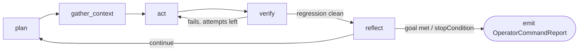

# Loop & context policy

A cartridge carries its agentic loop, its context management, and its guardrails as **one signed JSON document in ROM** — turning what used to be hardcoded harness code into portable, verifiable data.

`.acx` block **Loop** — [SPEC §9](../reference/schemas.md). Schema: [`loop-policy-context-policy.schema.json`](../reference/schemas.md).

## Why this block exists

Most agent frameworks bury the loop shape, the retrieval strategy, and the guardrails in the host's source code. AGENTIBUS, the reference host this standard grew out of, computed them in a hardcoded `buildMissionRules()` plus routing and guardrail-derivation TypeScript. That means the *behavior* of an agent could not travel with the agent — only its weights and prompt could.

The Loop + Context Policy block makes that behavior a first-class, signed asset. Per [SPEC §9.1](../reference/schemas.md), turning this logic into data is a hard requirement:

!!! quote "SPEC §9.1"
    This turns hardcoded `buildMissionRules()`/routing/guardrail TypeScript into data; hosts **MUST** evaluate it as data without recompilation.

This is the concrete payoff of framing a cartridge as a **self-contained, signed harness**. Lilian Weng, in *"Harness Engineering for Self-Improvement"* (2026-07-04), defines a harness as:

!!! quote "Lilian Weng — Harness Engineering for Self-Improvement"
    the system surrounding a base model that orchestrates execution and decides how the model thinks and plans, calls tools and acts, perceives and manages context, stores artifacts, and evaluates results

That sentence is a near-exact table of contents for this block: *plans* → `loop.cycle`, *calls tools and acts* → `loop.subAgents` + `rules`, *perceives and manages context* → `context`, *stores artifacts* → `memoryFiles`/`playbook`, *evaluates results* → `verification`. Weng's thesis — that "the layer between the raw model and the real-world context seems to be as important as the model's raw intelligence" — is exactly why this layer is worth signing and shipping.

## Location & integrity

Every cartridge **MUST** carry exactly one policy document ([SPEC §9.1](../reference/schemas.md)):

| Property | Value |
| --- | --- |
| sqlar name | `rom/policy/loop-context-policy.json` |
| media type | `application/vnd.acx.loop-context-policy.v1+json` |
| zone | **ROM** (signed, immutable, shareable) |
| declared | `schemaVersion: "acx.loop-context-policy/1"` |
| field-learned overlay | `save/policy/rule-overlay.json` (**SAVE** zone) |

Because it lives in ROM, it is listed in the content-addressed `checksum.sha256` manifest and covered by the cartridge's detached DSSE/ed25519 signature — the same mechanism documented in [signing & trust](signing-trust.md). Hosts **MUST NOT** mutate it at runtime; any field-learned rule additions go to the SAVE-zone overlay, never back into ROM. That immutability is not decorative — the tamper proofs show that any byte change to a signed ROM object is caught:

```text title="proofs-transcript.txt — PROOF 2 (excerpt)"
verify (objects.oid tamper): invalid / tampered - ROM content diverges from signed manifest (object hash mismatch).
verify (SKILL.md content tamper, oid stale): invalid / tampered - ROM content diverges from signed manifest (object hash mismatch).
```

The same guarantee covers the policy JSON: you cannot quietly widen `maxTurns` or delete a `MissionRule` from a signed cartridge without flipping its trust status to `tampered`. A document with an unrecognized `schemaVersion` **MUST** be rejected.

!!! warning "Reference-implementation honesty"
    The reference implementation carries, signs, and hash-verifies this document like any other ROM object. A **loop-policy *evaluator*** — the runtime that reads `cycle`, drives `stopConditions`, and enforces `budget` — is **specified normatively but not shipped** in the zero-dependency reference impl. Treat the runtime semantics below as "specified; host-side."

## The loop (`loop`)

`loop` declares the agentic loop shape. Required keys: `maxTurns`, `cycle`, `stopConditions`.

### Fields

- **`maxTurns`** (integer ≥ 1, REQUIRED) — hard turn ceiling; maps 1:1 to the Claude Agent SDK `maxTurns`.
- **`cycle`** (REQUIRED, ≥ 1) — an ordered subset of the canonical phases. In v1 the vocabulary is `["gather_context","act","verify"]` — the "gather context → take action → verify work → repeat" loop. `verify` SHOULD be present; a cartridge that omits it **MUST** justify itself in `hints`.
- **`verification`** — the smallest valid check to run before every commit or handoff: `{ commands[], maxAttempts, scope, passIntent, blockOnFailure }`. `scope ∈ {touched, all}`. **`passIntent` is prose intent** (`"lint+types+touched tests green"`), never a scored threshold — scored acceptance belongs to the [provable-level protocol](../leveling/provable-level.md).
- **`stopConditions`** (REQUIRED, ≥ 1) — `{ when, action }` pairs. `when ∈ {completed, pr_ready, blocked, max_turns, guardrail_stop, budget_exhausted, needs_input}`; `action ∈ {stop, handoff, await_human, report_continue}`. `guardrail_stop` fires on a `MissionGuardrailSignal` of kind `stop`; `blocked` on kind `blocked`.
- **`handoff`** — `{ emits: "OperatorCommandReport", returnWindows[] }` with `returnWindows ⊆ {phase_exit, blocker, pr_ready, ambiguity, destructive_change}`. On any terminating condition whose `action ∈ {handoff, await_human}`, the loop **MUST** emit exactly one `OperatorCommandReport` (see [outcome contract](#rules-outcome-contract-verbatim)).
- **`subAgents`** — reuses the Agent SDK `AgentDefinition` triple as `{ id, description, promptRef, tools[], maxTurns?, retrieval?, contextReturnBudgetTokens?, concurrency }`.

### The cycle, as a diagram



The dashed `plan` and `reflect` phases are the **v1.1** additions ([below](#harness-alignment)); v1 cartridges run `gather_context → act → verify`.

### Sub-agents, and the cost of parallelism

`subAgents` make delegation portable. Two rules keep fan-out safe:

1. Each sub-agent **MUST** return a single condensed summary; `contextReturnBudgetTokens` SHOULD default to 1000–2000 so a delegate cannot flood the parent window.
2. Per Cognition's principle that *"Actions carry implicit decisions,"* any sub-agent that **writes** or makes design decisions **MUST** default `concurrency: "single_threaded"`. Only read-only fan-out (search, review) **MAY** set `parallel`.

That maps directly onto Weng's Pattern 3 for parallelism:

!!! quote "Lilian Weng — Harness Engineering for Self-Improvement"
    make parallelism explicit and inspectable

=== "loop"

    ```json
    {
      "loop": {
        "maxTurns": 40,
        "cycle": ["gather_context", "act", "verify"],
        "verification": {
          "commands": ["npm run lint", "npm run typecheck", "npm test -- --changed"],
          "maxAttempts": 3,
          "scope": "touched",
          "passIntent": "lint+types+touched tests green",
          "blockOnFailure": true
        },
        "stopConditions": [
          { "when": "completed", "action": "stop" },
          { "when": "pr_ready", "action": "handoff" },
          { "when": "blocked", "action": "await_human" },
          { "when": "max_turns", "action": "report_continue" },
          { "when": "budget_exhausted", "action": "handoff" }
        ],
        "handoff": {
          "emits": "OperatorCommandReport",
          "returnWindows": ["pr_ready", "blocker", "destructive_change"]
        },
        "subAgents": [
          {
            "id": "codebase-searcher",
            "description": "Read-only search across the repo for call sites.",
            "promptRef": "rom/skills/expertise-designer/SKILL.md",
            "tools": ["acx:search"],
            "contextReturnBudgetTokens": 1500,
            "concurrency": "parallel"
          }
        ]
      }
    }
    ```

=== "context"

    ```json
    {
      "context": {
        "retrieval": "just_in_time",
        "identifierKinds": ["file_path", "stored_query", "symbol", "memory_ref"],
        "compaction": {
          "preserve": ["architectural_decisions", "unresolved_bugs", "user_intent", "task_state"],
          "discard": ["redundant_output", "tool_output"],
          "targetTokenBudget": 60000
        },
        "toolResultTruncation": { "maxTokens": 4000, "keepLastN": 3, "headBytes": 2048, "tailBytes": 1024 },
        "memoryFiles": ["save/notes/CLAUDE.md"],
        "embeddingEngineId": "local-hash-128"
      }
    }
    ```

=== "rules + budget"

    ```json
    {
      "rules": [
        {
          "id": "ask-before-destructive",
          "category": "checkpoint",
          "title": "Confirm destructive changes",
          "trigger": "about to delete files or drop tables",
          "action": "emit a checkpoint MissionGuardrailSignal and await_human",
          "severity": "critical"
        }
      ],
      "guardrailContract": {
        "signalKinds": ["milestone", "checkpoint", "question", "blocked", "stop"],
        "outcomeReport": "OperatorCommandReport"
      },
      "budget": {
        "tokenSpend": { "dailyPerProject": 5000000, "dailyPerAgent": 1000000, "dailyGlobal": 20000000 },
        "concurrency": { "maxCommandsPerStation": 2, "maxStationsPerProject": 8, "maxGlobalInFlightCommands": 16 },
        "timeouts": { "defaultCommandSec": 900, "maxCommandSec": 3600 },
        "killSwitch": { "enabled": false, "reason": null }
      }
    }
    ```

## Context (`context`)

The context block encodes *how the agent perceives and manages context* as declarable, portable knobs.

- **`retrieval`** (REQUIRED) — `just_in_time | preload | hybrid`. `just_in_time` keeps lightweight identifiers (file paths, stored queries, links) and loads at runtime; `preload` front-loads a `preload[]` list; `hybrid` combines both.
- **`identifierKinds`** — for `just_in_time`, the permitted identifier kinds `{file_path, stored_query, web_link, memory_ref, symbol}`.
- **`compaction`** — expressed strictly as **intent**: `{ preserve[], discard[], targetTokenBudget }` over the fixed `ContextCategory` vocabulary (`architectural_decisions`, `unresolved_bugs`, `implementation_details`, `user_intent`, `task_state`, `tool_output`, `redundant_output`, `file_contents`). `targetTokenBudget` is a *target, not a trigger*. The cartridge **MUST NOT** specify a summarization algorithm — that is model-specific and lives in [`hints`](#budget-defaults-the-hints-escape-hatch).
- **`toolResultTruncation`** — intent knobs `{ maxTokens?, keepLastN?, headBytes?, tailBytes? }`; **MUST NOT** reference any vendor strategy identifier.
- **`memoryFiles`** — CLAUDE.md-style note-taking references that persist state outside the window.
- **`embeddingEngineId`** (REQUIRED) — reuses the manifest `vectorEngine` pattern. Consumers **MUST** re-index against their own engine and **MUST NOT** trust foreign vectors; the JSON [memory](memory.md) baseline is always authoritative.

`memoryFiles` is the standard's answer to Weng's durable-state rule, which is why memory lives in files rather than in a giant rolling transcript:

!!! quote "Lilian Weng — Harness Engineering for Self-Improvement"
    A harness should not carry the entire workflow and all logs in context; instead, it should keep durable state in files.

!!! note "Compaction is intent, not algorithm"
    `preserve`/`discard`/`targetTokenBudget` tell a host *what matters*, not *how to summarize*. Any host may map that intent onto its own compaction mechanism — but that mapping is non-portable and stays in `hints` (§9.5). This split is deliberate: the interface is standard, the mechanism is disposable.

## Rules & outcome contract (verbatim)

These are reused **verbatim** from AGENTIBUS so a cartridge and its host speak the same guardrail dialect with no translation.

- **`rules`** — `MissionRule[]`: `{ id, category, title, trigger, action, severity }`, with `category ∈ {question,checkpoint,devtools,quality,coordination}` and `severity ∈ {info,warn,critical}`. This is the declarative form of the former hardcoded rules — hosts evaluate `trigger` → `action` as data. The full 6-field interface (including `title`) is kept intact; dropping a field would fork the schema.
- **`guardrailContract.signalKinds`** — the emittable `MissionGuardrailSignal` kinds: `milestone | checkpoint | question | blocked | stop`.
- **`guardrailContract.outcomeReport`** — **MUST** be `"OperatorCommandReport"`. The loop's terminal outcome **MUST** conform verbatim: `outcome ∈ {progressed, completed, blocked, handoff, needs-input}`, plus `quality`, `confidence`, `artifacts[]`, `learnings[]`, `blockers[]`, `nextAction`, `recommendedFollowUp`, `userAttentionRequired`.

## Budget defaults & the `hints` escape hatch

- **`budget`** (OPTIONAL) — reuses `ResourceLimits` **verbatim** (`tokenSpend`, `concurrency`, `timeouts`, `killSwitch`). It supplies cartridge-authored **defaults only**. At runtime the host's `meta/game/resource-limits.yaml` **MUST** take precedence; enforcement order is **host policy > cartridge default**, so a shared cartridge can never *raise* a consuming org's ceilings.
- **`hints`** — an opaque, model-specific escape hatch. Hosts **MUST** be able to **ignore every field under `hints` and still run a conformant loop**, and nothing under `hints` may alter the outcome contract above.

!!! danger "What is quarantined to `hints` — and why"
    The following **MUST** appear only under `hints`, never as normative loop fields: reasoning/`effort` scales; KV-cache / prefix-stability signals; the summarization algorithm; and any vendor context-editing strategy identifier or its numeric token triggers — e.g. Anthropic `clear_tool_uses_20250919`, `compact_20260112`, or the beta header `context-management-2025-06-27`. These are volatile and vendor-specific; pinning them into the normative surface would make a cartridge stop being portable the moment a vendor bumps a date.

This split is directly warranted by Weng's forecast:

!!! quote "Lilian Weng — Harness Engineering for Self-Improvement"
    many harness improvements will be internalized into core model behavior, but the interface with external context and tools should remain

The durable *interface* (retrieval strategy, compaction intent, stop conditions, outcome contract) is normative; the *mechanics* that models will eventually internalize stay in the ignorable `hints{}`.

## v1.1 harness alignment (§9.6) { #harness-alignment }

[SPEC §9.6](../reference/schemas.md) is **informative and additive**: v1.1 introduces new fields that a v1 reader safely ignores (unknown keys are dropped), and a cartridge that uses them declares `schemaVersion: "acx.loop-context-policy/1.1"`. Each field traces to a specific idea in Weng's post.

- **`loop.cycle` MAY add `plan` and `reflect`** — matching her canonical loop:

    !!! quote "Lilian Weng — Harness Engineering for Self-Improvement"
        plan, execute, observe/test, improve, and execute again until the goal is achieved

- **`loop.verification.regression` `{ heldInSuite, heldOutSuite, acceptIf }`** — encodes her acceptance rule verbatim:

    !!! quote "Lilian Weng — Harness Engineering for Self-Improvement"
        Candidates are accepted only if they have no regression on both held-in and held-out data.

    This is the **same criterion the provable-level protocol enforces cryptographically**. Where the loop policy *states* the held-in/held-out rule as configuration, [§10 / the provable level](../leveling/provable-level.md) turns it into a signed, revocable credential by re-running the pinned ROM on a **sealed held-out slice**:

    ```text title="proofs-transcript.txt — PROOF 3 (excerpt)"
    benchmark acx-bench-dag-de@2026.07.1: 160 tasks, held-out slice digest sha256:d16bf83a37c399775…
    strong agent (competence 33): ISSUED ✅  | mu=33.03 sigma=1.232 games=90 passRate=60% R=29.34 => acxLevel=29 tier=principal
    anti-transplant — VC on mutated ROM: REJECTED ✅ [ 'ROM digest binding mismatch' ]
    ```

    A cartridge *declares* "accept only with no held-out regression"; the level protocol *proves* the agent meets it and binds that proof to the ROM digest `sha256:1726cf1e…09943`.

- **`context.playbook` `{ store, entryShape }`** — gives the ACE "evolving playbook" its structured, itemized `(id, description)` form, distinct from prose `memoryFiles`.
- **`observability` `{ tracer, decisionLog, pillars }`** — exposes component / experience / decision observability so runs are inspectable; ties to the host audit log.
- **`loop.subAgents[].mode` `{ sync | backend }`** — adds a monitorable long-running job lifecycle, the machinery behind "make parallelism explicit and inspectable."

### Concept → ACX field → disposition

| Weng / harness concept | ACX policy field | Disposition |
| --- | --- | --- |
| Harness = the layer around the model | the whole signed policy doc | **adopt** — made portable & signable |
| Loop: plan, execute, observe/test, improve | `loop.cycle` (+ `plan`, `reflect` in v1.1) | **adopt** |
| Smallest valid verification before commit | `loop.verification` | **adopt** |
| Accept only if no regression on held-in **and** held-out | `loop.verification.regression` | **validate** — cryptographically enforced by [§10 level](../leveling/provable-level.md) |
| Keep durable state in files, not context | `context.memoryFiles`, `context.playbook` | **adopt** |
| Manage/perceive context | `context.retrieval` / `compaction` / `toolResultTruncation` | **adopt** (intent only) |
| Make parallelism explicit and inspectable | `loop.subAgents[].concurrency` + `.mode` | **adopt** |
| Component / experience / decision observability | `observability` | **adopt** |
| Reasoning effort, KV-cache, summarization algo, vendor context-editing | `hints{}` | **hints** — opaque, ignorable, non-portable |
| Improvements internalized into the model | (nothing — deliberately excluded) | **hints** / out of scope |

!!! tip "The one-line summary"
    A cartridge *declares* its harness; the trust layer *signs* it; the level protocol *proves* the one claim (held-out regression acceptance) that actually needs proving. Everything vendor-specific is quarantined where a host can ignore it.

## Related

- [Signing & trust](signing-trust.md) — how this document is covered by the DSSE/ed25519 signature.
- [Harness requirements](harness-requirements.md) — the tool-roles and handshake a host must satisfy to *run* this loop.
- [Memory partition](memory.md) — the JSON baseline and vectors that `context.embeddingEngineId` re-indexes.
- [Provable level](../leveling/provable-level.md) — the cryptographic form of `verification.regression`.
- [Proofs](../proofs.md) — the verbatim transcript quoted above.
- SPEC §9 & §9.6 — the normative text and the harness-alignment rationale.
