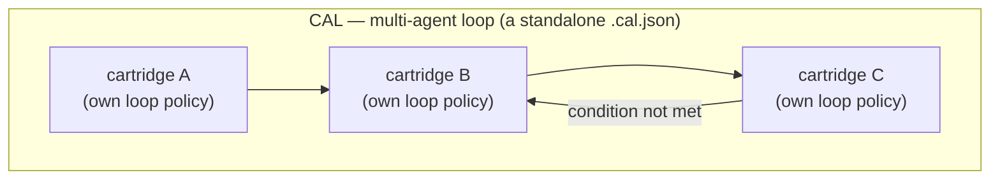
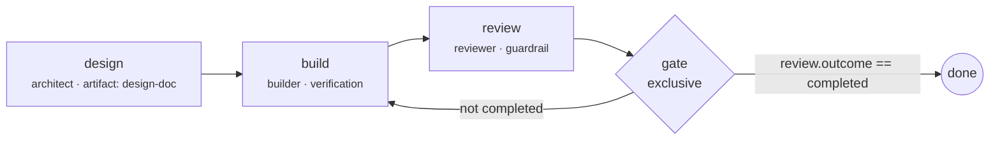

# Loop engineering: conditional agentic loops

A **CAL (Conditional Agentic Loop)** is a signed, BPMN-like process document that connects **multiple cartridges** — each referenced by content hash or staffed into a role slot — and declares who may do what, when, under which structured conditions, and what counts as done; its companion, **RAC (Required Available Context)**, declares the knowledge that must be present *as descriptions only, never content*.

Schema: [`cal.schema.json`](../reference/schemas.md) (`acx.cal/1`) and [`cal-skillset.schema.json`](../reference/schemas.md) (`acx.cal-skillset/1`). Implementation: `src/cal.mjs`.

## Share an agent team in 60 seconds

```bash
# Validate the portable contract and required public metadata.
acx workflow lint my-team.cal.json --publish

# Sign the exact graph. Keep the emitted .key.pem private and out of git.
acx workflow sign my-team.cal.json \
  --publisher io.github.yourhandle \
  --out my-team.signed.cal.json

# A recipient verifies before trusting, staffing, or executing anything.
acx workflow verify my-team.signed.cal.json

# Then — separately — it checks whether its own roster can fill every slot.
acx workflow ready my-team.signed.cal.json --cartridges ./roster
```

This separation is the portable contract: the same signed workflow can be shared through git, HTTP, or
OCI; each receiving studio supplies its own cartridges. `lint`, `sign`, `verify`, `inspect`, and `ready`
are read-only with respect to agent work — none dispatches tasks or evaluates arbitrary code.

## One agent vs. many

The [loop & context policy](loop-context.md) block engineers the loop *inside* a single cartridge: `maxTurns`, the `plan → gather_context → act → verify → reflect` cycle, stop conditions, verification. A CAL is the layer above it — the loop *between* cartridges. Where the policy answers "how does this one agent iterate?", the CAL answers "which agents, in which order, gated by what?"



Each participant still runs its own signed single-agent loop when it takes a task; the CAL only decides whose turn it is and when the process ends.

## The data model, connected

| Object | What it is | Where it lives |
| --- | --- | --- |
| `CartridgeRef` | A participant: an alias bound either to an exact cartridge by **hash** (`romDigest` = the signed ROM manifest hash) or to a **slot** (any cartridge matching `role` / `minLevel` / `capabilities` may staff it) | `cal.participants[]` |
| `RacItem` | Required Available Context: a **description** of knowledge that must be present (`kind`, `description`, `required`, a `check` for how to confirm it, optional `okf` descriptor). **MUST NOT carry content** | `cal.rac[]` |
| `CalNode` | A `task` (agent alias + `requires{skills, capabilities, rac}` + a `completion` condition), a `gateway` (`exclusive` / `parallel` / `inclusive`), or an `event` (`start` / `end` / `stop` / `handoff` / `timer`) | `cal.nodes[]` |
| `CalEdge` | A transition `{from, to, when}` with a **structured** condition — no expression eval | `cal.edges[]` |
| `Cal` | The whole document: discovery metadata + `participants[] + rac[] + variables[] + limits + start + nodes[] + edges[] + integrity` | a standalone `.cal.json` (e.g. `registry/cals/`) |
| `CalSkillSet` | The per-cartridge participation declaration: which roles it plays, which other agents it references by `romDigest`, which CAL ids it takes part in | **inside each cartridge** at `rom/cal/skillset.json` (ROM-signed) |

Everything connects: a `CalNode` names a participant alias; the alias resolves via a `CartridgeRef`; the node's `requires.rac` points at `RacItem` ids; `CalEdge` conditions read the CAL's declared `variables` or RAC availability; and each cartridge advertises its side of the contract in its own signed `CalSkillSet`.

For public discovery, a publishable workflow also carries a stable `id`, SemVer `version`, human-readable
`name` and `description`, SPDX `license`, `authors[]`, and `tags[]`. Unknown top-level fields are rejected;
vendor additions belong under reverse-DNS keys in `extensions`.

## Participants: hash or slot

A participant is a stable alias inside the process; how it binds to a real cartridge is a per-participant choice.

=== "bind: hash — pin an exact agent"

    ```json
    { "alias": "reviewer", "bind": "hash",
      "romDigest": "sha256:…" }
    ```

    `romDigest` is the **content-addressed ROM manifest hash** — the same value the DSSE/ed25519 signature covers (see [signing & trust](signing-trust.md)). Pinning by hash means: this exact signed brain, byte-for-byte, or nothing. Resolution matches `card.romHash === romDigest`.

=== "bind: slot — staff from any matching cartridge"

    ```json
    { "alias": "builder", "bind": "slot",
      "slot": { "role": "devops_engineer",
                "minLevel": { "acxLevel": 15 },
                "capabilities": [{ "taskType": "build-dag" }] } }
    ```

    Any cartridge whose card matches the constraints may fill the alias. `role` matches the card role; each required capability must appear as a [capability](capabilities.md) `taskType`; `minLevel.acxLevel` gates on the cartridge's level — which is only worth trusting because levels are [independently attested, held-out-verified credentials](../leveling/provable-level.md), not self-declared numbers. When several cartridges match, the resolver staffs the highest-level candidate.

Set `"required": false` on a participant to make an unstaffed slot a warning rather than a readiness failure.

## RAC: required available context — descriptions only

A RAC item declares knowledge that must exist before the loop runs. The rule is absolute and doubly enforced — the schema (`"not": {"required": ["content"]}`) and the linter (`rac … MUST NOT carry content — description only`) both reject a RAC item that embeds content:

```json
{ "id": "infra-arch", "kind": "terraform", "required": true,
  "description": "Terraform modules describing the network + IAM architecture (structure only, not the .tf contents).",
  "check": { "type": "file-glob", "hint": "infra/**/*.tf" } }
```

- **`kind`** ∈ `wiki | code-map | infra | terraform | api-spec | dataset | runbook | custom`.
- **`description`** (required) — what the knowledge *is*, in prose.
- **`check`** — how a host or operator confirms availability: `file-glob`, `url`, `mcp-resource`, or `manual`, each with a `hint`.
- **`okf`** (optional) — an Open Knowledge Format descriptor of the knowledge artifact, metadata only; see [knowledge & OKF](knowledge-okf.md) for how RAC's description-not-content rule and OKF's "just markdown, metadata about data" premise are the same idea.

!!! note "Why descriptions and not content"
    The CAL is a shareable process definition; the knowledge it depends on is often private (infra layouts, warehouse schemas, internal wikis). Declaring *that* the knowledge must be present — with a check to confirm it — lets the same CAL run against any environment that can satisfy the description, without ever leaking the environment into the document. Edges can even branch on it: the condition `{"racAvailable": "warehouse-schema"}` is true only when the host reports that item available.

## Nodes: task, gateway, event

=== "task"

    ```json
    { "id": "build", "type": "task", "agent": "builder",
      "action": "Build + backfill the Airflow DAG",
      "requires": { "capabilities": ["build-dag"], "rac": ["infra-arch", "warehouse-schema"] },
      "completion": { "type": "verification",
                      "commands": ["lint", "dag:validate", "test:touched"],
                      "passIntent": "DAG parses, tasks wire up, touched tests green" } }
    ```

    A task binds a participant alias plus `requires{skills, capabilities, rac}`. The linter checks coverage against the *bound* cartridge: every required capability must be among the agent's [capabilities](capabilities.md) (`taskType` match), every required skill among its `SKILL.md` [skills](skills.md), every RAC id declared in `cal.rac[]`. Every task **must** declare a `completion`:

    | `completion.type` | Done means |
    | --- | --- |
    | `skill-scripts` | the named skill `scripts[]` ran to completion |
    | `verification` | the `commands[]` passed, judged against a prose `passIntent` |
    | `guardrail` | a guardrail of the given `kind` fired (e.g. a milestone) |
    | `artifact` | the task `produces` the named artifact |

    Every task can also declare the host-facing safety contract:

    - `sideEffects`: `none | workspace | external`
    - `approval`: `never | on-request | always`

    A host may always impose a stricter approval or resource policy. A workflow never grants authority the
    host or operator did not already provide.

=== "gateway"

    ```json
    { "id": "gate", "type": "gateway", "gateway": "exclusive" }
    ```

    `exclusive` (one outgoing edge wins), `parallel` (all fire), `inclusive` (every edge whose condition holds fires) — the standard BPMN trio.

=== "event"

    ```json
    { "id": "done", "type": "event", "event": "end" }
    ```

    `start | end | stop | handoff | timer`. A `handoff` event is where the multi-agent loop meets the single-agent [`handoff` / `OperatorCommandReport` contract](loop-context.md).

## Edges: structured conditions, no eval

An edge is `{from, to, when}`. Omitting `when` means the transition always fires. The condition grammar is deliberately closed — five shapes, evaluated by a ~20-line interpreter (`evalCondition` in `src/cal.mjs`), with **no expression language and no `eval`**:

| Shape | Example | True when |
| --- | --- | --- |
| always | `{"always": true}` | unconditionally |
| comparison | `{"var": "review.outcome", "op": "eq", "value": "completed"}` | dotted-path variable compares (`eq ne lt gt le ge in`) |
| all | `{"all": [c1, c2]}` | every sub-condition holds |
| any | `{"any": [c1, c2]}` | at least one holds |
| not | `{"not": c}` | the sub-condition fails |
| rac | `{"racAvailable": "code-wiki"}` | the host reports that RAC item available |

This is the same design stance as the [loop policy](loop-context.md)'s structured stop conditions: conditions are *data* a host evaluates, never code a host executes.

## Bounded graph semantics

Portable validity is stricter than “all referenced ids exist”:

- every node must be reachable from `start`;
- every reachable node must have a path to an `end` or `stop` event;
- terminal events must not have outgoing edges;
- non-terminal nodes must have at least one outgoing edge;
- duplicate ids and duplicate edges are rejected;
- multiple branches from a non-gateway node must all be conditional;
- every cyclic graph must declare a positive `limits.maxSteps`;
- `limits.maxDurationMs` and `limits.maxParallel` let hosts impose further bounds.

These are structural guarantees, not a claim that the graph will finish under every real-world condition.
A conformant runtime still enforces the limits and fails closed when a completion contract is not met.

## Worked example: `ship-a-feature`

The repository ships a real CAL at `registry/cals/ship-a-feature.cal.json`: an architect designs, a
builder builds, a security sentinel reviews, and an exclusive gateway **loops back to build** until that
review passes.



All three participants are slot-bound (`architect`, `devops_engineer` with `minLevel.acxLevel: 15`, `security_expert`), so the same document staffs itself from whatever roster is on hand — or you pin any of them by `romDigest`. Resolving it against the bundled catalog:

```console
$ node --experimental-sqlite src/cli.mjs workflow ready registry/cals/ship-a-feature.cal.json
ACX Workflow: Ship a data-pipeline feature @ 1.0.0  (5 nodes, 3 participants)

Participants (agents, referenced by hash or staffed by slot):
  ✓ architect      slot  Mia Torres — staffed best of 1 match(es)
  ✓ builder        slot  Ada Ridge — staffed best of 1 match(es)
  ✓ reviewer       slot  Rex Calder — staffed best of 1 match(es)

Required Available Context (RAC — descriptions only, confirm before running):
  □ infra-arch       [terraform] Terraform modules describing the network + IAM architecture (structure only, not the .tf contents).  (check: file-glob infra/**/*.tf)
  □ code-wiki        [wiki] An LLM-readable wiki / knowledge map of the codebase: modules, data flows, conventions.  (check: mcp-resource wiki://project/overview)
  · warehouse-schema [api-spec] A description of the target Snowflake warehouse schema (table names + grains, not the data).  (check: manual confirm the DE team shared the schema doc)

Flow:
  [task] design         agent=architect    Design the pipeline + interfaces  {cap:design-api rac:infra-arch rac:code-wiki}  completion=artifact
  [task] build          agent=builder      Build + backfill the Airflow DAG  {cap:build-dag rac:infra-arch rac:warehouse-schema}  completion=verification
  [task] review         agent=reviewer     Security + quality review  {cap:harden-security}  completion=guardrail
  [gateway] gate (exclusive)
  [event] done

Conditional transitions:
  gate → done   when {"var":"review.outcome","op":"eq","value":"completed"}
  gate → build  when {"not":{"var":"review.outcome","op":"eq","value":"completed"}}

verdict: READY ✓ — structure valid, team staffed, requirements covered
```

`acx workflow ready <cal.json> [--cartridges <dir>]` recursively scans `.acx` files (default: the bundled
catalog), resolves every participant, prints the RAC checklist (`□` required, `·` optional) and flow, and
exits non-zero when anything is unresolved or uncovered. `acx cal` remains an alias.

The registry also ships `research-council.cal.json`, a task-general example: a scout and skeptic work in
parallel, then an editor with `approval: always` synthesizes a decision brief. It demonstrates that ACX is
not tied to coding workflows.

## Integrity, identity, and trust

A signed workflow carries an `acx.workflow-signature/1` `integrity` block. The signer:

1. removes the top-level `integrity` field;
2. canonicalizes the remaining document with RFC 8785/JCS;
3. addresses it as `sha256:<digest>`;
4. binds the digest, workflow `id` and `version`, `publisherId`, and `signedAt` in an in-toto Statement v1;
5. signs the Statement as a DSSE envelope with Ed25519.

Verification recomputes all of those bindings. A valid signature from an unknown key is `portable`; a
matching, namespace-proven public-key registry entry is `trusted`; a digest, signature, identity, or
key-compromise mismatch is `tampered` and exits non-zero. The private key is never embedded.

```bash
acx workflow inspect registry/cals/ship-a-feature.cal.json
acx workflow verify registry/cals/ship-a-feature.cal.json
```

The public profile uses media type `application/vnd.acx.workflow.v1+json`. Its DSSE payload type is
`application/vnd.in-toto+json`, matching the cartridge signing model.

## Interoperability profile

ACX defines a portable workflow artifact, not another transport or tool-calling protocol:

- An [A2A Agent Card](https://a2a-protocol.org/latest/specification/) can advertise ACX support through
  `AgentExtension`; ACX supplies the signed team graph and staffing constraints.
- [MCP tools](https://modelcontextprotocol.io/specification/2025-11-25/server/tools) can satisfy task
  capabilities at runtime; ACX declares roles, required capabilities, context, completion, and control flow.
- An [OCI 1.1 artifact manifest](https://github.com/opencontainers/image-spec/blob/main/manifest.md) can
  transport the JSON as a typed artifact; git and HTTP work equally because verification covers the bytes,
  not the transport.

These mappings are informative. The normative ACX artifact remains usable without A2A, MCP, or OCI.

## The per-cartridge `CalSkillSet`

The CAL is a standalone document, but each cartridge also carries its **own** side of the multi-agent contract — a small, ROM-signed participation declaration at `rom/cal/skillset.json` (`acx.cal-skillset/1`), pointed to by the `acx.cal_skillset` metadata key:

```json
{
  "schemaVersion": "acx.cal-skillset/1",
  "plays": [
    { "role": "devops_engineer",
      "providesCapabilities": ["build-dag", "deploy-service"],
      "canComplete": ["airflow-dag-authoring"] }
  ],
  "references": [
    { "alias": "reviewer", "romDigest": "sha256:…", "role": "security_expert" }
  ],
  "processes": ["ship-a-feature"]
}
```

- **`plays`** — the roles this agent can fill, the capability `taskType`s it provides, and the skills it `canComplete` (including skill scripts). `buildCalSkillSet()` derives this automatically from the cartridge's capabilities and skills tables.
- **`references`** — other agents this one hands off to, **by content hash** — the same `romDigest` binding as a hash participant, so a cartridge's collaborators are pinned inside its own signed ROM.
- **`processes`** — CAL ids this agent participates in.

Because the file lives in ROM, it is covered by the content-addressed manifest and the DSSE/ed25519 [signature](signing-trust.md): an agent's declared collaborations cannot be swapped out after signing. Every cartridge carries this alongside the clean package spec (`rom/package-spec.json`, `acx.package-spec/1`) and the fixed memory schema (`acx.lance-memory/1`); `acx spec` validates all of them.

## Visual authoring

```bash
acx builder --port 8799
```

The local builder edits discovery metadata, bounds, participants, RAC, nodes, task safety/approval,
completion contracts, and structured edges. “Validate for share” runs the same publication and roster
checks as the CLI. “Save draft” writes an **unsigned** draft under `platform/builder/drafts/`; it never
writes directly into the signed registry. Export or save, then sign explicitly:

```bash
acx workflow sign platform/builder/drafts/my-loop.cal.json \
  --publisher io.github.yourhandle \
  --out registry/cals/my-loop.cal.json
```

This boundary is intentional: a browser editor does not silently create or retain a publishing private key.

## Generating a loop from a codebase

`acx init` bootstraps both sides:

```console
$ node --experimental-sqlite src/cli.mjs init my-agent --role backend_dev
$ node --experimental-sqlite src/cli.mjs init --from-code . --out ./crew
```

The first form scaffolds a single fillable agent package. The second (`src/init.mjs`) **analyzes a codebase and generates an agent set plus a CAL plus RAC**: it inspects `package.json` dependencies, `*.tf` files, Dockerfiles/CI, test layouts, Python/Airflow markers, and `SECURITY` files to propose roles, then emits `agents/<role>/` packages, a `cal/from-code.cal.json` wiring them together, RAC items describing the code knowledge (e.g. a `code-wiki` item: *"An LLM-readable wiki / knowledge map of the codebase"*), and a README. Run on this repository itself, it detects `backend_dev`, `devops_engineer`, and `qa_engineer` plus a code-wiki RAC.

!!! warning "Honesty: what the reference implementation does and does not do"
    - The `--from-code` analyzer is a **heuristic scaffold — no LLM is invoked**. It proposes roles and RAC descriptions from file-system signals; you fill in the specifics before exporting real cartridges.
    - `acx workflow lint` is a **portable structural linter**, `workflow ready` is a **local roster resolver**, and `evalCondition` is a real structured-condition interpreter — but a runtime that *drives* the loop (dispatching tasks to hosts, enforcing approvals and limits, advancing edges as completions land) is host-side, like the single-agent [loop-policy evaluator](loop-context.md).
    - RAC items and OKF descriptors are **metadata only**, always. If you find yourself wanting to put content in one, that content belongs in a knowledge source the `check` can point at — see [knowledge & OKF](knowledge-okf.md).

## See also

- [Loop & context policy](loop-context.md) — the single-agent loop each participant runs internally.
- [Capabilities](capabilities.md) — the `taskType` records that slot constraints and `requires.capabilities` match against.
- [Provable level](../leveling/provable-level.md) — why `slot.minLevel` gates on something an agent cannot fake.
- [Knowledge & OKF](knowledge-okf.md) — the Open Knowledge Format mapping for RAC's `okf` field.
- [Signing & trust](signing-trust.md) — the `romDigest` and DSSE envelope that hash-bound participants and the `CalSkillSet` rely on.
