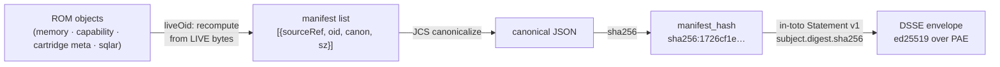

# Signing & trust

A cartridge is trusted not because it *says* it is intact, but because a verifier **recomputes** the ROM content address from the live bytes, checks an ed25519 signature over it inside a DSSE/in-toto envelope, and resolves the signer against a public-keys-only trust registry.

This page covers SPEC §4. It builds on the [container format](container.md) (the ROM/SAVE split and the ROM `manifest_hash`) and feeds the [distribution](../lifecycle/distribution.md) and [loading](../lifecycle/loading.md) lifecycle.

!!! quote "Why signing matters for a harness"
    Lilian Weng frames a harness as *"the system surrounding a base model that orchestrates execution and decides how the model thinks and plans, calls tools and acts, perceives and manages context, stores artifacts, and evaluates results"* ([Harness Engineering for Self-Improvement](https://lilianweng.github.io/posts/2026-07-04-harness/), 2026-07-04). A `.acx` cartridge **is** that harness, packaged as a portable agent-OS image. Signing is what lets a host boot someone else's harness without trusting the person who shipped it.

## What gets signed

The integrity core is a **hash-of-hashes** over ROM-zone objects only (SPEC §4.1). The SAVE zone is deliberately excluded so that field learning never invalidates the signature — `strip-to-ROM` re-export proves by hash equality that the ROM was untouched (see [container](container.md#strip-to-rom)).

Implementations **MUST NOT** sign raw container bytes. The single signed digest is the ROM `manifest_hash` from §3.3. Ed25519 is the default (and only reference) algorithm.



### The C1 lesson: never trust self-declared hashes

!!! danger "Critical defect C1 — fixed"
    An earlier design built the signed manifest from each object's **self-declared** `objects.oid` column. An attacker could rewrite a signed `SKILL.md` body — or flip a capability's proficiency to `verified` — leave the stale `oid` in place, and the cartridge still verified as **trusted**. The signature covered a hash the attacker controlled.

The fix (`design/01-review-response.md`, C1) is the security-critical rule at the heart of `buildRomManifest`: recompute every object's content address from its **live source**, never from the stored column.

```javascript title="src/sign.mjs — liveOid recomputes from the live source"
// SPEC §3.3: the manifest MUST reflect the live content address, never the
// self-declared objects.oid. Recompute from source; a divergence means the
// content was mutated after the object was registered.
const computed = liveOid(cartridge, r)
if (computed == null) mismatches.push({ sourceRef: r.source_ref, reason: 'missing source' })
else if (computed !== r.oid) mismatches.push({ sourceRef: r.source_ref, reason: 'oid mismatch', stored: r.oid, computed })
return { sourceRef: r.source_ref, oid: computed ?? r.oid, canon: r.canon, sz: r.sz }
```

`liveOid()` resolves each `source_ref` back to real bytes and hashes those:

| `source_ref` prefix | Live source | Hashed content |
| --- | --- | --- |
| `memory:` | `memory.payload` row | UTF-8 payload bytes |
| `capability:` | `capabilities.json` row | UTF-8 capability JSON |
| `cartridge:` | `getMeta(key)` | JCS of `{key, value}` |
| *(sqlar file)* | `getFile(source_ref)` | **uncompressed** file bytes (`canon='raw'`) |

Any divergence is recorded in `mismatches`, `finalizeAndSign` refuses to sign, and verification returns `tampered`. Two dedicated tests lock this in — see proof 1:

```text
✔ C1: rewriting signed sqlar content with a stale objects.oid is detected as tampered
✔ C1: rewriting a capability proficiency to verified with a stale oid is tampered
```

## The DSSE / in-toto envelope

The normative envelope is a **DSSE envelope whose `payloadType` is `application/vnd.in-toto+json`**, carrying an **in-toto Statement v1** (SPEC §4.2). This keeps stock `cosign`/`oras` verification working (see [distribution](../lifecycle/distribution.md)). The ROM manifest identity `application/vnd.acx.rom-manifest.v1+json` names the *predicate content*, not the DSSE payloadType.

The signing input is the DSSE Pre-Authentication Encoding, verbatim:

```text
PAE = "DSSEv1" SP LEN(payloadType) SP payloadType SP LEN(payload) SP payload
sig = Ed25519(privkey, PAE)
```

=== "Envelope"

    ```json
    {
      "payloadType": "application/vnd.in-toto+json",
      "payload": "<base64(canonical-json(Statement))>",
      "signatures": [
        { "keyid": "ed25519:17bb8c9290fd2a3d0c3a434ad0e99544d809dbff1540d64be0bab2274df14f66",
          "sig": "<base64(Ed25519-sig-over-PAE)>" }
      ]
    }
    ```

    The DSSE envelope contains **exactly** `{payloadType, payload, signatures}` — nothing else (test §4.2).

=== "in-toto Statement v1"

    ```json
    {
      "_type": "https://in-toto.io/Statement/v1",
      "subject": [
        { "name": "io.github.agentibus/scenario-research-designer@…",
          "digest": { "sha256": "1726cf1e6025c166e06dc839a5cbae6c900f0ffa3e0b1235be8b78e88ee09943" } }
      ],
      "predicateType": "https://acx.dev/attestation/cartridge/v1",
      "predicate": {
        "acxSchemaVersion": "0.1",
        "publisherId": "io.github.agentibus",
        "romDigest": "sha256:1726cf1e…",
        "manifestHash": "sha256:1726cf1e…",
        "checksumHash": null,
        "fileCount": null,
        "embeddingEngine": { "id": "local-hash-128", "dim": 128 },
        "signedAt": "2026-04-03T13:35:46.190Z",
        "provenanceInstanceId": null
      }
    }
    ```

The decoded Statement's `subject[0].digest.sha256` **MUST** equal the ROM `manifest_hash`; subjects are matched purely by digest. The `provenanceInstanceId` is informational and **MUST NOT** participate in trust decisions.

!!! note "Fail-safe: never claim an unverifiable signature is valid"
    If no public key is available, `verifyEnvelope` cannot assert validity, and `evaluateTrust` returns `portable` with `Signature present but UNVERIFIED (no public key available)` — never `trusted`. Test §4.5: *"unverifiable envelope (no key) never claims the signature is valid."*

### keyid form

The `keyid` is content-addressed, not a name (SPEC §4.2 — a resolved contradiction, block C wanted the reverse-DNS id here):

```javascript title="src/sign.mjs"
// keyid = "ed25519:"+lowercasehex(sha256(DER SubjectPublicKeyInfo))
export function keyIdFromPublicKey(publicKey) {
  const der = publicKey.export({ type: 'spki', format: 'der' })
  return 'ed25519:' + sha256Hex(der)
}
```

A real value from the transcript:

```text
keyid: ed25519:17bb8c9290fd2a3d0c3a434ad0e99544d809dbff1540d64be0bab2274df14f66
```

It is a **hint only** — a direct lookup key into the trust registry. Verification **MUST NOT** depend on it beyond registry lookup. The human-readable reverse-DNS identity lives in `predicate.publisherId`, never in `keyid`.

## The trust taxonomy

`evaluateTrust` (`src/trust.mjs`) returns an `AgentPackageVerification` and evaluates the five states in the SPEC §4.5 order — `tampered` first (deny), `local` last (most trusted):

| Trust | Status | Meaning | When |
| --- | --- | --- | --- |
| `tampered` | `invalid` | ROM content diverges from what was signed. **Reject.** | DSSE PAE verify fails, OR any recomputed ROM oid ≠ its manifest entry, OR `subject.digest.sha256 ≠ manifest_hash` |
| `legacy` | `warning` | No DSSE envelope at all (pre-standard / unsigned). Importable with warning | `SELECT … FROM signatures WHERE target='rom-manifest'` returns no row |
| `portable` | `warning` | Signature **valid**, but signer is not fully trusted here. Graceful degradation | `keyid` absent from registry, OR `namespaceProof` unverified, OR key revoked/expired under the §4.4 downgrade rules |
| `trusted` | `verified` | DSSE verifies AND `keyid` is `active` AND namespace-proof valid AND not expired/revoked | Registered, in-window, proven signer |
| `local` | `verified` | As `trusted`, and the `keyid` equals the verifying instance's **own** key | `localKeyId && keyid === localKeyId` |

!!! tip "Portable is a feature, not a failure"
    An unknown-but-cryptographically-valid signer is **portable**, not rejected. A cartridge you download from a stranger still verifies its own integrity end-to-end — you just haven't decided to *trust the publisher* yet. Tampering is the only hard stop.

## Trust registry — public keys only

The registry is a **separate artifact** (public keys only), published at `https://<domain>/.well-known/acx-trust-registry.json` or as OCI `application/vnd.acx.trust-registry.v1`. This fixes the git-tracked-plaintext-private-key defect: private key material **MUST NEVER** appear in a cartridge, a `signature.json`, or the registry (SPEC §4.4).

`loadTrustRegistry` enforces that structurally — it refuses to load anything containing private key material:

```javascript title="src/trust.mjs"
const asText = JSON.stringify(reg)
if (/PRIVATE KEY/.test(asText)) throw new Error('trust registry contains private key material — refusing to load')
```

Test §12.4: *"loadTrustRegistry refuses private key material."* Each entry carries:

```json
{
  "keyid": "ed25519:17bb8c92…",
  "publisherId": "io.github.agentibus",
  "algorithm": "ed25519",
  "publicKeyPem": "-----BEGIN PUBLIC KEY-----\n…\n-----END PUBLIC KEY-----\n",
  "status": "active",
  "notBefore": "2026-01-01T00:00:00Z",
  "notAfter": "2027-01-01T00:00:00Z",
  "namespaceProof": { "...": "..." },
  "rotatedFrom": null, "rotatedTo": null,
  "revokedAt": null, "revocationReason": null
}
```

### Rotation, expiry, revocation

The key lifecycle checks (§4.4) run only *after* the signature verifies, and downgrade `trusted` → `portable` (or reject) rather than silently passing:

- **Rotation** — a successor sets `rotatedFrom`; the predecessor overlaps until its `notAfter`. Cartridges whose `signedAt` falls in the predecessor's validity stay trusted after rotation.
- **Expiry** — `now > notAfter` ⇒ `expired`; verification returns `portable`, never `trusted`.
- **Revocation** — `revocationReason == "key-compromise"` ⇒ **never** `trusted`, regardless of `signedAt` (returns `tampered`). Otherwise a cartridge with `signedAt < revokedAt` stays `portable` with a warning; a later signature is `portable`/rejected.

```javascript title="src/trust.mjs — revocation is severity-aware"
if (registryEntry.status === 'revoked') {
  if (registryEntry.revocationReason === 'key-compromise') {
    return { status: 'invalid', trust: 'tampered', summary: 'Signer key is compromised (revoked).', … }
  }
  if (registryEntry.revokedAt && signedAt && signedAt < registryEntry.revokedAt) {
    // signed before revocation for a non-compromise reason -> downgrade to portable
    return { status: 'warning', trust: 'portable', summary: 'Signer key later revoked (non-compromise); signed before revocation.', … }
  }
  return { status: 'warning', trust: 'portable', summary: 'Signer key revoked.', … }
}
```

### Reverse-DNS publisher identity

Trust binds to `publisherId` + `keyid`, never to the hostname-derived `instanceId` (SPEC §4.3). `publisherId` **MUST** be a reverse-DNS label — `com.example.teamx`, `io.github.alice`. Namespace ownership is proven by one of:

- **DNS-TXT challenge** (`com.*`, `org.*`, `net.*`) — the publisher signs a registry challenge and publishes the key at `_acx-challenge.<domain>`; grants `<domain>/*`.
- **GitHub OIDC** (`io.github.*`) — a GitHub Actions OIDC id-token binds `io.github.<user|org>/*` to the workflow subject.

!!! warning "Namespace-proof verification is host-side and scoped out of the reference impl"
    The reference implementation checks `registryEntry.namespaceProof` as a **present/absent** field (a missing proof downgrades to `portable`). Actually *validating* a DNS-TXT challenge or a GitHub OIDC token against the live world is **specified normatively but not implemented** — it is host-side registrar machinery. The publisher ids used throughout these docs (`io.github.agentibus`) are illustrative handles, not real orgs.

## The real verify outputs

These are verbatim from [`proofs-transcript.txt`](../_assets/proofs-transcript.txt) (see the [Proofs](../proofs.md) page). The cartridge under test is `io.github.agentibus/scenario-research-designer` with `rom_manifest_hash: sha256:1726cf1e…`.

=== "portable (unknown signer)"

    Empty registry — the signature is valid, but the signer isn't known here.

    ```text
    $ acx verify demo.acx
    status:   warning
    trust:    portable
    summary:  Signature valid but signer not in trust registry.
    keyid:    ed25519:17bb8c9290fd2a3d0c3a434ad0e99544d809dbff1540d64be0bab2274df14f66
    signedAt: 2026-04-03T13:35:46.190Z
    issues:   Signer keyid not in trust registry
    exit=0
    ```

=== "local (our own key)"

    Verified against a trust registry where the signer is *this instance's* key.

    ```text
    verify (trusted registry, local key): verified / local - Signed by this instance.
    ```

=== "tampered (C1 in action)"

    Two independent tampers — rewriting the sqlar `SKILL.md` bytes, and rewriting an object with a stale `oid` — both caught because the manifest is recomputed from live bytes:

    ```text
    verify (objects.oid tamper):        invalid / tampered - ROM content diverges from signed manifest (object hash mismatch).
    verify (SKILL.md content tamper, oid stale): invalid / tampered - ROM content diverges from signed manifest (object hash mismatch).
    ```

`acx verify` exits **non-zero** only when the result is `invalid`/`tampered`; `portable` and `legacy` exit `0` with a warning so downstream tooling can still import with degraded trust.

```bash
acx verify <file.acx> [--registry <trust.json>]   # SPEC §4.5 taxonomy
```

!!! example "Trust survives a level attestation"
    Attaching a [provable-level](../leveling/provable-level.md) credential to the cartridge does **not** re-sign the ROM — proof 3 shows the signature stays intact: `ROM signature after attaching attestation: warning / portable (intact ✅)`. The attestation is additive; the ROM digest it binds to is exactly the signed `manifest_hash`.

## Implementation notes

- **Zero-dependency.** Signing and verification use only Node ≥ 22 builtins (`node:crypto`, `node:sqlite`). Run everything with `node --experimental-sqlite` — see the [CLI reference](../reference/cli.md).
- **Reproducible manifest.** Test §12.3: *"ROM manifest hash is reproducible from the same ROM objects"* and *"rebuilding the ROM manifest from the stored objects reproduces the signed hash."* JCS canonicalization is key-insertion-order independent.
- **Round-trip + negatives.** The suite covers sign+verify round-trip (`subject.digest = manifest_hash`), payload tamper, and wrong-key rejection (proof 1, §12.3).

See also: [container format](container.md) · [skills](skills.md) · [capabilities](capabilities.md) · [distribution](../lifecycle/distribution.md) · [provable level](../leveling/provable-level.md).
