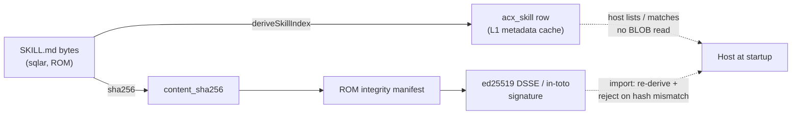

# Skill bundles

A skill is a plain agentskills.io package — `SKILL.md` plus optional resources — stored byte-for-byte in the signed ROM zone, enumerable from one SQL row without ever inflating a BLOB.

Skills are the vendor-neutral, codebase-agnostic capability layer of a cartridge. They travel **wholly in the ROM zone** (signed, immutable); nothing skill-related ever lives in SAVE. Because the on-disk bytes are a stock Agent-Skill package, the same `SKILL.md` that ships inside a `.acx` extracts and installs into `~/.claude/skills/` or any agentskills.io runtime unchanged. See SPEC §5.

!!! abstract "The one-line mental model"
    A cartridge is a self-contained, signed harness. Its skills are the reusable, model-portable slices of that harness — the part Lilian Weng predicts will *not* get absorbed into the base model: *"many harness improvements will be internalized into core model behavior, but the interface with external context and tools should remain."* ([Harness Engineering for Self-Improvement](https://lilianweng.github.io/posts/2026-07-04-harness/), 2026-07-04.)

## Layout in `sqlar`

Every skill is a directory rooted at `rom/skills/<name>/`, stored as `sqlar` rows (Deflate; the container's convention is `sz == length(data)` for uncompressed). The frontmatter `name` **MUST** equal the parent directory `<name>`.

```text
rom/skills/<name>/SKILL.md          # REQUIRED  (Level-2 body)
rom/skills/<name>/references/*.md    # OPTIONAL  (Level-3)
rom/skills/<name>/scripts/*          # OPTIONAL  (Level-3)
rom/skills/<name>/assets/*           # OPTIONAL  (Level-3)
```

Reference chains **MUST** stay one level deep from `SKILL.md` — a resource may not itself point at further files the host is expected to chase. See [the container format](container.md) for how the `rom/` prefix places these rows in the signed zone and [signing & trust](signing-trust.md) for how the ROM manifest covers them.

## Frontmatter — agentskills.io, verbatim (6 keys)

`SKILL.md` **MUST** begin with YAML frontmatter containing **only** these six top-level keys. Runtimes **MUST** reject unknown top-level keys — that closed set is what keeps a cartridge skill installable in a plain agentskills.io host.

| Key | Rule |
|---|---|
| `name` | REQUIRED. 1–64 chars, `^[a-z0-9]+(-[a-z0-9]+)*$`, **matches the parent directory**. |
| `description` | REQUIRED. 1–1024 chars. State **what** the skill does **and when** to use it — this is the entire Level-1 payload. |
| `license` | MAY. SPDX identifier (e.g. `Apache-2.0`). |
| `compatibility` | MAY. 1–500 chars. |
| `metadata` | MAY. Map of string→string. `metadata.version` SHOULD be SemVer. |
| `allowed-tools` | MAY (Experimental). Space-separated tool list. |

!!! warning "Host-superset fields are forbidden at the top level"
    Claude Code and other hosts recognize richer fields — `context`, `effort`, `hooks`, `model`, `agent`, `when_to_use`, and so on. These **MUST NOT** appear as top-level frontmatter keys. They travel in the namespaced extension block ([below](#namespaced-host-superset-ext)) and a recognizing host re-projects them into frontmatter *at install time*. The stored `SKILL.md` therefore stays 100% agentskills.io-valid. See SPEC §5.2 / §5.4.

### A real `SKILL.md`

This is the exact skill the reference exporter writes into every cartridge (`src/export.mjs`, `buildSkillMd`) — the `expertise-designer` bundle you'll see in the proofs transcript:

```markdown
---
name: expertise-designer
description: Specialized designer expertise on research, ux, benchmarking. Use when a task matches this agent's demonstrated domain.
license: Apache-2.0
metadata:
  version: 1.0.0
---

# Scenario Research Designer — designer

Portable, codebase-agnostic expertise exported from AGENTIBUS.

## When to use
Specialized designer expertise on research, ux, benchmarking. Use when a task matches this agent's demonstrated domain.
```

## The `acx_skill` derived index

A host **MUST** be able to list and match skills reading only SQL rows, never inflating a BLOB. One ROM-zone table carries that index. This is the DDL the reference container actually creates (`src/container.mjs`):

```sql
-- SPEC §5.3 derived skill index (re-derivable cache; SKILL.md in sqlar is authoritative).
CREATE TABLE IF NOT EXISTS acx_skill (
  sqlar_path     TEXT PRIMARY KEY,   -- authoritative identity; the SKILL.md path
  name           TEXT NOT NULL,      -- frontmatter name (may collide across dirs)
  description    TEXT NOT NULL,      -- Level-1 payload (<=1024)
  license        TEXT, compatibility TEXT, skill_version TEXT,
  body_tokens    INTEGER,
  content_sha256 TEXT NOT NULL,      -- sha256 of UNCOMPRESSED SKILL.md bytes
  resources      TEXT NOT NULL,      -- JSON inventory of Level-3 material
  ext            TEXT,               -- JSON, namespaced superset
  schema_version TEXT NOT NULL       -- 'acx.skill/1'
);
```

!!! note "Why `sqlar_path` is the primary key"
    SPEC §5.3 frames the index around `name`, but two skills in different directories could carry the same frontmatter `name`. The implementation makes the `sqlar` path — which is globally unique — the authoritative row identity, and keeps `name` as an indexed attribute.

`acx_skill` is a **derived cache**; the `SKILL.md` bytes in `sqlar` are authoritative. The exporter rebuilds the whole table from those bytes in `deriveSkillIndex()` (`src/assemble.mjs`):

- it enumerates `rom/skills/*/SKILL.md`, parses the frontmatter, and writes one row per skill;
- `body_tokens` is a cheap estimate — `Math.ceil(body.length / 4)` (~4 chars/token);
- `content_sha256 = sha256Hex(<uncompressed SKILL.md bytes>)`;
- `resources` is the Level-3 inventory (see [budget](#progressive-disclosure-budget));
- `schema_version` is the literal `'acx.skill/1'`.

### `content_sha256` binds the index to the signature

This is the load-bearing invariant. `content_sha256` **MUST** equal the entry's hash in the ROM integrity manifest, so **the ROM signature covers skills transitively** — you cannot swap a skill body without invalidating the cartridge signature. On import a host **MUST** re-derive `acx_skill` and **MUST reject any row whose `content_sha256` ≠ the recomputed hash.**

Conformance test §12.7 (`test/conformance.test.mjs`) asserts exactly this equality:

```javascript
deriveSkillIndex(cart)
const row = cart.db.prepare(
  'SELECT name,description,sqlar_path,content_sha256,schema_version FROM acx_skill'
).get()
assert.equal(row.content_sha256, sha256Hex(bytes),
  'acx_skill.content_sha256 must match SKILL.md bytes')
```

And the smoke run proves the negative case — editing `SKILL.md` while leaving a stale `objects.oid` behind flips trust straight to `tampered`:

```text
verify (SKILL.md content tamper, oid stale): invalid / tampered - ROM content diverges from signed manifest (object hash mismatch).
```

See [signing & trust](signing-trust.md) for the full manifest → DSSE → verify chain.

## Namespaced host-superset (`ext`) {#namespaced-host-superset-ext}

`acx_skill.ext` is a JSON object keyed by **reverse-DNS namespaces**. A host reads only the namespaces it recognizes and ignores the rest — that is how a superset field survives round-tripping through a host that has never heard of it.

=== "Stored (namespaced, structured)"

    ```json
    {
      "io.claude.code": {
        "model": "opus",
        "when_to_use": "Reach for this before touching any research UX task.",
        "hooks": [
          { "event": "PostToolUse", "run": "scripts/lint.sh" }
        ]
      }
    }
    ```

=== "Re-projected at install (host-recognized)"

    ```yaml
    # A recognizing host MAY merge its namespace's simple keys back into
    # frontmatter at install time — SKILL.md on disk stays agentskills.io-valid.
    model: opus
    when_to_use: Reach for this before touching any research UX task.
    ```

Structured values — the `hooks` array above — are precisely why the superset is *not* forced into the string-only `metadata` map. A recognizing host **MAY** merge its namespace's simple keys back into frontmatter at install, but the stored `SKILL.md` is never mutated. See SPEC §5.4.

## Progressive-disclosure budget

Skills exist to keep context cheap: the host pays for a skill in three escalating tiers, and never pays for a tier it doesn't reach. This is the ACX realization of the harness principle that context is a managed budget, not a dumping ground — *"A harness should not carry the entire workflow and all logs in context; instead, it should keep durable state in files."*

| Level | Loaded | Budget | Location |
|---|---|---|---|
| **L1 Metadata** | Always, at startup | ~100 tok (`name` + `description`) | `acx_skill` row — **no BLOB read** |
| **L2 Instructions** | On activation | < 5000 tok; body < 500 lines | `sqlar` `SKILL.md` |
| **L3 Resources** | On demand | 0 tok until read | `references/` · `scripts/` · `assets/` |

The `resources` column inventories all L3 material so it is discoverable and integrity-checkable *without inflating anything*:

```json
[{ "path": "rom/skills/expertise-designer/references/ux-playbook.md",
   "bytes": 4096,
   "sha256": "…" }]
```

!!! tip "Author rule"
    Move any detail beyond the ~5000-token body into `references/`. The L2 body is a router — it tells the agent *what exists and when to open it*, not the whole manual.

## Extraction proof — `sqlite3 -Ax`

The acid test for "it's really a stock skill package" is that the system `sqlite3` binary — which knows nothing about `.acx` — can unpack it. Proof 9 in the [proofs transcript](../_assets/proofs-transcript.txt) does exactly that against the archive tooling built into SQLite:

```console
$ sqlite3 /tmp/demo.acx -Ax rom/skills/
rom/skills/expertise-designer/SKILL.md
```

The extracted file lands on disk at its `sqlar` path, byte-identical to the signed bytes — the same bytes whose `sha256` is `content_sha256` in the index and an entry in the ROM manifest. To list without extracting, use `-Atv`:

```console
$ sqlite3 /tmp/demo.acx -Atv rom/skills/
```

And the CLI's own `inspect` reads L1 straight from the index — no BLOB inflation, exactly as a host would at startup:

```text
== skills (acx_skill) ==
  - expertise-designer: Specialized designer expertise on research, ux, benchmarking. Use when a task matches this agent's d
```

!!! example "Reproduce it"
    Every command above is generated by the repo's proof scripts. Run `node --experimental-sqlite scripts/smoke.mjs` (the reference implementation is zero-dependency: Node ≥ 22's builtin `node:sqlite` + `node:crypto`), then `sqlite3 <file>.acx -Ax rom/skills/`. See the [conformance reference](../reference/conformance.md) and the full [proofs page](../proofs.md).

## Where skills sit in the whole cartridge



Next: how [capabilities](capabilities.md) turn a skill's domain into a sellable, attestable claim, and how the whole ROM gets [signed and trusted](signing-trust.md).
