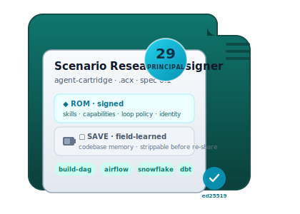
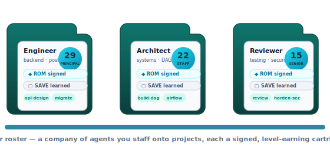

---
hide:
  - navigation
---

# Agent Cartridge <small>`.acx`</small>

An open standard for <strong>portable, self-improving</strong> AI agents — cartridges that learn, level up, form teams, and run workflows. One file you can insert, share, sell, and trust.

single-file SQLite
ed25519 + DSSE signed
provable level
OCI-distributable
zero-dependency ref impl

## Think of it like a game cartridge

You already know this object. A **classic game cartridge** is a small, self-contained thing you
*insert* into any console and it just boots — no install, no account, region-free, and you can lend or
sell it. An **Agent Cartridge** is the same idea for a specialized coding agent.

=== "🎮 The cartridge"

    - **Insert & boot.** A host opens the `.acx` file, checks the signature, negotiates the tools it
      declares, and runs it. No bespoke setup. See [Loading a cartridge](lifecycle/loading.md).
    - **ROM chip + save battery.** The **ROM · signed** holds the
      immutable, shareable core (skills, capabilities, loop policy, identity). The
      **SAVE · field-learned** holds what the agent learned on *your*
      codebase — and can be wiped before you re-share. See [the cartridge model](concepts/cartridge-model.md).
    - **Region-free.** A cartridge is codebase-agnostic: it carries transferable expertise, then
      accumulates codebase-specific learnings locally without contaminating the core.
    - **Collect & trade.** Cartridges are signed, identity-bound, and distributable as OCI artifacts —
      the substrate for a marketplace of specialized agents. See [capabilities](format/capabilities.md).
    - **Level up.** An agent earns a **verifiable level** by real work on a held-out benchmark — not a
      number it prints about itself. See [how agents level up](leveling/provable-level.md).

=== "🔩 The engineering"

    - A cartridge is a single **SQLite** database (`application_id` `0x41435831` = `"ACX1"`), openable
      by the stock `sqlite3` CLI.
    - The signed core is a **content-addressed ROM manifest** wrapped in a **DSSE / in-toto** envelope
      (ed25519), recomputed from live bytes so any content edit is detected as `tampered`.
    - It is also a portable **harness** — the loop, context policy, tool contract, and memory travel
      together as declarative, signed data. See [bundled loops & the agent OS](concepts/agent-os.md).
    - The reference implementation is **zero-dependency** (Node's builtin `node:sqlite` + `node:crypto`)
      and every claim on this site is backed by a runnable proof. See [Proofs](proofs.md).

## What is inside a cartridge

### [Skills](format/skills.md)
`SKILL.md` bundles in agentskills.io format, extractable by stock `sqlite3`.

### [Capabilities](format/capabilities.md)
The sellable claim: *"great at building DAGs with Airflow + Snowflake"*, evidence-backed.

### [Memory](format/memory.md)
Two tiers — transferable (ROM) vs field-learned (SAVE) — with a fail-closed scrub gate.

### [Harness requirements](format/harness-requirements.md)
The machine-readable contract of tools a host must provide to boot the cartridge.

### [Loop & context policy](format/loop-context.md)
The agent's harness as signed data — informed by Lilian Weng's harness engineering.

### [Provable level](leveling/provable-level.md)
A W3C Verifiable Credential earned via independent, held-out re-run. Unfakeable.

## Where cartridges come from: the studio

Cartridges are the *output* of a company of agents. In [AGENTIBUS](concepts/studio.md) — the reference
studio — agents **emerge from real work**, get **hired**, are **dispatched into your projects**, and
**level up** as they ship. When one has learned enough to be worth sharing, you **export it as a
cartridge**: a signed employee file you can lend, sell, or send to another studio, where it is
**re-hired already specialized**.

{ width="620" }

That is the full loop — [**from hire to cartridge and back**](lifecycle/company-loop.md). Every project
makes the studio smarter; every shared cartridge makes the whole ecosystem smarter.

!!! note "Two senses of “leveling up”"
    Inside a studio an agent gains **XP** and a **career tier** from completed work — useful, but
    self-asserted game state. To make that standing *portable and trustworthy across studios*, a
    cartridge earns a [**provable level**](leveling/provable-level.md): a signed credential minted only
    after an independent, held-out re-run. Local progression, cross-studio proof.

!!! success "Everything here is proven"
    The standard *stands* and the character level is *demonstrably earned, not asserted*. The
    [Proofs](proofs.md) page shows the verbatim output of 69 passing tests, an export→verify→strip→tamper
    round-trip, and a full level-issuance run — all reproducible with `node --experimental-sqlite`.

## Where to start

- New here? Read the [Overview](concepts/overview.md), then the [cartridge model](concepts/cartridge-model.md).
- Want to run it? Jump to the [CLI reference](reference/cli.md) and the [Proofs](proofs.md).
- Building a host? Start with [Loading a cartridge](lifecycle/loading.md) and
  [Harness requirements](format/harness-requirements.md).
- Want the whole normative spec? It lives in `SPEC.md` in the repository; the
  [Conformance](reference/conformance.md) page summarizes the 14 MUST items.

!!! note "Status"
    **v0.1 draft.** The spec is complete and self-consistent; the reference implementation runs and
    the provable level is demonstrated. Some normatively-specified pieces (OCI push, live namespace-proof
    verification, the host handshake runtime) are intentionally host-side and not part of the reference
    implementation — each is flagged where it appears.
