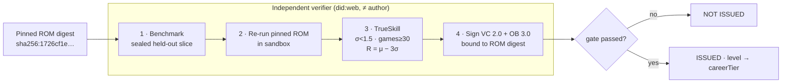

# How agents level up (provable)

A cartridge's level is **earned by an independent re-run on a sealed held-out slice and sealed into a signed credential — never self-asserted** — so "senior" means something you can verify, not something a vendor typed into a README.

Most "agent benchmarks" end with a number in a blog post. The Agent Cartridge ends with a **W3C Verifiable Credential** that a third party can re-check offline, that is cryptographically bound to the exact bytes of the agent it grades, and that any verifier will reject the moment those bytes change. This is [SPEC §10](../reference/conformance.md), block **Provable**.

!!! quote "Lilian Weng, *Harness Engineering for Self-Improvement* (2026-07-04)"
    "Candidates are accepted only if they have **no regression on both held-in and held-out data**."

    The provable-level protocol is that acceptance criterion made cryptographic: the held-out re-run is performed by someone other than the author, the trajectories are content-addressed and signed, and the verdict is a revocable credential — not a self-reported score.

## The claim, and why you shouldn't trust it

A cartridge ships a [capability record](../format/capabilities.md) like `build-dag[pkg:pypi/apache-airflow+…]`. On its own that record is a **claim**: `verified` is `false`. A claim becomes `verified: true` only when an independent **level attestation** resolves against it. Everything on this page is the machinery that produces (and re-checks) that attestation.

The gate has four independent stages. Failing any one means **NOT ISSUED**.



## Two levels: studio XP vs portable proof

An agent actually carries **two** notions of level, and it matters which one you are looking at.

| | Studio level (XP) | Provable level (this page) |
|---|---|---|
| Where it lives | Inside a studio like [AGENTIBUS](../concepts/studio.md) | In the cartridge, as a signed credential |
| How it's earned | XP from completed tasks; auto-promotion up the career tiers | Independent held-out re-run on a benchmark |
| Who vouches for it | The studio itself (self-asserted) | An independent verifier (cryptographic) |
| Travels across studios? | No — it's local game state | **Yes** — bound to the ROM digest, revocable |
| Good for | Day-to-day staffing, casting, morale | Selling, lending, or trusting an agent you did not train |

Both use the **same 8 career tiers** (`intern … legend`). The studio XP tier is how a company *runs its
roster*; the provable level is how that standing becomes *portable and trustworthy* the moment the agent
leaves the building as a cartridge. The rest of this page is about the second one — the one you can prove.

## Stage 1 — a benchmark with a sealed held-out slice

A benchmark is a versioned task-suite (`acx-bench-*`, itself an `.acx`, `artifactType application/vnd.acx.benchmark.v1`) split into a **public slice** and a **sealed held-out slice**. Only the held-out slice's `heldOutSliceDigest` is published; the plaintext is keyed to the verifier enclave (SPEC §10.2 step 1).

`makeBenchmark()` in `src/level/benchmark.mjs` derives the split deterministically from a sealed key, so the same suite always seals the same held-out tasks, and publishes only their digest:

```javascript title="src/level/benchmark.mjs (excerpt)"
const heldOutSliceDigest = 'sha256:' + sha256Hex(jcs(heldOut.map((t) => t.id).sort()))
return { id, name, version, digest, heldOutSliceDigest, publicSlice, heldOut, seal, taskCount }
```

The reference suite `demoDagBenchmark()` is **160** post-cutoff DAG tasks with difficulties spanning 15–48, held-out fraction 0.6:

```text
benchmark acx-bench-dag-de@2026.07.1: 160 tasks, held-out slice digest sha256:d16bf83a37c399775…
```

!!! warning "Contamination is made structurally impossible, not merely discouraged"
    Held-out tasks **MUST** be time-sliced *after* the model cutoff — the SWE-bench *verified* pattern — so the graded answers cannot be in any training set (SPEC §10.2 step 1). Every task pins its graded artifacts by full SHA-256. The public never sees the held-out tasks; a verifier proves it used them by publishing `acx:heldOutSliceDigest`, which any auditor can compare against the benchmark's sealed record.

## Stage 2 — an independent verifier re-runs the pinned ROM

The verifier is an **accredited `did:web` distinct from the cartridge's controller**. It re-executes the exact, signed [ROM zone](../format/container.md) — never the author's word about how it did — in a sandbox on a randomly drawn held-out subset. In `prove-level.mjs` the verifier is a freshly generated key, deliberately not the publisher's:

```javascript title="scripts/prove-level.mjs (excerpt)"
// An INDEPENDENT verifier — distinct key/identity from the cartridge publisher.
const verifierKey = generateSigningKey()
const issuerDid = 'did:web:verifier.acx.dev'
```

The draw order over held-out tasks is **deterministic in `(romDigest, benchmark)`**, so a second verifier reproduces the exact same games — the run is auditable, not a one-off:

```javascript title="src/level/benchmark.mjs — runVerification()"
const order = benchmark.heldOut
  .map((t) => ({ t, r: sha256Hex(romDigest + '|draw|' + t.id) }))
  .sort((a, b) => (a.r < b.r ? -1 : 1))
  .map((x) => x.t)
```

Each full trajectory is content-addressed (sha256 → `acx:digestMultibase`) and signed as a **DSSE / in-toto envelope** (the same envelope machinery as [signing & trust](../format/signing-trust.md)), then URL-linked in the credential's `evidence[]`. The credential in `_assets` carries one such envelope inline plus "+89 more content-addressed, DSSE-signed trajectory evidences".

!!! note "The reference solver is deterministic and pluggable"
    In the zero-dependency reference implementation, `referenceSolver(romDigest, task, competence)` is a **deterministic** stand-in: pass/fail is a pure function of the ROM digest, the task id, and a competence parameter — reproducible for re-runs and ROM-bound so a level can't be transplanted. A **production verifier plugs a real sandboxed agent run** into the same `solver` slot; its graded artifacts are pinned by full SHA-256 and the surrounding protocol — draw, gating, evidence, credential — is byte-for-byte identical.

    ```javascript
    export function runVerification({ romDigest, benchmark, competence,
      solver = referenceSolver, sigmaMax = 1.5, minGames = 30, drawCount = 50, … })
    ```
    The crypto, the σ-gate, the credential, and the anti-gaming checks are all real today. Only the *grader inside `solver`* is a placeholder.

## Stage 3 — TrueSkill σ-gating

Every graded task is a 1v1 TrueSkill game against a fixed-skill "task opponent" whose skill is the task's difficulty. `src/level/trueskill.mjs` implements the standard Herbrich/Minka/Graepel update (β = 25/6, τ = 25/300). A credential **MUST NOT** issue unless **both**:

| Gate | Default | Why it matters |
|------|---------|----------------|
| `sigma < sigma_max` | `1.5` | The rating must be *confident*, not just high. σ only shrinks with many informative games. |
| `gamesPlayed >= N_min` | `30` | A minimum sample — no leveling on a handful of tasks. |

The reported level uses the **conservative** rating `R = mu − 3*sigma`, not `mu`:

```javascript title="src/level/trueskill.mjs"
export function conservative(r) { return r.mu - 3 * r.sigma }
export function levelFor(R) {
  const acxLevel = Math.max(0, Math.round(R))
  return { acxLevel, careerTier: careerTierForLevel(acxLevel) }
}
```

!!! tip "Why one lucky run cannot level you up"
    A single win barely moves `mu`, while `sigma` stays high — so `R = mu − 3σ` stays low **and** the σ-gate fails. You only clear the gate by winning *consistently across many held-out games*. This is why variance farming and one-shot luck don't work (SPEC §10.2 step 3).

### Level → careerTier ladder

`R` buckets into an integer `acxLevel`, then into one of eight `CareerTier` values (reused verbatim from AGENTIBUS — SPEC §10.2 step 4):

| careerTier | acxLevel |
|------------|----------|
| `intern` | < 5 |
| `junior` | ≥ 5 |
| `mid` | ≥ 10 |
| `senior` | ≥ 15 |
| `staff` | ≥ 20 |
| `principal` | ≥ 25 |
| `distinguished` | ≥ 30 |
| `legend` | ≥ 35 |

## Stage 4 — a signed credential bound to the ROM digest

If (and only if) the gate passes, the verifier emits a **W3C Verifiable Credential 2.0 embedding an Open Badges 3.0 achievement**, secured by a Data Integrity proof (`cryptosuite: eddsa-jcs-2022` — JCS-canonicalized, no RDF dependency). It binds to the exact ROM-zone digest via `credentialSubject.result[].acx:cartridgeRomDigest`, so **a level cannot be transplanted onto a mutated cartridge** (SPEC §10.1).

`verifyLevelCredential()` re-checks the whole policy — proof, self-issuance, gate, ROM binding, revocation — offline:

```javascript title="src/level/credential.mjs — verifyLevelCredential()"
if (issuerId && subjectId && issuerId === subjectId) issues.push('self-issuance rejected (issuer == subject)')
if ((res['acx:ratingSigma'] ?? 99) >= sigmaMax) issues.push(`sigma ${res['acx:ratingSigma']} >= ${sigmaMax}`)
if ((res['acx:gamesPlayed'] ?? 0) < minGames) issues.push(`gamesPlayed ${res['acx:gamesPlayed']} < ${minGames}`)
if (expectedRomDigest && res['acx:cartridgeRomDigest'] !== expectedRomDigest) issues.push('ROM digest binding mismatch')
if (revoked) issues.push('credential revoked (status bit set)')
```

## The real transcript: earn it, then try to fake it

This is Proof 3 from the repository's proof run (`scripts/prove-level.mjs`, verbatim in [`_assets/proofs-transcript.txt`](../proofs.md)). It earns a level and then runs the anti-fake gauntlet — a weak agent is refused, a strong agent is issued **principal**, and every forgery is rejected:

```text title="PROOF 3: prove-level (earn + verify unfakeable level)"
cartridge ROM digest: sha256:1726cf1e6025c166e06dc839a5cbae6c900f0ffa3e0b1235be8b78e88ee09943
benchmark acx-bench-dag-de@2026.07.1: 160 tasks, held-out slice digest sha256:d16bf83a37c399775…

weak agent (competence 14): NOT ISSUED — gating failed: sigma=2.230 (<1.5?), games=50 (>=30?) | R=5.80 tier=junior
strong agent (competence 33): ISSUED ✅  | mu=33.03 sigma=1.232 games=90 passRate=60% R=29.34 => acxLevel=29 tier=principal

credential verification: VALID ✅

capability build-dag effective proficiency (resolved from attestation): VERIFIED tier=principal mu=33.03 sigma=1.232
ROM signature after attaching attestation: warning / portable (intact ✅)

anti-gaming — self-issued credential: REJECTED ✅ [ 'self-issuance rejected (issuer == subject)' ]
anti-transplant — VC on mutated ROM: REJECTED ✅ [ 'ROM digest binding mismatch' ]
revocation — status bit set: REVOKED ✅

PROVABLE LEVEL OK — level earned from re-run, cryptographically verified, unfakeable
```

Read it line by line:

=== "Earned, not given"

    - The **weak agent** (competence 14) played 50 games but its `sigma=2.230` never dropped under `1.5`, so — despite `games=50 ≥ 30` — it is **NOT ISSUED**. Its `R=5.80` would only have bucketed to `junior` anyway.
    - The **strong agent** (competence 33) played 90 games, shrank `sigma` to `1.232`, reached `R=29.34`, and earned `acxLevel=29` → **`principal`**. Note it passed only **60%** of held-out tasks: leveling rewards *calibrated consistency against difficulty*, not a perfect score.

=== "Resolved without breaking the signature"

    - `credential verification: VALID` — the freshly signed VC re-checks against the verifier's public key.
    - The capability `build-dag` resolves to **VERIFIED** by *reading the attestation*, not by editing the ROM. Mutating the signed capability in place would (correctly) break the ROM signature — the C1 integrity guarantee. So the attestation lives ROM-digest-bound and separate, and the ROM signature stays **intact** (`warning / portable`). See [capabilities](../format/capabilities.md) and [signing & trust](../format/signing-trust.md).

=== "Every forgery rejected"

    - **Self-issuance** (issuer set to the subject) → `REJECTED` — you cannot grade yourself.
    - **Anti-transplant** (the real VC checked against a *different* ROM digest) → `REJECTED` with `ROM digest binding mismatch` — a level is welded to the exact bytes it graded.
    - **Revocation** (status bit flipped) → `REVOKED` — instantly invalid, no recall needed.

!!! note "Deterministic, but ROM-specific"
    The CLI `level` proof (Proof 8) grades a *different* cartridge (`rom sha256:f479be…642`) and reports `mu=32.85 sigma=1.191 games=90 acxLevel=29 principal` — a slightly different rating because the held-out draw is keyed to that cartridge's ROM digest. Same benchmark, same held-out slice digest (`sha256:d16bf83a…`), reproducible per-ROM.

## The real credential

Below is the actual level VC emitted for the CLI-`level` cartridge (`rom sha256:f479be…642`), compacted in [`_assets/level-credential.example.json`](../_assets/level-credential.example.json). Note the three `@context` entries (VC 2.0 + OB 3.0 + the ACX level namespace), the ROM-digest binding, the held-out slice digest, an inline DSSE-signed trajectory, the `BitstringStatusListEntry` for revocation, and the `eddsa-jcs-2022` proof.

```json title="_assets/level-credential.example.json (key fields)"
{
  "@context": [
    "https://www.w3.org/ns/credentials/v2",
    "https://purl.imsglobal.org/spec/ob/v3p0/context-3.0.3.json",
    "https://acx.dev/ns/level/v1"
  ],
  "type": ["VerifiableCredential", "OpenBadgeCredential"],
  "issuer": { "id": "did:web:verifier.acx.dev", "type": ["Profile"] },
  "credentialSubject": {
    "type": ["AchievementSubject"],
    "id": "urn:acx:cartridge:io.github.agentibus/scenario-research-designer@025edd67-…",
    "achievement": {
      "name": "ACX Level — Data-Engineering DAG Construction (Airflow+Snowflake)",
      "criteria": { "narrative": "Independently re-executed on a sealed held-out slice … R=mu-3sigma gated at sigma<1.5 over >=30 games." }
    },
    "result": [{
      "achievedLevel": "principal",
      "acx:ratingMu": 32.846,
      "acx:ratingSigma": 1.191,
      "acx:gamesPlayed": 90,
      "acx:acxLevel": 29,
      "acx:careerTier": "principal",
      "acx:passRate": 0.6,
      "acx:cartridgeRomDigest": "sha256:f479be021b8ea2e55cc6e3e33b95df9d151196548dfc854dedbe578be7120642",
      "acx:benchmarkId": "acx-bench-dag-de",
      "acx:benchmarkVersion": "2026.07.1",
      "acx:benchmarkDigest": "sha256:019fc517108a721b9bfc83e9a8d61c5011c29894c43a361c35fdacb2c783e900",
      "acx:heldOutSliceDigest": "sha256:d16bf83a37c399775bd88ab3b3a7d889eef3058cbf1196bb283b9c3d26d4507b"
    }]
  },
  "evidence": [
    { "acx:digestMultibase": "sha256:af4e658d…", "acx:dsseEnvelope": { "payloadType": "application/vnd.in-toto+json", "payload": "eyJiZW5jaG1hcmsi…", "signatures": [{ "keyid": "ed25519:0f5fb283…", "sig": "MrC0HVut30y0…" }] } },
    { "...": "+89 more content-addressed, DSSE-signed trajectory evidences" }
  ],
  "credentialStatus": { "type": "BitstringStatusListEntry", "statusPurpose": "revocation", "statusListIndex": "0", "statusListCredential": "https://acx.dev/status/1" },
  "proof": { "type": "DataIntegrityProof", "cryptosuite": "eddsa-jcs-2022", "verificationMethod": "did:web:verifier.acx.dev#key-1", "proofPurpose": "assertionMethod", "proofValue": "z61n5pMvBiRNvLeP…" }
}
```

## Anti-gaming rules (all MUST — SPEC §10.3)

| Attack | Defense | Status |
|--------|---------|--------|
| Memorize the held-out answers | Held-out slice is never revealed — only `acx:heldOutSliceDigest` is public | real |
| Train on the benchmark | Held-out tasks are time-sliced **post-model-cutoff** (SWE-bench *verified* pattern) | specified |
| Transplant a level onto an edited cartridge | Subject binds to `acx:cartridgeRomDigest`; editing SAVE **or** ROM invalidates it | **demonstrated** (`ROM digest binding mismatch`) |
| Variance farming / one lucky run | σ-shrink **and** `N_min` gate; conservative `R = mu − 3σ` | **demonstrated** (weak agent refused) |
| Resubmit-until-lucky | Per-cartridge-digest **cooldown** + logging of *failed* attempts | specified; host-side |
| Self-issue your own credential | Reject any VC where `issuer.id == credentialSubject.id` controller | **demonstrated** (`self-issuance rejected`) |
| Contamination discovered after issuance | Verifier flips the `BitstringStatusListEntry` bit — instant, no recall | **demonstrated** (`REVOKED`) |

!!! info "What runs today vs. what is specified"
    The σ-gate, held-out re-run protocol, ROM-digest binding, self-issuance rejection, credential signing/verification, and revocation are **real and exercised** in the transcript above. The **post-cutoff time-slicing** and the **resubmission cooldown / failed-attempt logging** are specified normatively and enforced host-side. Distributing the attestation as an OCI **Referrers** artifact (`artifactType application/vnd.acx.level-attestation.v1`, subject = the cartridge image-manifest digest) is likewise **specified; host-side** — see [distribution](../lifecycle/distribution.md). In the reference implementation the VC is stored in the cartridge's `attestations` table and written alongside as JSON.

## Weng's acceptance criterion, made cryptographic

Weng's self-improvement loop accepts a candidate only with "no regression on both held-in and held-out data." A cartridge is a [self-contained, signed harness](../concepts/agent-os.md) — the agent-OS image — and its [loop-context policy](../format/loop-context.md) carries `verification.regression { heldInSuite, heldOutSuite, acceptIf }` straight from that post (SPEC §9.6). Provable-level is the same idea pushed one step further:

- **held-in** → the author's own [`verification` gate](../format/loop-context.md) inside the loop;
- **held-out** → an *independent* re-run this page describes, on a slice the author never saw;
- and the acceptance verdict is not a self-reported pass but a **signed, ROM-bound, revocable credential** anyone can re-check.

That is what "senior" earns you here: not a label, but a credential that fails closed the instant the bytes, the signer, the confidence, or the integrity of the run stops holding.

---

*See also:* [capabilities](../format/capabilities.md) · [signing & trust](../format/signing-trust.md) · [the cartridge as agent-OS](../concepts/agent-os.md) · [loop & context policy](../format/loop-context.md) · [distribution](../lifecycle/distribution.md) · [all 10 proofs](../proofs.md).
