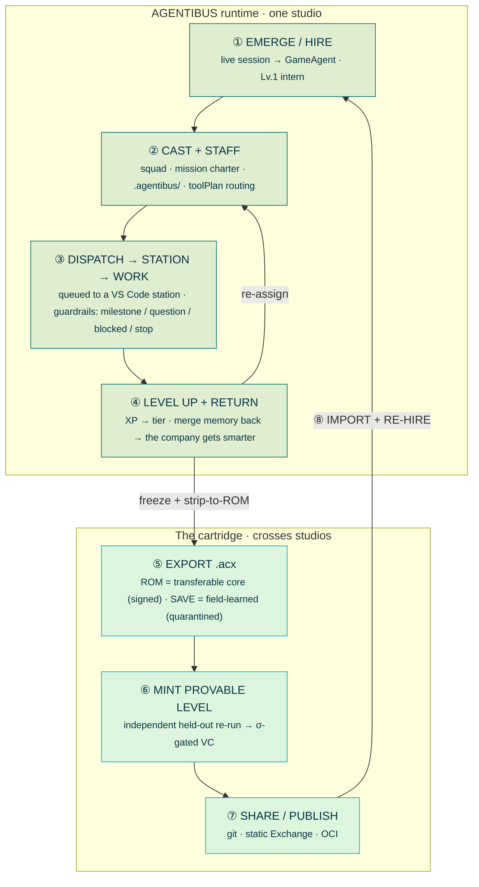

# From hire to cartridge and back

The whole lifecycle in one loop: an agent **emerges** inside a studio, gets **cast** onto a project, is
**dispatched** to a station and **works**, **levels up** and **returns** — its memory merging back so *the
company gets smarter* — then you **export** it as a signed `.acx` cartridge, optionally **mint a provable
level**, **share or publish** it, and another studio **imports** it and **re-hires** an agent that arrives
*pre-specialized*. Every turn of the loop makes the ecosystem smarter.

This page is the connective tissue between the two halves of the standard:

- **AGENTIBUS is the runtime.** Emergence, casting/staffing, dispatch, stations, guardrails, XP, and merge-back are all *live studio machinery* — they happen inside one running company. See [The studio](../concepts/studio.md) and [The agent OS](../concepts/agent-os.md).
- **The cartridge is the portable artifact.** The `.acx` file is the frozen, signed, shareable form of a
  studio employee — the thing that *crosses studios*. A station is where an agent works; a cartridge is
  what you hand to someone else's stations.

!!! note "Two words, two layers"
    **Dispatch** and **stations** are AGENTIBUS-internal: an agent is queued to a live VS Code window and does real work there. **Export / import** cross the studio boundary: the agent's transferable core is serialized into a single signed file that boots on *any* conforming host. Keep the distinction in mind — the loop below is really *one company's runtime loop wrapped in a portability envelope*.

## The loop



The left column is a single company running; the right column is the export envelope. The two arrows that cross the boundary are the whole point: **freeze + strip-to-ROM** turns a returned employee into a shippable file, and **import + re-hire** turns that file back into a working employee somewhere else — pre-specialized on arrival.

---

## ① An agent emerges / is hired

Agents are **not provisioned from a form — they emerge from real work.** The first time a live terminal session runs, the studio mints a `GameAgent` at `level: 1`, `xp: 0`, `careerTier: intern`, `completedProjects: 0`, empty `unlockedSkills`, and `promotionStatus: 'temporary'`. If it still carries a shell/tool name (`zsh`, `claude`, `codex`, …) it is given a generated identity (from a fixed name pool) and a deterministic pixel avatar derived from its fingerprint.

An agent *auto-promotes* to `permanent` once it has **3+ successful tasks across 2+ sessions with consistent domain overlap** — the moment a temporary spawn becomes a real employee whose skill profile persists across sessions.

- Runtime detail: [The studio](../concepts/studio.md) — emergence, career tiers, and the eight-tier ladder (`intern < 5`, `junior ≥ 5`, `mid ≥ 10`, `senior ≥ 15`, `staff ≥ 20`, `principal ≥ 25`, `distinguished ≥ 30`, `legend ≥ 35`).
- Standard detail: those same eight tiers are what a cartridge's [provable level](../leveling/provable-level.md) maps onto — but *earned by attestation*, not asserted by game state.

## ② Casting + staffing assign it to a project

When a brief arrives, two engines decide *who works on what*:

- **Casting** scores every agent's fit for a repo — `fitScore = skill + tech + experience + availability + teamwork`, clamped 0–100 — and ranks candidates.
- **Staffing** builds the per-brief squad: it infers target capabilities from the brief against a 19-tag vocabulary, scores each agent, and emits a `suggestedTeam` with roles `primary` / `support` / `specialist` (default 3 agents, cap 5).

Staffing also produces the **mission charter** — a four-phase plan (`discovery → foundation → delivery → quality`) — and a **`toolPlan`**: provider/model routing *per phase*, deduped and ordered:

```
claude:spec (opus) → codex:build (gpt-5.4) → gemini:research (gemini-2.5-pro) → claude:review (opus)
```

The assignment is materialized as **`.agentibus/` artifacts** written into the repo: `MISSION.md`, `RUNBOOK.md`, `OPERATING_RULES.md`, plus `TASKS.md` / `TEAM.md` status boards and per-agent `package/` + `dispatch.json`.

- Runtime detail: [The studio](../concepts/studio.md) — casting, staffing, the capability vocabulary, and phase routing.
- Standard detail: the capabilities a brief matches against become the cartridge's [capability records](../format/capabilities.md) — `{taskType, stack (purl), domain, proficiency}`, `verified` only when a level attestation resolves.

## ③ It is dispatched to a station and works

Dispatch is **pure AGENTIBUS runtime.** Each connected VS Code window is a **station** (`OperatorStation`); the operator loop is *web → command queue → stations → outcome reports → guardrail derivation*.

- **Idempotent dispatch.** Queuing runs read-check-write under a mutex; a repeated `idempotencyKey` returns the existing command instead of duplicating it.
- **Resource limits** enforced *before* dispatch: token spend caps (`$50/project/day`, `$10/agent/day`, `$200/day global`), concurrency (`3` commands/station, `2` stations/project, `12` global in-flight), timeouts (`300s` default, `3600s` max), and a global `killSwitch`. Over budget → `429`.
- **Audit log.** Every queue writes a `command.queue` event with a fresh `traceId`.

As the agent works, its **outcome reports** are converted into **mission guardrail signals** of five kinds:

| Signal | Fires when |
| --- | --- |
| `milestone` | outcome `completed` / `handoff` |
| `checkpoint` | outcome `progressed` (no hard stop, no blocker pressure) |
| `question` | needs input, or a `spec`/`context`/`approval` blocker, or low confidence with a next action |
| `blocked` | blocker pressure, non-critical |
| `stop` | hard stop — critical/requires-human blocker or `quality: poor` |

Declarative mission rules back these up — e.g. *stop and request confirmation* before dropping tables, touching auth/secrets, or acting on prod.

- Runtime detail: [The studio](../concepts/studio.md) — the operator loop, stations, and guardrail derivation.
- Standard detail: the same loop shape is frozen into the cartridge's [loop & context policy](../format/loop-context.md) — `cycle [plan, gather_context, act, verify, reflect]`, `stopConditions`, `handoff (OperatorCommandReport)`, `rules (MissionRule)`, `budget (ResourceLimits)` — and negotiated at boot via the four required tool-roles (`acx:execute`, `acx:dispatch`, `acx:memory.write`, `acx:search`). See [harness requirements](../format/harness-requirements.md) and [loading](loading.md).

## ④ It levels up (XP) and returns — memory merges back

Real work earns **XP** (`pr-merged 130`, `bug-fixed 95`, `project-completed 260`, …, clamped `5–400`); crossing a `LEVEL_THRESHOLDS` boundary raises the level, updates the career tier, and grants skill points. This ladder is **internal and self-asserted** — game numbers, not proof (that is what step ⑥ fixes).

On completion the agent **returns from deployment**, and its portable memories are **merged back into the central company manifest**. Merge-back is idempotent and content-addressed: records dedupe first by `id`, then by an `artifactFingerprint`, with conflicts resolved deterministically (keep longer text, worse impact, max XP, union of tags). This is the literal mechanism behind *"when they return, the memory merges back — the company gets smarter."*

- Runtime detail: [The studio](../concepts/studio.md) — XP values, thresholds, and `mergeReturnedPortableMemories`.
- Standard detail: [Memory](../format/memory.md) — the two-tier partition (`portable` vs `field-learned`), the mandatory `codebaseFingerprint` on field-learned records, and the fail-closed scrub gate on export.

## ⑤ Export it as a signed `.acx` cartridge

Now cross the studio boundary. **Export** freezes the employee into a single signed SQLite file, partitioned into two zones:

- <span class="acx-rom">ROM · signed</span> — the **transferable core**: skills, capabilities, loop policy, identity. Content-addressed, hashed, wrapped in a DSSE / in-toto envelope.
- <span class="acx-save">SAVE · field-learned</span> — codebase-specific memory, **quarantined by default** so no `repoId` or codebase fingerprint leaks into a shared ROM.

The real export from the [proofs transcript](../proofs.md):

```console
$ acx export ./agent-package /tmp/demo.acx --publisher io.github.agentibus
cartridge id:   io.github.agentibus/scenario-research-designer@025edd67-cc60-47b8-a059-ddd839c29db5
rom hash:       sha256:f479be021b8ea2e55cc6e3e33b95df9d151196548dfc854dedbe578be7120642
keyid:          ed25519:17bb8c9290fd2a3d0c3a434ad0e99544d809dbff1540d64be0bab2274df14f66
signing key:    /tmp/demo.acx.key.pem  (private — keep secret, outside cartridge)
field-learned:  quarantined (default)
wrote:          /tmp/demo.acx
```

Before you hand the cartridge on, **strip-to-ROM** removes every SAVE row and re-exports; the ROM manifest hash **must** be unchanged — machine-checkable proof the core was never mutated by field learning:

```console
$ acx strip /tmp/demo.acx /tmp/demo.rom.acx
rom hash before strip: sha256:f479be021b8ea2e55cc6e3e33b95df9d151196548dfc854dedbe578be7120642
rom hash after  strip: sha256:f479be021b8ea2e55cc6e3e33b95df9d151196548dfc854dedbe578be7120642
hash-equality proof:   EQUAL (ROM intact; SAVE removed)
wrote:                 /tmp/demo.rom.acx
exit=0
```

- Standard detail: [The cartridge model](../concepts/cartridge-model.md) (ROM/SAVE), [the container](../format/container.md) (the SQLite layout), [signing & trust](../format/signing-trust.md) (DSSE + `keyid`), and [loading](loading.md) (how a host boots and later strips it). CLI: [reference/cli.md](../reference/cli.md).

## ⑥ Optionally mint a provable level

The internal level from step ④ is unverifiable. To make it *portable and trustworthy*, an **independent verifier re-runs the pinned ROM on a sealed held-out slice it could not pre-see**, and issues a W3C Verifiable Credential + Open Badge only if the rating passes a TrueSkill σ-gate (`sigma < 1.5`, `gamesPlayed ≥ 30`, conservative `R = mu − 3·sigma`). The VC is bound to the ROM digest and revocable.

The real level run from the [proofs transcript](../proofs.md):

```console
$ acx level /tmp/demo.acx
cartridge rom digest: sha256:f479be021b8ea2e55cc6e3e33b95df9d151196548dfc854dedbe578be7120642
benchmark: acx-bench-dag-de@2026.07.1 (160 tasks, held-out 96)

level: ISSUED
  acxLevel:  29
  tier:      principal
  rating:    mu=32.85 sigma=1.191 games=90 pass@1=60% R=29.27
  credential verify: VALID
  capability build-dag -> resolvable as VERIFIED via attestation (ROM signature left intact)
wrote VC: /tmp/demo.level-attestation.json
exit=0
```

Anti-fake by construction: **no self-issuance** (issuer ≠ subject), **ROM-digest binding** (a VC transplanted onto a mutated ROM is rejected), the **σ-gate**, the **held-out slice**, and **revocation** — all exercised in the proofs.

- Standard detail: [Provable level](../leveling/provable-level.md) — the full gating, credential format, and anti-gaming tests.

!!! note "Weng's acceptance rule, made cryptographic"
    Lilian Weng frames harness self-improvement so that *"candidates are accepted only if they have no regression on both held-in and held-out data"* ([Harness Engineering for Self-Improvement](https://lilianweng.github.io/posts/2026-07-04-harness/), 2026-07-04). The provable level turns exactly that acceptance rule into an *independently issued, ROM-bound credential*.

## ⑦ Share or publish it through an exchange

A stripped, re-signed ROM (optionally carrying a level VC) ships as **one immutable layer in a stock OCI
image manifest** (`artifactType application/vnd.acx.cartridge.v1`). It distributes and verifies through
any existing OCI registry with **zero registry code change**; the DSSE signature and each level attestation
travel as OCI **referrers**, verifiable with off-the-shelf `cosign` / `oras`. The same artifact can be
discovered through the static Exchange and reviewed through the git registry. ACX defines no checkout,
payment, or entitlement semantics.

- Standard detail: [Distribution (OCI)](distribution.md) — the manifest layout, referrers, and example `oras`/`cosign` commands.

## ⑧ Another studio imports it and re-hires the agent

The recipient's host **imports** the `.acx`: it brand-checks the header, verifies the ROM signature
(`local` / `trusted` / `portable` / `legacy` / `tampered`), negotiates the four tool-roles, loads skills,
ingests the transferable ROM memory, and — because the embedding engine may differ — **re-indexes vectors
from the JSON baseline**. The SAVE zone starts empty; the codebase fingerprint is derived locally.

At that point the loop **closes**: the imported cartridge becomes an employee in a *different* studio, and step ① runs again — except the agent is no longer a Lv.1 intern. It arrives **pre-specialized**: its skills, capabilities, loop policy, and (if minted) its independently verified level are already loaded. It gets cast (②), dispatched (③), levels up on the new codebase (④), and can be re-exported (⑤) — now carrying learnings from *two* companies' worth of work.

That is the ecosystem flywheel: **a station is where an agent works; a cartridge is how expertise crosses the boundary between studios**, and *every project makes the ecosystem smarter*.

- Standard detail: [Loading a cartridge](loading.md) — the full open → verify → negotiate → ingest → learn sequence.

---

## Where each stage lives

| # | Stage | Layer | Page |
| --- | --- | --- | --- |
| ① | Emerge / hire | AGENTIBUS runtime | [The studio](../concepts/studio.md) |
| ② | Cast + staff | AGENTIBUS runtime | [The studio](../concepts/studio.md) · [capabilities](../format/capabilities.md) |
| ③ | Dispatch → station → work | AGENTIBUS runtime | [The studio](../concepts/studio.md) · [loop & context](../format/loop-context.md) · [harness requirements](../format/harness-requirements.md) |
| ④ | Level up + return (merge-back) | AGENTIBUS runtime | [The studio](../concepts/studio.md) · [memory](../format/memory.md) |
| ⑤ | Export `.acx` (ROM + SAVE) | Cartridge artifact | [cartridge model](../concepts/cartridge-model.md) · [container](../format/container.md) · [signing & trust](../format/signing-trust.md) · [loading](loading.md) |
| ⑥ | Mint provable level | Cartridge artifact | [provable level](../leveling/provable-level.md) |
| ⑦ | Share / publish | Cartridge artifact | [distribution](distribution.md), [static Exchange](exchange.md) |
| ⑧ | Import + re-hire | Boundary crossing | [loading](loading.md) |

## Related

- [The studio](../concepts/studio.md) — the AGENTIBUS runtime: emergence, casting, dispatch, stations, XP, merge-back.
- [The agent OS](../concepts/agent-os.md) — why a cartridge is a portable, signed harness.
- [The cartridge model](../concepts/cartridge-model.md) — ROM vs SAVE.
- [Loading](loading.md) and [Distribution](distribution.md) — the two boundary-crossing steps in detail.
- [Provable level](../leveling/provable-level.md) — turning asserted levels into independently re-run credentials.
- [Proofs](../proofs.md) — the verbatim transcript the export and level commands above are drawn from.
