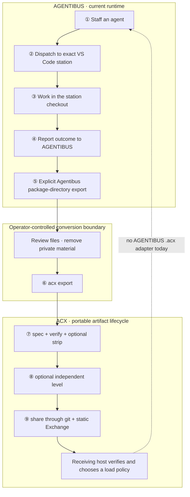

# From station outcome to shareable cartridge

AGENTIBUS and ACX cover adjacent parts of an agent lifecycle, but there is no automatic round-trip
between them today. The current path has an explicit operator-controlled boundary:

1. an agent works through a repo-bound AGENTIBUS station;
2. AGENTIBUS records the outcome and can export its own package directory;
3. an operator reviews that directory and runs the ACX CLI;
4. ACX creates, verifies, and shares a signed `.acx` artifact;
5. a receiving ACX host decides whether and how to load it.

AGENTIBUS does not currently import `.acx`, turn a cartridge into a local employee, or synchronize
learning back into an existing cartridge.



## ①–④ Work stays inside the station boundary

AGENTIBUS can cast agents against a project and derive a small team from a free-text brief. The actual
execution boundary is not fuzzy: work is queued to a connected VS Code station whose persisted station
id, repository id, and workspace match the request.

The station owns the existing checkout, terminal, agent CLI, credentials, and shell-integration events.
It reports output and the final exit status against the originating command id. When the station or
binding is unavailable, execution fails closed. AGENTIBUS does not clone the project, create a server
worktree, run a local fallback process, or inject a portable agent package into the checkout.

Outcome reports can update AGENTIBUS task history, guardrails, agent experience, skill evidence, and
company knowledge. Those updates are local runtime state. They are not automatically ACX memory records
and do not modify an existing `.acx` file.

- Runtime detail: [The studio](../concepts/studio.md).
- Standard analogy: [Loop and context policy](../format/loop-context.md) describes how a portable host
  can express bounded cycles and handoffs; it is not a transcript of AGENTIBUS execution.

## ⑤ Export an Agentibus package directory

AGENTIBUS has a package-directory export for its own exchange model:

```text
POST /api/game/agents/:id/export
→ { packagePath, packageSlug, memoryRecordCount, fileCount }
```

The directory can contain `manifest.json`, `memory-records.json`, Markdown knowledge files, checksums,
an Agentibus package signature, and optional derived memory data. It remains an **Agentibus package**,
not an `.acx` cartridge.

AGENTIBUS also has package-directory import logic. That does not imply ACX compatibility on import: the
runtime does not open, verify, or hire from the ACX SQLite container.

## Review before crossing the boundary

Treat the exported directory as sensitive runtime material. Before conversion:

- inspect every included Markdown and JSON file;
- remove secrets, private repository names, local paths, customer data, and source excerpts that should
  not travel;
- decide which records are genuinely transferable;
- confirm the public artifact id, version, description, license, authors, tags, and publisher identity;
- keep signing keys outside both repositories and exported directories.

The ACX scrub gate is defense in depth, not a substitute for this review.

## ⑥ Convert explicitly with the ACX CLI

Run the conversion from an ACX checkout or installed CLI:

```bash
acx export /path/to/agentibus-package ./my-agent.acx \
  --publisher io.github.example
```

The exporter reads the compatible package-directory fields and builds a new ACX artifact. It derives an
ACX skill, capabilities, harness requirements, loop policy, discovery metadata, and the ROM object graph;
partitions memory into transferable ROM and quarantined field-learned SAVE; runs the fail-closed scrub
gate; and signs the ROM manifest with the ACX publisher key.

This step does not preserve the Agentibus package signature as the authority for the `.acx`. The new
artifact has its own ACX identity, ROM digest, and signature.

The checked-in proof uses `examples/sample-agent-package`, an Agentibus-shaped fixture. It proves that
the ACX converter works for that input shape; it does not call a live Agentibus server or prove a shipped
runtime adapter. See [Proofs](../proofs.md).

## ⑦ Verify and strip before sharing

```bash
acx spec ./my-agent.acx
acx verify ./my-agent.acx
acx inspect ./my-agent.acx
acx strip ./my-agent.acx ./my-agent.rom.acx
acx verify ./my-agent.rom.acx
```

`acx spec` checks the format and invariants. `acx verify` recomputes the content-addressed ROM manifest
and verifies its DSSE/in-toto signature. `acx strip` removes SAVE data and proves the ROM manifest hash
is unchanged.

An unknown but valid signer resolves as `portable`, not automatically trusted. A signature proves
provenance and integrity; it never grants tools, filesystem access, model credentials, or permission to
execute.

## ⑧ Optionally request a provable level

AGENTIBUS XP, career tier, and fit scores are self-asserted local routing signals. They do not become a
portable credential during conversion.

`acx level` is a separate ACX verification action. A level credential is issued only when the configured
benchmark and evidence pass the verifier's gates, and it is bound to the exact ROM digest. The reference
solver is deterministic and pluggable; a production verifier must provide the real isolated agent run.

- Standard detail: [Provable level](../leveling/provable-level.md).

## ⑨ Share through git and the static Exchange

The reference implementation supports reviewed git publication and a fully static discovery surface.
Prepare an immutable artifact coordinate, open a pull request, let CI verify the signed bytes and rebuild
the deterministic index, then share the generated page.

```bash
acx share agent ./my-agent.rom.acx \
  --registry ../acx-registry \
  --publisher io.github.example \
  --id my-agent \
  --version 1.0.0
```

ACX also specifies an OCI layout, but wrapping, pushing, pulling, and resolving OCI objects are host/CI
responsibilities rather than commands shipped by this reference CLI.

- [Sharing over git](sharing-git.md)
- [Static Exchange](exchange.md)
- [OCI distribution](distribution.md)

## What a receiving studio can honestly claim

A recipient can download the artifact, verify its ROM and signer, inspect its skills and policies, and
apply its own trust and tool negotiation rules. A conforming host may then materialize or boot the
cartridge according to the ACX loading contract.

Current AGENTIBUS is not that host. There is no shipped `.acx` import/re-hire path, no automatic mapping
from an ACX level to AGENTIBUS career state, and no automatic re-export after new station work. Those are
adapter responsibilities and roadmap work, not properties of the current release.

## Current boundary at a glance

| Stage | Shipped owner | Current status |
| --- | --- | --- |
| Agent emergence, staffing, station execution | AGENTIBUS | Implemented |
| Outcome reporting and local progression | AGENTIBUS | Implemented |
| Agent package-directory export/import | AGENTIBUS | Implemented in its own format |
| Package directory → signed `.acx` | ACX CLI | Explicit manual conversion |
| `.acx` spec, verify, strip, level, git share | ACX CLI | Implemented within documented scope |
| `.acx` import or re-hire in AGENTIBUS | Adapter | Not implemented |
| Continuous two-way synchronization | Adapter | Not implemented |

## Related

- [The studio](../concepts/studio.md) — current AGENTIBUS runtime and the explicit handoff.
- [Cartridge model](../concepts/cartridge-model.md) — ROM versus SAVE.
- [Loading](loading.md) — the host-side ACX loading contract.
- [Signing and trust](../format/signing-trust.md) — what verification does and does not authorize.
- [Proofs](../proofs.md) — runnable ACX evidence, including the bundled conversion fixture.
