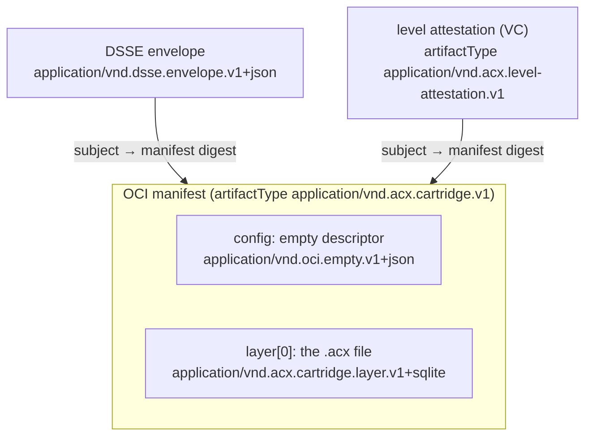

# Distribution (OCI)

A `.acx` cartridge ships as **one immutable layer inside a stock OCI image manifest**, so it distributes — and verifies — through any existing OCI registry with zero registry code change.

The cartridge is a self-contained, signed harness — the agent-OS image (see [The agent OS](../concepts/agent-os.md)). Distribution is the last lifecycle step after [loading](loading.md): the frozen `.acx` file, its DSSE signature, and any [provable-level](../leveling/provable-level.md) attestations all travel as ordinary OCI objects that `cosign` and `oras` already understand.

!!! warning "Specified, host-side — not in the reference implementation"
    OCI push is **normative in [SPEC §11](https://acx.dev) but scoped out of the zero-dependency reference implementation**. The reference tool produces the frozen `.acx` bytes, the DSSE envelope, and the level VC — all of which are what you push. Wrapping those in an OCI manifest and uploading them is done by the host / CI runtime using stock `oras`/`cosign`; nothing below runs inside the reference solver today. The layouts and media types are fixed by the spec so that any host does it the same way.

## The manifest layout

Per [SPEC §11](https://acx.dev), the `.acx` file is pushed as a single blob inside an **OCI Image
Manifest v1.1.1**:

| Field | Value |
| --- | --- |
| `artifactType` (top level) | `application/vnd.acx.cartridge.v1` |
| `config` | the OCI **empty descriptor** `application/vnd.oci.empty.v1+json`, digest `sha256:44136fa355b3678a1146ad16f7e8649e94fb4fc21fe77e8310c060f61caaff8a`, size `2` |
| `layers[0].mediaType` | `application/vnd.acx.cartridge.layer.v1+sqlite` |
| `layers[0].digest` | the digest of the frozen `.acx` bytes (uncompressed, **no tar**) |

Because `config.mediaType` is the empty value, OCI Image Specification 1.1.x requires `artifactType` to
be set — which is exactly what tags the manifest as a cartridge.

Layer annotations SHOULD carry `vnd.acx.rom-manifest-hash` and `vnd.acx.spec-version` so a registry browser can read the ROM identity without pulling the blob.



!!! note "Two integrity guarantees, kept distinct"
    - The **OCI layer digest** guarantees transport integrity of *one frozen snapshot* — the exact bytes you pushed.
    - The **DSSE rom-manifest-hash** guarantees *ROM semantics across re-materialization* — the on-disk file legitimately diverges once SAVE rows are written, but the signed ROM manifest still matches. See [Signing & trust](../format/signing-trust.md).

    For the demo cartridge in the [proofs](../proofs.md), that ROM hash is `sha256:1726cf1e6025c166e06dc839a5cbae6c900f0ffa3e0b1235be8b78e88ee09943` — stable across strip-to-ROM even as the layer digest tracks the whole file.

## Signature and attestations via the Referrers API

The [DSSE / in-toto envelope](../format/signing-trust.md) and each [provable-level](../leveling/provable-level.md) VC / Open Badge are attached as **separate referring manifests** through the OCI Referrers API, each with `subject` → the cartridge manifest digest. Where a registry does not support Referrers, the `sha256-<digest>` fallback tag is mandated.

- The DSSE referrer's single layer has `mediaType: application/vnd.dsse.envelope.v1+json`.
- The level attestation's `artifactType` is `application/vnd.acx.level-attestation.v1`.

This is stock DSSE + in-toto + OCI Referrers, so verification uses off-the-shelf tooling with **no ACX-specific code**.

## Example commands

=== "oras (discover referrers)"

    ```bash
    # List the DSSE signatures attached to a cartridge reference
    oras discover \
      --artifact-type application/vnd.dsse.envelope.v1+json \
      registry.example.com/io.github.agentibus/scenario-research-designer:1.0
    ```

=== "cosign (attest)"

    ```bash
    # Attach a signed predicate as an OCI referrer
    cosign attest \
      --predicate predicate.json \
      --type https://acx.dev/attestation/cartridge/v1 \
      --key cosign.key \
      registry.example.com/io.github.agentibus/scenario-research-designer:1.0
    ```

=== "cosign (verify)"

    ```bash
    # Verify the attestation with stock cosign — no ACX plugin
    cosign verify-attestation \
      --type https://acx.dev/attestation/cartridge/v1 \
      --key cosign.pub \
      registry.example.com/io.github.agentibus/scenario-research-designer:1.0
    ```

!!! note "`io.github.agentibus` is illustrative"
    The publisher handle above is an example, not a real organization. Substitute your own reverse-DNS publisher id.

## Zero-change registry distribution

Harness/Gitness `dbPutManifestV2` stores the manifest row, the empty config blob, and the SQLite layer **byte-for-byte without validating** `artifactType`, `config`, or `layers`. A cartridge is therefore a well-formed OCI object to a registry that has never heard of ACX — it distributes with **zero registry change**.

!!! tip "Why this matters"
    Because the whole distribution path is stock OCI, cartridges inherit the existing supply-chain ecosystem for free: content-addressed pull, mirroring, retention, and signature verification all work through tools your CI already runs. The ACX-specific meaning lives entirely in the media types and the DSSE/VC payloads — never in the registry.

!!! example "The held-out re-run, made portable"
    A cartridge carries the same regression discipline Lilian Weng frames for harnesses — *"candidates are accepted only if they have no regression on both held-in and held-out data"* ([Harness Engineering for Self-Improvement](https://lilianweng.github.io/posts/2026-07-04-harness/), 2026-07-04). The ACX [provable level](../leveling/provable-level.md) turns that acceptance rule into a cryptographic, independently-issued credential, and OCI distribution is how that credential travels **bound to the ROM digest it was earned against** — attach it as a referrer, and any consumer can resolve the capability without trusting the publisher's claim alone.

## Related

- [Loading](loading.md) — how a host boots the cartridge it just pulled.
- [Signing & trust](../format/signing-trust.md) — the DSSE envelope and ROM manifest hash referenced above.
- [The container](../format/container.md) — what the frozen `.acx` layer actually contains.
- [Provable level](../leveling/provable-level.md) — the VC attestations attached as OCI referrers.
- [CLI reference](../reference/cli.md) — producing the `.acx`, DSSE envelope, and VC that you push.

*Normative source: [SPEC §11 — OCI Distribution](https://acx.dev).*
