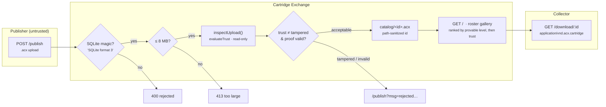

# The exchange: browse, verify, trade

The **Cartridge Exchange** is the marketplace layer of the standard: a trading post where signed, capability-bearing, level-attested `.acx` cartridges are browsed, verified, acquired, and published — without any host ever executing the code it is inspecting.

A cartridge is a self-contained, signed harness — the agent-OS image (see [The agent OS](../concepts/agent-os.md)). Everything the exchange needs to make a trade *trustworthy* is already sealed inside the file: the [DSSE signature](../format/signing-trust.md), the [declared and provable levels](../leveling/provable-level.md), and the [capability records](../format/capabilities.md). The exchange doesn't add trust — it *reads and checks* the trust the cartridge already carries. That is what lets strangers trade agents safely.

!!! note "Where this sits in the loop"
    In the [company loop](company-loop.md), a cartridge is the frozen, sellable form of a studio employee — "the thing that crosses studios." The exchange is *where it crosses*. One studio [exports](company-loop.md) an agent to a signed `.acx`, publishes it here; another studio browses the roster, verifies it, acquires it, and re-hires a pre-specialized agent. The exchange is the connective tissue between two studios that never share a runtime.

## What the reference exchange is (and is not)

The bundled exchange in `platform/` is a **zero-dependency reference implementation**: a neutral trading post to prove the trust model end to end, not a production registry.

- It reuses the reference implementation directly — `platform/catalog.mjs` opens each `.acx` **read-only** through `src/container.mjs` and runs `evaluateTrust` from `src/trust.mjs`.
- `platform/views.mjs` server-renders plain HTML (the cartridge theme); `platform/server.mjs` is a single `node:http` server; `platform/seed.mjs` seeds a starter roster.
- Same runtime rule as the rest of the project: **Node ≥ 22 builtins only** (`node:sqlite`, `node:crypto`, `node:http`), run with `--experimental-sqlite`.

```bash
node --experimental-sqlite platform/seed.mjs      # seed a roster into platform/catalog/
node --experimental-sqlite platform/server.mjs    # -> http://localhost:8787  (PORT to override)
```

!!! tip "Neutral trading language"
    The exchange is a general **Cartridge Exchange** — a roster you browse, verify, collect, and trade. It is not modeled on, and does not reference, any real trading-card game or franchise. The domain vocabulary is deliberately generic: *browse, roster, acquire, publish, trade*.

## The trade flow: publish → verify → list → acquire

Every cartridge takes the same path. Publishing is *untrusted by default* — the file is verified on the way in, and only an intact, validly-signed cartridge is ever listed. Acquisition serves the exact bytes that were verified.



The reject path is the important one. A cartridge whose signed [ROM manifest](../format/signing-trust.md) no longer matches its live bytes is classified `tampered` by `evaluateTrust`, and `inspectUpload` refuses it — it never reaches the catalog directory, so it can never be listed or acquired.

## Endpoints

All routes are served by `platform/server.mjs` on `http://localhost:8787` (set `PORT` to change).

| Method | Path | Purpose |
| --- | --- | --- |
| `GET` | `/` | Roster gallery — every catalog cartridge, ranked by provable level, then trust tier, then name |
| `GET` | `/c/:id` | Detail page for one cartridge (metadata, skills, capabilities, trust verdict, level) |
| `GET` | `/api/cartridges` | The full catalog as JSON |
| `GET` | `/download/:id` | Serves the raw `.acx`, `Content-Type: application/vnd.acx.cartridge` |
| `GET` | `/verify/:id` | Re-verifies a listed cartridge and renders the verdict |
| `GET` | `/publish` | The upload form |
| `POST` | `/publish` | Accepts an untrusted `.acx`; verifies before listing (see below) |

The gallery ranking (`platform/catalog.mjs`, `listCatalog`) sorts by `level.acxLevel` descending, then a trust rank (`local > trusted > portable > legacy > tampered`), then name — so a cartridge with a real [provable level](../leveling/provable-level.md) rises to the top, and the cartridge's own cryptographic properties, not a popularity metric, determine its standing.

## Security model

!!! danger "The exchange never executes a cartridge — it only reads and verifies"
    This is the load-bearing property of the whole trading post. Read `platform/catalog.mjs` and `platform/server.mjs` and you will find **no code path that runs, boots, evals, or dispatches** an uploaded cartridge. Every cartridge is opened **read-only** as a SQLite database; the only operations are *reading metadata* and *verifying the ed25519 DSSE signature over the recomputed ROM manifest*. Uploads are untrusted, and a **tampered** cartridge is **rejected on publish** — never listed, never served.

The upload path enforces defense in depth, all in `server.mjs`:

- **8 MB upload cap** — the request stream is destroyed with `413` the moment it exceeds `MAX_UPLOAD`.
- **SQLite-magic check** — the first 15 bytes must be `SQLite format 3` (per the [container format](../format/container.md)); anything else is `400`.
- **Path-traversal sanitization** — the incoming id is run through `safeId` (lowercased, non-`[a-z0-9._-]` collapsed, leading/trailing dots stripped, capped at 64 chars) and the resolved path is asserted to stay inside `CATALOG_DIR`. A crafted id can never write outside the catalog.
- **Verify-before-list** — `inspectUpload` calls `evaluateTrust`; a file is `acceptable` only when `trust !== 'tampered'` and the proof status is not `invalid`. Rejected uploads are deleted from the temp dir and never enter the catalog.

!!! warning "The C1 integrity guarantee is what makes the reject real"
    A tampered cartridge is caught because the ROM manifest is **recomputed from live bytes**, never read from a self-declared column — the [C1 fix](../format/signing-trust.md) at the heart of `buildRomManifest`. Rewrite one signed sqlar object, or flip a capability's `verified` flag, and the recomputed content address no longer matches the signed manifest; `evaluateTrust` returns `tampered`; the exchange returns you to `/publish` with a rejection message. Without C1, a marketplace could be poisoned by a cartridge that *claims* its own integrity. With it, the claim is checked against the bytes. See [Signing & trust](../format/signing-trust.md) and the [container format](../format/container.md) for the mechanism.

## Relationship to OCI distribution

The exchange and [OCI distribution](distribution.md) are **two front doors to the same signed artifact**, at different levels of production-readiness.

=== "Reference exchange (this page)"
    A simple, file-based trading post. Cartridges live as plain `.acx` files in `platform/catalog/`; the server is `node:http`; verification is inline. Zero dependencies, zero external services — ideal for browsing the trust model, demos, and local trading. It serves the *raw* `.acx` bytes at `/download/:id`.

=== "OCI registry (production)"
    In production the same frozen `.acx` bytes ship as **one immutable layer inside a stock OCI image manifest** (`artifactType application/vnd.acx.cartridge.v1`) and distribute through any existing OCI registry, verifiable with stock `cosign`/`oras`. See [Distribution (OCI)](distribution.md).

!!! note "Same file, same signature, either path"
    Whether a collector pulls a cartridge from this reference exchange or from an OCI registry, they receive **the identical signed bytes** and run **the identical `evaluateTrust` check** locally before booting it. The trust decision lives in the cartridge, not in the transport — so the transport is free to be as simple as a file server or as production-grade as a registry. OCI push itself is *specified in [SPEC §11](https://acx.dev) and host-side* — scoped out of the zero-dependency reference implementation — while this exchange is the runnable, in-repo distribution surface.

## Try it

```bash
# 1. seed a starter roster of signed cartridges
node --experimental-sqlite platform/seed.mjs

# 2. run the exchange
node --experimental-sqlite platform/server.mjs
# -> Cartridge Exchange on http://localhost:8787

# 3. browse the roster, open a detail page, inspect the JSON
open http://localhost:8787
curl -s http://localhost:8787/api/cartridges | head

# 4. acquire a cartridge (raw .acx bytes)
curl -s http://localhost:8787/download/<id> -o acquired.acx

# 5. publish one back — verified before it is ever listed
curl -s -X POST --data-binary @acquired.acx \
     -H 'x-cartridge-id: my-agent' \
     http://localhost:8787/publish -i
```

Try step 5 with a **tampered** cartridge (mutate one signed byte after export) and the exchange bounces you to `/publish?msg=rejected…` — the C1 check doing its job at the marketplace boundary.

## See also

- [From hire to cartridge and back](company-loop.md) — the full lifecycle; the exchange is where a cartridge leaves one studio and lands in another.
- [Capabilities](../format/capabilities.md) — the `{taskType, stack, domain, proficiency}` records the roster surfaces, and why `verified:true` requires a resolvable attestation.
- [Provable level](../leveling/provable-level.md) — the independently-issued credential that ranks a cartridge on the gallery and is bound to its ROM digest.
- [Distribution (OCI)](distribution.md) — the production transport for the same signed bytes.
- [Signing & trust](../format/signing-trust.md) — the DSSE envelope, the trust taxonomy, and the C1 integrity guarantee the exchange enforces on every publish.
