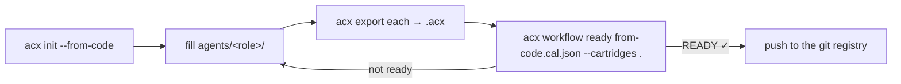

# Creating agents & agent sets

`acx init` scaffolds a fillable agent-package; `acx init --from-code` reads your codebase and generates a
whole **agent set** — several role-specialized cartridges plus a [conditional agentic loop](../format/loops-cal.md)
and the [required context](../format/knowledge-okf.md) that connects them.

## Scaffold a single agent

```bash
node --experimental-sqlite src/cli.mjs init my-agent --role backend_dev
```

This writes a fillable AGENTIBUS-style package (`manifest.json` with placeholder values,
`memory-records.json` with one transferable example record, `IDENTITY.md`, `SKILLS.md`). Fill it in, then
[export](loading.md) it to a signed cartridge:

```bash
node --experimental-sqlite src/cli.mjs export my-agent my-agent.acx --publisher io.github.you
```

The [scrub gate](../format/memory.md) blocks secrets on export, and the private signing key is written to
`my-agent.acx.key.pem` **outside** the cartridge.

## Generate an agent set from the current code

`--from-code` analyzes a repository with fast heuristics — no LLM is invoked — and proposes a team. Run
against this very repository:

```text
$ node --experimental-sqlite src/cli.mjs init --from-code . --out /tmp/agent-set
Analyzed .
Generated an agent set in /tmp/agent-set:
  • backend_dev      caps=implement-feature  (node package.json present)
  • devops_engineer  caps=deploy  (Dockerfile / CI workflows)
  • qa_engineer      caps=test-authoring  (test files/dir)
Required Available Context (descriptions only):
  □ code-wiki      [wiki] An LLM-readable knowledge map / wiki of the codebase: modules, data flows, conventions (structure only).

Next: fill agents/<role>/, export each, then 'acx workflow ready /tmp/agent-set/cal/from-code.cal.json --cartridges .'
```

It writes:

```
agent-set/
├─ agents/
│  ├─ backend_dev/      manifest.json · memory-records.json · IDENTITY.md · SKILLS.md
│  ├─ devops_engineer/  …
│  └─ qa_engineer/      …
├─ cal/
│  └─ from-code.cal.json     # a starter loop wiring the roles together
└─ README.md                 # detected roles, the RAC list, and next steps
```

### What it detects

| Signal in the repo | Role added | Capability |
|---|---|---|
| `package.json` (react/vue/nuxt…) or `src/components/` | `frontend_dev` | `implement-feature` |
| `package.json` (express/fastify/nest/prisma…) | `backend_dev` | `design-api` |
| `pyproject.toml` / `requirements.txt` | `backend_dev` | `implement-feature` |
| `*.tf` / terraform | `devops_engineer` | `deploy`, `harden-security` (+ an `infra-arch` RAC) |
| `Dockerfile` / `.github/workflows/` | `devops_engineer` | `deploy` |
| `airflow` / `dags/` | `devops_engineer` | `build-dag` |
| `tests/` or `*.test.*` | `qa_engineer` | `test-authoring` |
| `SECURITY.md` / auth deps | `security_expert` | `harden-security` |
| `docs/` or a `README.md` | — (adds a `code-wiki` RAC) | — |

!!! note "It's a scaffold, not a decision"
    The analyzer proposes a plausible team and loop from file signals; you fill in each agent's actual
    expertise, the loop's actions, and the completion conditions. Nothing here calls a model — it is a
    deterministic starting point you own and edit.

## The loop, end to end



1. **init** — generate the set from your code.
2. **fill** — write each agent's manifest + transferable memory.
3. **export** — turn each into a signed cartridge.
4. **check** — [`acx workflow lint`](../format/loops-cal.md) validates the portable workflow, `acx workflow ready` resolves the local roster and tells you what's missing, and [`acx check`](loading.md) confirms a host can boot each cartridge.
5. **share** — [push to the git registry](sharing-git.md), the [OCI registry](distribution.md), or the [exchange](exchange.md).

This mirrors how OpenWiki generates an Open Knowledge Format wiki from a codebase — generation on one side,
[declaration and verification](../format/knowledge-okf.md) on the other.

## Related

- [Loop engineering (CAL)](../format/loops-cal.md) — the loop the generator produces.
- [Required context & OKF](../format/knowledge-okf.md) — the RAC items it emits.
- [From station outcome to shareable cartridge](company-loop.md) — the explicit current handoff.
