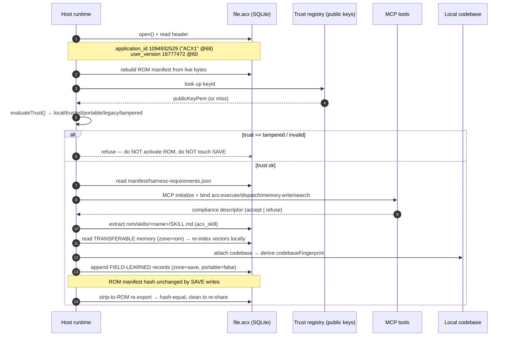
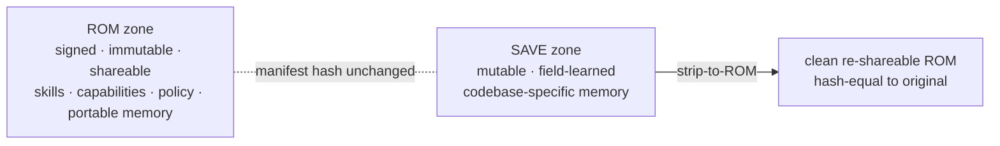

# Loading a cartridge

How a **host** boots an `.acx` cartridge end to end — open and brand-check the file, verify the ROM signature, negotiate the four required tool-roles, load skills, ingest transferable memory, learn field-specific memory into the SAVE zone, and later strip back to a clean, re-shareable ROM.

A cartridge is a self-contained, signed **harness** — the "agent-OS image" any host boots. In Lilian Weng's framing, a harness is *"the system surrounding a base model that orchestrates execution and decides how the model thinks and plans, calls tools and acts, perceives and manages context, stores artifacts, and evaluates results"* ([*Harness Engineering for Self-Improvement*](https://lilianweng.github.io/posts/2026-07-04-harness/), 2026-07-04). Loading is the moment a host takes that portable harness and wires it onto local tools and a local codebase.

!!! note "What runs today vs. what is specified"
    The reference implementation is **zero-dependency** (Node ≥ 22 `node:sqlite` + `node:crypto`). Everything in the **open → verify → inspect → strip** path below runs verbatim with `node --experimental-sqlite`. The **capability-negotiation handshake**, the **loop-policy evaluator**, live **namespace-proof** checks, and `vec0` vector indexing are **specified normatively (SPEC §8, §9, §4.3, §3.5) but are host-side and not exercised by the reference tool** — the reference stores vectors in a plain table and re-indexes from the JSON baseline. Where a step is host-side, it is called out.

## The loading sequence



## 1. Open and brand-check the file

An `.acx` file **is** a single SQLite database (SPEC §3.1). Before trusting anything, confirm the two header words a real cartridge sets. `file(1)` reads them from a 72-byte header range without a page cache:

```console
$ file /tmp/demo.acx
/tmp/demo.acx: SQLite 3.x database, application id 1094932529, user version 16777472, last written using SQLite version 3053002, file counter 14, database pages 33, cookie 0xa, schema 4, UTF-8, version-valid-for 14
```

| Header word | Offset | Value | Meaning |
| --- | --- | --- | --- |
| `application_id` | 68 | `1094932529` = `0x41435831` = ASCII `A C X 1` | Brands the file as a cartridge; `< 2^31` so `PRAGMA application_id` accepts it. |
| `user_version` | 60 | `16777472` = `0x01000100` | Packed `[MAJOR=1][MINOR=0][vec0_format=1][flags]`. |

`Cartridge.open()` rejects any file whose `application_id` is wrong (test: *"§12.1 Cartridge.open rejects a non-.acx file (wrong application_id)"*). The `vec0_format` byte matters at import: **an importer whose embedding engine differs from the packed format MUST drop and re-index the `vectors` table** (SPEC §3.1, §7.6) — see [step 6](#ingest-memory).

## 2. Verify the ROM signature (`evaluateTrust`)

The whole-file SHA-256 is deliberately **not** signed — SQLite mutates the change counter (offset 24), freelist pages, and page layout on every write, so any SAVE-zone write would break a file-level hash while the ROM is untouched (SPEC §3.3). Instead the host **recomputes the ROM integrity manifest from live bytes** — every `objects` row with `zone='rom'`, sorted by `(kind, source_ref)`, canonicalized with RFC 8785 (JCS), hashed — and checks the DSSE / in-toto envelope over it (see [Signing & trust](../format/signing-trust.md)).

`evaluateTrust()` (SPEC §4.5) returns one of five verdicts, evaluated in order:

| Trust | Condition |
| --- | --- |
| `tampered` | DSSE fails, a recomputed ROM object digest ≠ its manifest entry, or `subject.digest.sha256 ≠ manifest_hash`. **Refuse.** |
| `legacy` | No DSSE envelope; a bare pre-standard `signature.json` verifies. Import with warning. |
| `portable` | DSSE verifies, but `keyid` absent from the registry (or namespace-proof unverified / key downgraded). Import with warning. |
| `trusted` | DSSE verifies AND `keyid` is `active`, namespace-proof valid, not expired/revoked. |
| `local` | As `trusted`, and `keyid` equals the verifying host's own key. |

The **trust registry carries public keys only** — private key material must never appear in a cartridge or registry (`loadTrustRegistry` refuses private key material, SPEC §4.4).

=== "Empty registry → portable"

    ```console
    $ acx verify /tmp/demo.acx
    status:   warning
    trust:    portable
    summary:  Signature valid but signer not in trust registry.
    keyid:    ed25519:17bb8c9290fd2a3d0c3a434ad0e99544d809dbff1540d64be0bab2274df14f66
    signedAt: 2026-04-03T13:35:46.190Z
    issues:   Signer keyid not in trust registry
    exit=0
    ```

    The signature is cryptographically valid — the host just doesn't know the signer yet, so it degrades gracefully to `portable` (exit 0, importable with a warning).

=== "Trusted registry → local/trusted"

    ```text
    verify (empty registry):            warning / portable - Signature valid but signer not in trust registry.
    verify (trusted registry, local key): verified / local  - Signed by this instance.
    ```

=== "Tampered ROM → refuse"

    ```text
    verify (objects.oid tamper):             invalid / tampered - ROM content diverges from signed manifest (object hash mismatch).
    verify (SKILL.md content tamper, oid stale): invalid / tampered - ROM content diverges from signed manifest (object hash mismatch).
    ```

    Editing a signed `sqlar` blob while leaving a stale `objects.oid` is caught because the host recomputes each `oid` from the **live** bytes, never from the self-declared value.

!!! warning "A tampered/invalid verdict is a hard stop"
    `acx verify` exits non-zero on `invalid`/`tampered`. On refusal the host **MUST NOT** activate the ROM and **MUST NOT** mutate the SAVE zone (SPEC §8.5). `keyid` itself is only a registry-lookup hint — verification never depends on it beyond the lookup (SPEC §4.2).

## 3. Inspect what you're about to boot

`acx inspect` is the host's read-only pre-flight over meta, ROM object counts, skills, capabilities, memory zones, and attestations:

```console
$ acx inspect /tmp/demo.acx
== meta ==
  acx.agent_name = Scenario Research Designer
  acx.cartridge_id = io.github.agentibus/scenario-research-designer@025edd67-cc60-47b8-a059-ddd839c29db5
  acx.created_at = 2026-04-03T13:35:46.190Z
  acx.declared_level = 4
  acx.embedding_engine = {"id":"local-hash-128","dim":128}
  acx.model = gemini-2.5-pro
  acx.provider = gemini
  acx.publisher_id = io.github.agentibus
  acx.role = designer
  acx.rom_manifest_hash = sha256:f479be021b8ea2e55cc6e3e33b95df9d151196548dfc854dedbe578be7120642
  acx.spec_version = 0.1
  acx.vec0_format = 1

== ROM objects ==
  total: 21  (memory:1, cartridge:9, sqlar:11)

== skills (acx_skill) ==
  - expertise-designer: Specialized designer expertise on research, ux, benchmarking. Use when a task matches this agent's d

== capabilities ==
  - implement-feature[pkg:generic/benchmarking+pkg:generic/research+pkg:generic/ux]  verified=false
  - build-dag[pkg:generic/snowflake+pkg:pypi/apache-airflow+pkg:pypi/dbt-core]  verified=false

== memory (by zone) ==
  rom: 1

== attestations ==
  (none)
```

!!! tip "`declared_level` is a claim, not a proof"
    `acx.declared_level = 4` and `verified=false` are the publisher's self-assertions. A capability only reads `verified=true` once an **independent** [provable-level](../leveling/provable-level.md) attestation resolves against the ROM digest. Treat unverified capabilities as claims until then.

Note `acx.embedding_engine = {"id":"local-hash-128","dim":128}`: the ROM manifest declares `float[384]` as a **template**, but this cartridge's real vectors are dim-128 — the host materializes the concrete dimension from `embedding_engine.dim` (SPEC §3.5).

## 4. Read harness-requirements and negotiate tools

Every cartridge embeds exactly one **harness-requirements manifest** at `sqlar` path `manifest/harness-requirements.json` (`schemaVersion: "acx.harness.v1"`, ROM-zone, covered by the signature). A host **MUST** refuse activation if it fails verification or its `schemaVersion` is unrecognized (SPEC §8.1). ROM content invokes tools **by role**, never by a host-specific tool name — this is what makes a cartridge portable across hosts.

The **required minimal contract is exactly four roles**; absence of any one **MUST** cause refusal (SPEC §8.4):

| Role | Scopes | What it does |
| --- | --- | --- |
| `acx:execute` | `exec` (+ optional `fs.read`) | Run commands/code in a sandbox; returns the MCP `content:[{type:"text",text}]` envelope. |
| `acx:dispatch` | `dispatch` | Spawn/route a sub-agent unit of work. |
| `acx:memory.write` | `memory.write` | Append a durable **SAVE-zone** record (ref tool `agentibus_add_memory`). |
| `acx:search` | `search`, `memory.read` | Retrieval over memory + knowledge (ref tool `agentibus_search_memory`). |

Read-only inventory tools (`agentibus_list_agents`, `agentibus_project_status`, …) are `tier:"optional"` — their absence must not block activation, and the cartridge runs degraded when they're unbound.

The **handshake** (SPEC §8.5, host-side): the host (1) signature-verifies the manifest, (2) runs MCP `initialize`, (3) binds each role to a concrete tool whose advertised `inputSchema` is *structurally accepting* of the contract schema and whose granted scopes ⊇ the role's `capabilityScopes`, then (4) emits a **compliance descriptor** (`application/vnd.acx.harness-compliance.v1+json`) carrying a `requirementsHash`, `bindings[]`, and a `verdict` of `accept` or `refuse`. It refuses when the negotiated `protocolRevision < mcp.minProtocolRevision` (floor `2024-11-05`), a required role is unbound, a scope is denied, `model.toolUse` is required-but-false, or `contextWindowTokens < minContextWindowTokens`. On refuse it returns MCP's exact JSON-RPC error: `code -32602`, `message "Unsupported harness"`.

!!! warning "Specified, host-side — not in the reference tool"
    The negotiation runtime and the MCP `initialize` handshake are normative but **not implemented in the zero-dependency reference impl**. The reference verifies only that the embedded manifest matches its schema (test: *"§8 harness-requirements manifest matches its schema (requiredTools, no forbidden keys)"*). See [Harness requirements](../format/harness-requirements.md) for the manifest shape and [Loop & context policy](../format/loop-context.md) for the loop the host then drives.

## 5. Load skills

Skills travel wholly in the ROM zone as stock **SQLite Archive** (`sqlar`) rows under `rom/skills/<name>/SKILL.md`, with agentskills.io frontmatter. Because `sqlar` keeps the exact stock schema, they extract with off-the-shelf `sqlite3` — no ACX code required:

```console
$ sqlite3 /tmp/demo.acx -Ax
rom/skills/expertise-designer/SKILL.md
```

The `acx_skill` table is a **derived index** (SPEC §5.3) that lets a host enumerate skills without unpacking; its `content_sha256` matches the extracted bytes (test: *"§12.7 sqlar skills are extractable byte-for-byte and index `content_sha256` matches"*). The authoritative content is always the `SKILL.md` in `sqlar`. See [Skills](../format/skills.md).

## 6. Ingest TRANSFERABLE memory (re-index vectors locally) { #ingest-memory }

Memory is a two-tier partition (SPEC §7). Every record carries a mandatory boolean `portable` and a `codebaseFingerprint`:

- **TRANSFERABLE** (`portable: true`) — codebase-agnostic, ROM zone, `codebaseFingerprint` and `repoId` **MUST** be `null`. These are the only records eligible to merge into the host's native memory.
- **FIELD-LEARNED** (`portable: false`) — codebase-specific, SAVE zone, **MUST** carry a non-null `codebaseFingerprint`. Written in [step 8](#8-learn-into-the-save-zone).

The `memory-records.json` canonical-JSON projection is the **always-present portable baseline and the sole source of truth on import** (SPEC §7.6). Vectors are derived, never signed, and engine-specific — so on import the host **MUST re-index every record from the JSON baseline using its own engine and MUST discard foreign vectors**. A bundle with vectors but no baseline is invalid.

Import merge is idempotent and reuses AGENTIBUS' two-key merge unchanged: dedupe by `id`, then by the 10-hex-char `artifactFingerprint`; conflicts resolve deterministically (longer text wins, worse impact wins, max `xpAwarded`, union tags, latest timestamp). `portable` and `codebaseFingerprint` are excluded from the fingerprint, so a record's content address is **tier-independent** — merging is commutative and idempotent (SPEC §7.3), and re-tiering never forks a duplicate.

!!! note "vec0 is templated, not run, in the reference impl"
    The DDL declares a `vectors` `vec0` virtual table, but the reference implementation uses a plain table and re-indexes from the JSON baseline. Real `vec0` indexing is host-side (SPEC §3.5, §7.6).

## 7. Start a codebase — derive a fingerprint

To attach the harness to a real repository, the host derives a **privacy-preserving codebase fingerprint** (SPEC §7.2):

```
codebaseFingerprint = "cbf1_" + HMAC-SHA-256(key = installationSalt, msg = canonicalRepoIdentity)   [first 40 hex chars]
```

`canonicalRepoIdentity` is the git `origin` URL normalized to `host + "/" + path` (lowercased, credentials removed, default port removed, trailing `.git` stripped), falling back to the root-commit SHA when there's no remote. The `installationSalt` is a ≥ 256-bit **org-scoped secret held outside the bundle and never exported**. The fingerprint **MUST NOT** contain or derive from the repo name or label. The secret salt makes it dictionary-resistant; org-scoping makes it intentionally non-correlatable across orgs — that is the quarantine boundary.

## 8. Learn into the SAVE zone

As the agent works, `acx:memory.write` appends **FIELD-LEARNED** records (`portable: false`, `zone: 'save'`) tagged with the current `codebaseFingerprint`. These are quarantined by default: excluded from re-share unless `--include-field-learned` is passed, and even then they **MUST NOT** re-project onto an importer's codebase (SPEC §7.4).

Crucially, **SAVE writes never touch the ROM**. Field-learned records are quarantined by default so no `repoId` leaks into ROM memory (test: *"field-learned records are quarantined by default"*), and the on-disk file digest legitimately drifts while the signed ROM manifest stays identical. This mirrors Weng's rule that a harness *"should keep durable state in files"* rather than in context — the cartridge **is** that durable, on-disk state.



## 9. Strip-to-ROM to re-share cleanly

When you want to hand the cartridge on — sell it, publish it, or push it to a registry — **strip-to-ROM** removes every SAVE-zone row and re-exports. The recomputed ROM manifest hash **MUST** equal the original signed hash; that equality is the machine-checkable proof the ROM was never mutated by field learning (SPEC §3.4):

```console
$ acx strip /tmp/demo.acx /tmp/demo.rom.acx
rom hash before strip: sha256:f479be021b8ea2e55cc6e3e33b95df9d151196548dfc854dedbe578be7120642
rom hash after  strip: sha256:f479be021b8ea2e55cc6e3e33b95df9d151196548dfc854dedbe578be7120642
hash-equality proof:   EQUAL (ROM intact; SAVE removed)
wrote:                 /tmp/demo.rom.acx
exit=0
```

Under the hood: `DELETE FROM memory WHERE zone='save'` (and the matching `sqlar`, `vectors`, `objects` rows), clear `acx.save_codebase_fingerprint`, clear the SAVE flag bit, `VACUUM`. The existing `signatures` row re-verifies unchanged. A **fail-closed scrub gate** also runs on export before signing — it blocks (non-zero exit) on any AWS key, PEM private key, GitHub token, JWT, or URI credential; local Unix, Windows, and `~/…` home paths are flagged for normalization, and secrets are never silently redacted (SPEC §7.5; tests: *"scrub gate FAILS CLOSED"*).

The stripped, re-signed ROM is now ready for [distribution](distribution.md) as an OCI layer — the last lifecycle step.

## Related

- [The agent OS](../concepts/agent-os.md) — why a cartridge is a portable, signed harness.
- [Container format](../format/container.md) and [Signing & trust](../format/signing-trust.md) — the header, ROM manifest, and DSSE envelope this page verifies.
- [Harness requirements](../format/harness-requirements.md) and [Loop & context policy](../format/loop-context.md) — the tool-roles and loop a host negotiates and drives.
- [Memory](../format/memory.md) — the two-tier partition and codebase fingerprint.
- [Provable level](../leveling/provable-level.md) — turning `verified=false` claims into independently re-run credentials.
- [CLI reference](../reference/cli.md) and the full [proofs transcript](../proofs.md).
