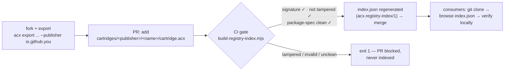

# Sharing over git

The `registry/` directory is a **git-shareable public registry**: an open, forkable, PR-reviewed way to publish cartridges and agent-package templates using nothing but git — with a CI verification gate that re-verifies every pushed cartridge and refuses to index anything tampered, invalid, or unclean.

A cartridge is a self-contained, signed harness — the agent-OS image (see [The agent OS](../concepts/agent-os.md)). Because everything that makes a cartridge trustworthy is sealed *inside* the `.acx` file — the [DSSE signature](../format/signing-trust.md), the [package spec](../format/packages.md), the capability and level records — the transport can be as dumb as a git repository. Git contributes what it is good at (forks, pull requests, history, review); the file contributes the trust.

## Three ways to share, one trust model

The git registry **complements** the other two distribution paths — it does not replace them. All three verify the exact same signed bytes with the exact same code path:

| | Git registry (this page) | [OCI distribution](distribution.md) | [HTTP exchange](exchange.md) |
| --- | --- | --- | --- |
| Transport | git push / pull request | OCI registry (`oras`, `cosign`) | live `node:http` server |
| Best for | open, forkable, PR-reviewed sharing of cartridges *and templates* | registry-grade distribution: tags, digests, replication | browsing, verifying, and trading a live roster |
| Review model | humans review the PR, CI verifies the cartridge | registry access control + signature verification | server verifies on catalog load |
| Index | `registry/index.json` (`acx.registry-index/1`), regenerated by CI | OCI image manifest per cartridge | server-rendered roster pages |
| Runs today | yes — `tools/build-registry-index.mjs` in the reference impl | layouts normative in SPEC §11; push is host-side | yes — `platform/` reference server |

Whichever path a cartridge travels, the verifier at the far end recomputes the ROM manifest from live bytes and checks the ed25519 DSSE envelope — the transport never becomes part of the trust story.

## Registry layout

```text
registry/
├── cartridges/
│   ├── io.github.ridgeworks/          # one directory per publisher (reverse-DNS id)
│   │   └── ada-ridge/                 # one directory per cartridge
│   │       ├── cartridge.acx          # the signed cartridge itself
│   │       └── README.md              # what it is, how it was trained (convention)
│   └── io.github.calder-sec/
│       └── rex-calder/
│           └── cartridge.acx
├── templates/                         # agent-package templates (export *inputs*)
│   └── <publisher>/<name>/            # a directory you can `acx export` directly
├── trust-registry.json                # PUBLIC KEYS ONLY (optional; see below)
└── index.json                         # generated — never hand-edited
```

Two kinds of contribution live side by side:

- **Cartridges** (`registry/cartridges/<publisher>/<name>/cartridge.acx`) — frozen, signed `.acx` files. These are the sellable output of the [company loop](company-loop.md): a studio's agent, exported and ready for someone else to re-hire.
- **Templates** (`registry/templates/<publisher>/<name>/`) — plain agent-package *directories* (the same shape as `examples/sample-agent-package/`): identity, skills, seed memories, loop policy. A template is not signed — it is the raw material someone forks, edits, and exports into *their own* signed cartridge under *their own* publisher id.

!!! note "Publisher ids are illustrative"
    Publisher ids like `io.github.ridgeworks` are reverse-DNS handles, not real organizations. Live namespace-proof verification (DNS-TXT / GitHub-OIDC) is specified in the spec but host-side — the git registry's namespace claim is enforced socially, by PR review of the `cartridges/<publisher>/` path.

## Pushing a cartridge

The workflow is an ordinary fork-and-PR loop with one extra step: you produce the signed artifact locally with the CLI.

**1. Fork and clone** the registry repository.

**2. Export your agent package into a signed cartridge:**

```bash
node --experimental-sqlite src/cli.mjs export \
  my-agent-package/ cartridge.acx \
  --publisher io.github.yourhandle
```

Export writes the ed25519 **private key to `cartridge.acx.key.pem` — outside the cartridge**. Keep it; never commit it. Only the public key ever appears anywhere in the registry.

**3. Sanity-check locally** — the same checks CI will run:

```bash
node --experimental-sqlite src/cli.mjs verify cartridge.acx   # signature + tamper check
node --experimental-sqlite src/cli.mjs spec cartridge.acx     # package-spec validation
```

`spec` prints the cartridge's [clean package spec](../format/packages.md) — the `rom/package-spec.json` manifest (`acx.package-spec/1`) that enumerates every artifact the cartridge carries with its versioned schema id — and ends with `validation: CLEAN ✓` or a list of issues. CI rejects anything that is not clean, so run this first.

**4. Add the cartridge under your publisher path:**

```bash
mkdir -p registry/cartridges/io.github.yourhandle/my-agent
cp cartridge.acx registry/cartridges/io.github.yourhandle/my-agent/cartridge.acx
# plus a README.md describing the agent (convention, strongly encouraged)
```

**5. Open a pull request.** Reviewers see a small, legible diff: one binary file, one README, one path that names the publisher. CI does the cryptographic part.

### Pushing a template

Same loop, no signing step: add the agent-package directory under `registry/templates/<publisher>/<name>/` and open a PR. Templates are reviewed as ordinary text (identity JSON, `SKILL.md` files, seed memories, loop policy) — which is exactly why git is the right transport for them: every line is diffable in the PR.

## The CI verification gate

`tools/build-registry-index.mjs` is the registry's gatekeeper. Run on every push, it **opens and verifies every cartridge in the tree** and regenerates `registry/index.json`:

```bash
node --experimental-sqlite tools/build-registry-index.mjs
```

```text
indexed 2 cartridge(s) -> registry/index.json
  Ada Ridge        io.github.ridgeworks     trust=portable level=distinguished Lv.30 spec=clean
  Rex Calder       io.github.calder-sec     trust=portable level=senior Lv.19 spec=clean
```

For each `.acx` it finds under `registry/cartridges/`, the builder:

1. opens the cartridge **read-only** through `src/container.mjs`,
2. runs `evaluateTrust` from `src/trust.mjs` — the same function the [exchange](exchange.md) and the CLI use — which recomputes the content-addressed ROM manifest **from live bytes** and verifies the DSSE envelope,
3. runs `validatePackageSpec` from `src/packagespec.mjs` against the embedded `rom/package-spec.json`,
4. extracts the summary fields (name, publisher, role, capabilities, ROM hash, provable level with `boundToRom` re-checked against the live `acx.rom_manifest_hash`).

Any cartridge that comes back `tampered`, `invalid`, or with an unclean spec is **rejected and the build exits non-zero**:

```text
REJECTED 1 cartridge(s) (tampered / invalid / unclean spec):
  ✗ cartridges/io.github.example/bad-agent/cartridge.acx  trust=tampered specClean=false
```

A failing build means the PR cannot merge and `index.json` is never regenerated to include the bad entry — **a bad push cannot be indexed**. This has been verified live: pushing a cartridge whose signed sqlar content was rewritten after signing is detected as `tampered` and rejected by the index build.

!!! danger "This is the C1 guarantee, applied to a registry"
    The gate inherits the security-critical rule from [signing & trust](../format/signing-trust.md#the-c1-lesson-never-trust-self-declared-hashes): **never trust self-declared hashes**. Verification recomputes every content hash from the live bytes in the file, so an attacker who edits signed content — even while keeping the stored manifest and signature intact — flips the cartridge to `tampered`. The git registry adds nothing to that mechanism; it just refuses to *list* what the mechanism condemns. Git history, branch protection, and PR review are conveniences on top — the cryptography is what actually protects consumers who clone the repo.



## The index: `acx.registry-index/1`

`registry/index.json` is a generated artifact — never hand-edited — that lets consumers browse the registry without opening every SQLite file:

```json
{
  "schemaVersion": "acx.registry-index/1",
  "generatedAt": "2026-07-16T21:02:38.470Z",
  "count": 2,
  "cartridges": [
    {
      "slug": "io.github.ridgeworks__ada-ridge__cartridge",
      "path": "cartridges/io.github.ridgeworks/ada-ridge/cartridge.acx",
      "name": "Ada Ridge",
      "publisher": "io.github.ridgeworks",
      "role": "devops_engineer",
      "trust": "portable",
      "trustStatus": "warning",
      "specClean": true,
      "romHash": "sha256:06b9ceae34b07743a3934674aeac6aa5548e61d2cef31b12ebaafd4670b45cd5",
      "capabilities": [ { "taskType": "implement-feature", "domain": "infrastructure", "verified": false } ],
      "level": { "acxLevel": 30, "careerTier": "distinguished", "boundToRom": true }
    }
  ]
}
```

Entries are sorted by provable level, then name. The index is a *convenience*, not a trust root: `romHash` lets a consumer confirm the file they cloned matches the entry, but the authoritative check is always re-running `acx verify` against the `.acx` bytes themselves.

## `trust-registry.json`: public keys only

The registry may carry a `registry/trust-registry.json` mapping key ids to publishers (SPEC §4.4):

```json
{
  "schemaVersion": "acx.trust-registry/1",
  "keys": [
    {
      "keyid": "ed25519:3f9a…",
      "publisherId": "io.github.ridgeworks",
      "algorithm": "ed25519",
      "publicKeyPem": "-----BEGIN PUBLIC KEY-----\n…"
    }
  ]
}
```

Two properties matter here:

- **Public keys only, enforced in code.** `loadTrustRegistry` in `src/trust.mjs` refuses to load any registry whose JSON contains `PRIVATE KEY` material — a fat-fingered PR that pastes a `.key.pem` fails the build instead of leaking.
- **It upgrades trust; its absence degrades gracefully.** Without a registry entry, a validly signed cartridge verifies against its embedded public key and lands at `portable` (signature valid, publisher key unregistered — the `trustStatus: "warning"` you see in the index above). Adding a publisher's public key via PR upgrades their cartridges to `trusted`. See the full taxonomy in [signing & trust](../format/signing-trust.md).

!!! tip "Registering a publisher key is itself a PR"
    That is the quiet advantage of the git transport: the trust registry's change history *is* the git history. Who vouched for which key, when, and in which review thread is answerable with `git log -p registry/trust-registry.json`.

## Where this fits

- A studio raises an agent through the [company loop](company-loop.md) and exports it — the git registry is one of the places the frozen employee can cross to another studio.
- For registry-grade distribution with digests and replication, wrap the same file in an [OCI manifest](distribution.md).
- To browse, verify, and trade a live roster with a UI, run the [exchange](exchange.md) — it consumes the very same files and runs the very same `evaluateTrust`.
- What the CI gate checks structurally is defined by the [clean package spec](../format/packages.md); what it checks cryptographically is defined by [signing & trust](../format/signing-trust.md).
