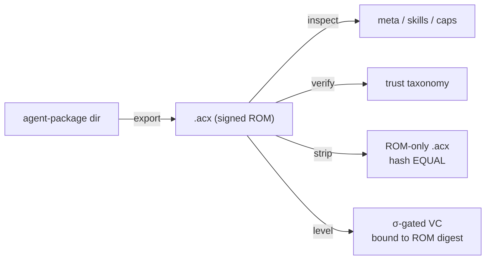

# CLI reference

`acx` is the zero-dependency reference command-line tool for building, inspecting, verifying, stripping,
leveling, and safely sharing `.acx` Agent Cartridges — and for linting, signing, verifying, inspecting,
staffing, and submitting reusable ACX Workflows and Agent Graphs.

## Running the tool

The reference implementation is pure ESM with no third-party dependencies: it uses only Node's built-in `node:sqlite` and `node:crypto`. Because `node:sqlite` is still gated behind a flag, every invocation must run under `node --experimental-sqlite`.

!!! warning "Node ≥ 22 and `--experimental-sqlite` are required"
    `acx` opens the cartridge with the built-in `node:sqlite` module. Without the flag the process aborts before any command runs.

    ```bash
    node --experimental-sqlite src/cli.mjs <command> …
    ```

    The shebang in `src/cli.mjs` already encodes this (`#!/usr/bin/env -S node --experimental-sqlite`), so `./src/cli.mjs <command>` works on a system where that env form is honored.

Running `acx` with no command (or `help`, `-h`, `--help`) prints usage:

```text
acx — Agent Cartridge (.acx) command-line tool

Usage:
  acx export <agent-package-dir> <out.acx> --publisher <reverse-dns> [--include-field-learned]
  acx inspect <file.acx>
  acx verify  <file.acx> [--registry <trust.json>]
  acx strip   <file.acx> <out.acx>
  acx spec    <file.acx>
  acx check   <file.acx> [--all-tools]
  acx load    <file.acx> [--host claude|codex|cursor]
  acx workflow lint    <workflow.cal.json> [--publish]
  acx workflow sign    <workflow.cal.json> --publisher <reverse-dns> [--key <pem>] [--out <file>]
  acx workflow verify  <workflow.cal.json> [--registry <trust.json>]
  acx workflow inspect <workflow.cal.json>
  acx workflow ready   <workflow.cal.json> [--cartridges <dir>]
  acx graph lint    <graph.agent-graph.json> [--publish]
  acx graph sign    <graph.agent-graph.json> --publisher <reverse-dns> [--key <pem>] [--out <file>]
  acx graph verify  <graph.agent-graph.json> [--registry <trust.json>]
  acx graph inspect <graph.agent-graph.json>
  acx share agent      <file.acx> --slug <slug> [--dry-run]
  acx share workflow   <workflow.cal.json> [--dry-run]
  acx share graph      <graph.agent-graph.json> [--dry-run]
  acx level   <file.acx>
```

| Command | One-liner | SPEC |
|---------|-----------|------|
| [`export`](#export)  | Package an agent directory into a signed `.acx` | §12 |
| [`inspect`](#inspect) | Print meta, ROM objects, skills, capabilities, memory, attestations | §12 |
| [`verify`](#verify)  | Evaluate the trust taxonomy (`local/trusted/portable/legacy/tampered`) | §4.5, §12.6 |
| [`workflow`](#workflow) | Validate, sign, verify, inspect, and staff portable agent-team workflows | §14 |
| [`graph`](#graph) | Validate, sign, verify, and inspect portable team information architectures | §16 |
| [`share`](#share) | Verify and prepare one focused registry pull request | Reference distribution workflow |
| [`strip`](#strip)   | Re-export SAVE-free and prove the ROM hash is unchanged | §3.4 |
| [`level`](#level)   | Earn a σ-gated, ROM-bound level credential from an independent verifier | §10 |

!!! note "What is real vs. host-side here"
    The crypto, hashing, DSSE/in-toto signing, trust evaluation, scrub gate, TrueSkill gating, and credential verification are **fully implemented**. The `level` benchmark's **reference solver is deterministic and pluggable** — a production verifier plugs a real sandboxed agent run into the same gate. OCI push, DNS-TXT/OIDC namespace proofs, the host handshake runtime, and `vec0` vector search are **specified normatively but not part of this CLI**.

---

## `share`

Prepare a signed agent, workflow, or Agent Graph for the git registry. `share` performs no git, network,
push, or PR operation: it verifies the artifact, enforces safe canonical paths, copies only the public
artifact, and generates review metadata.

```bash
acx share agent agent.acx --slug research-designer --dry-run
acx share agent agent.acx --slug research-designer

acx share workflow research-council.cal.json --dry-run
acx share workflow research-council.cal.json

acx share graph product-delivery.agent-graph.json --dry-run
acx share graph product-delivery.agent-graph.json
```

| Flag | Meaning |
| --- | --- |
| `--registry <dir>` | Registry root; defaults to this checkout's `registry/` |
| `--publisher <id>` | Require an exact match with the publisher bound into the signature |
| `--slug <slug>` | Required safe destination slug for an agent |
| `--dry-run` | Verify and print the planned paths/PR body without writing |
| `--force` | Permit a consciously reviewed update when different bytes already exist |

For agents, `share` requires a valid signed cartridge and clean `acx.package-spec/1`, then produces
`registry/cartridges/<publisher>/<slug>/cartridge.acx` plus a generated README card. For workflows, it
requires the complete publication profile and valid JCS/DSSE/in-toto publisher binding, then produces
`registry/cals/<id>.cal.json`. For Agent Graphs, it applies the same signature and publication gates, then
produces `registry/graphs/<id>.agent-graph.json`. It refuses legacy/unsigned artifacts, tampering, publisher
mismatches, unsafe identifiers, secret-like public metadata, and silent overwrite.

Continue with the deterministic index builder and tests:

```bash
node --experimental-sqlite tools/build-registry-index.mjs
npm test
git diff --check
git diff -- registry/
```

See [Share ACX](../share.md) for the human path and the bundled
[`$acx-share-agent`](../share.md#let-an-agent-prepare-its-own-share-pr) skill for agent-driven PR
preparation.

---

## `graph`

Work with a standalone `acx.agent-graph/1` information architecture without assigning or executing tasks.
The five public subcommands follow the workflow trust model while keeping organizational communication
separate from control flow.

| Subcommand | Purpose | Exit behavior |
|---|---|---|
| `graph lint <file> [--publish]` | Validate actor and knowledge references, routes and expected returns, loop bindings, convergence, direction invariants, and graph bounds; optionally validate public metadata | non-zero on any structural/publication issue |
| `graph sign <file> --publisher <id> [--key <pem>] [--out <file>]` | JCS-canonicalize the document, compute its SHA-256 digest, and add an Ed25519 DSSE/in-toto integrity block | non-zero if invalid or not publishable |
| `graph verify <file> [--registry <trust.json>]` | Recompute the digest and verify signature, graph id/version, publisher, key id, time, and trust-registry binding | non-zero when unsigned, invalid, or tampered |
| `graph inspect <file>` | Print a safe discovery card: actors, knowledge, route intents, connected loops, convergence, digest, and trust | read-only; never routes a message or dispatches a task |
| `graph digest <file>` | Print the SHA-256 digest of the unsigned JCS-canonical graph document | read-only; fails when the input is not a JSON object |

```bash
# Validate the public contract.
node --experimental-sqlite src/cli.mjs graph lint \
  product-delivery.agent-graph.json --publish

# Sign. With no --key, a new private key is written beside the output.
node --experimental-sqlite src/cli.mjs graph sign \
  product-delivery.agent-graph.json \
  --publisher io.github.yourhandle \
  --out product-delivery.signed.agent-graph.json

# Verify and inspect without executing anything.
node --experimental-sqlite src/cli.mjs graph verify \
  product-delivery.signed.agent-graph.json
node --experimental-sqlite src/cli.mjs graph inspect \
  product-delivery.signed.agent-graph.json
node --experimental-sqlite src/cli.mjs graph digest \
  product-delivery.signed.agent-graph.json
```

`lint` accepts fuzzy prose and selectors but fails closed on hard invariants. Routes cannot point back to
their own source. Required direction cannot have conflicting owners or cycles. Expected returns must name
a real reverse route. Loop participant bindings cannot be ambiguous. Every convergence has at least two
distinct loop inputs and positive wait/round limits; graph-wide propagation and fan-out are bounded.

Publishable graphs add a stricter safety profile: discovery metadata must not look like credentials or
private key material, and every referenced ACX Workflow is pinned by id, SemVer, and canonical digest.
Knowledge modules contain descriptions, stewards, audiences, and optional metadata locators — never the
knowledge payload itself.

!!! warning "An Agent Graph is not an authorization or dispatch engine"
    `direct`, `approval`, and other route fields describe team relationships. They never grant tool access,
    budget, filesystem rights, or permission to act. `lint`, `sign`, `verify`, and `inspect` consume
    declarative data only. A host that routes events remains responsible for policy, authorization, and all
    declared propagation/convergence bounds.

See the visual [Agent Graph guide](../format/agent-graph.md) for the Product Owner ↔ Developer reporting
loop and the research + delivery convergence pattern.

---

## `workflow`

Work with a standalone `acx.cal/1` team workflow without executing it. The five subcommands deliberately
separate a portable artifact's validity and trust from one machine's ability to staff it.

| Subcommand | Purpose | Exit behavior |
|---|---|---|
| `workflow lint <file> [--publish]` | Validate closed conditions, references, completion contracts, reachability, termination, cycle bounds, and optionally public metadata | non-zero on any structural/publication issue |
| `workflow sign <file> --publisher <id> [--key <pem>] [--out <file>]` | JCS-canonicalize the document, compute its SHA-256 digest, and create an Ed25519 DSSE/in-toto integrity block | non-zero if invalid or not publishable |
| `workflow verify <file> [--registry <trust.json>]` | Recompute the digest and verify the signature, workflow id/version, publisher, key id, time, and trust-registry binding | non-zero when invalid or tampered |
| `workflow inspect <file>` | Print a discovery card: identity, team slots, required capabilities, digest, signature, and trust | read-only; never executes tasks |
| `workflow ready <file> [--cartridges <dir>]` | Recursively scan `.acx` files, staff slots by role/proven level/capability/stack, and check each task's skill/capability coverage | non-zero when this roster cannot run it |

`acx cal <file> [--cartridges <dir>]` remains a backward-compatible alias for `workflow ready`.

### Share a workflow

```bash
# 1. Portable validation: no local cartridges required.
node --experimental-sqlite src/cli.mjs workflow lint team.cal.json --publish

# 2. Sign. With no --key, a new private key is written beside the output.
node --experimental-sqlite src/cli.mjs workflow sign team.cal.json \
  --publisher io.github.yourhandle --out team.signed.cal.json

# 3. Anyone can verify the exact shared graph before staffing or execution.
node --experimental-sqlite src/cli.mjs workflow verify team.signed.cal.json

# 4. The receiving studio checks whether its local roster can fill every slot.
node --experimental-sqlite src/cli.mjs workflow ready team.signed.cal.json \
  --cartridges ./roster
```

Signing covers every top-level field except `integrity` using RFC 8785/JCS and binds the digest into an
in-toto Statement carried by DSSE. The generated private key stays outside the JSON and must never enter
git. A valid but unregistered signer is `portable`; a namespace-proven trust-registry entry upgrades it to
`trusted`; content or identity tampering is `tampered`.

!!! warning "Validation does not execute the workflow"
    `lint`, `verify`, `inspect`, and `ready` consume declarative data only. Actual dispatch, tool calls,
    approvals, timers, variable updates, and branch advancement belong to a conformant host runtime.
    Before execution, a host must enforce each task's `sideEffects`, `approval`, completion contract,
    resource limits, and its own stricter policy.

---

## `export`

Package an AGENTIBUS agent-package directory into a signed `.acx` cartridge.

**Synopsis**

```bash
node --experimental-sqlite src/cli.mjs export \
  <agent-package-dir> <out.acx> \
  --publisher <reverse-dns> [--include-field-learned]
```

**Options**

| Argument / flag | Required | Meaning |
|-----------------|----------|---------|
| `<agent-package-dir>` | yes | Source AGENTIBUS agent-package directory. |
| `<out.acx>` | yes | Destination cartridge path. |
| `--publisher <reverse-dns>` | yes | Publisher id, e.g. `io.github.agentibus` (illustrative handle, not a real org). |
| `--include-field-learned` | no | Include quarantined field-learned SAVE memory. Default: **off**. |

**What it does**

1. Generates a fresh **ed25519 signing key** and derives `keyid = "ed25519:" + hex(sha256(DER SPKI))`.
2. Builds the ROM (skills, capabilities, meta), then signs a **content-addressed ROM manifest recomputed from live bytes** in a DSSE / in-toto envelope. See [Signing & trust](../format/signing-trust.md).
3. Writes the cartridge, then writes the **private key to `<out.acx>.key.pem` (mode `0600`) OUTSIDE the cartridge**.

!!! danger "The private key is written outside the cartridge — and must stay there"
    Per SPEC §4 the signing key is **never** stored inside the `.acx`. `export` emits it as a sibling file `<out>.key.pem`. Keep it secret; anyone with it can forge signatures under your `keyid`. The cartridge you distribute contains **public key material only**.

By default, field-learned memory is **quarantined** — the fail-closed scrub gate (SPEC §7.5) and the two-tier partition keep codebase-specific records out of what you ship unless you opt in with `--include-field-learned`. See [Memory](../format/memory.md).

=== "Command"

    ```bash
    node --experimental-sqlite src/cli.mjs export \
      ./agent-package /tmp/demo.acx \
      --publisher io.github.agentibus
    ```

=== "Real output (Proof 4)"

    ```text
    cartridge id:   io.github.agentibus/scenario-research-designer@025edd67-cc60-47b8-a059-ddd839c29db5
    rom hash:       sha256:f479be021b8ea2e55cc6e3e33b95df9d151196548dfc854dedbe578be7120642
    keyid:          ed25519:17bb8c9290fd2a3d0c3a434ad0e99544d809dbff1540d64be0bab2274df14f66
    signing key:    /tmp/demo.acx.key.pem  (private — keep secret, outside cartridge)
    field-learned:  quarantined (default)
    wrote:          /tmp/demo.acx
    ```

The `rom hash` printed here (`sha256:f479be02…7120642`) is the value that every later command binds to.

---

## `inspect`

Print meta, ROM object counts, skills, capabilities, memory zone counts, and attestations for a cartridge. Read-only.

**Synopsis**

```bash
node --experimental-sqlite src/cli.mjs inspect <file.acx>
```

**Options** — a single positional `<file.acx>`; no flags.

**What it does** — opens the cartridge read-only and prints six sections: `meta` (all `acx.*` keys, sorted), the ROM object total grouped by kind, the `acx_skill` rows, the `capabilities` rows (with each capability's `verified` flag), memory counts grouped by `zone`, and any attestations.

=== "Command"

    ```bash
    node --experimental-sqlite src/cli.mjs inspect /tmp/demo.acx
    ```

=== "Real output (Proof 5)"

    ```text
    == meta ==
      acx.agent_name = Scenario Research Designer
      acx.cartridge_id = io.github.agentibus/scenario-research-designer@025edd67-cc60-47b8-a059-ddd839c29db5
      acx.created_at = 2026-04-03T13:35:46.190Z
      acx.declared_level = 4
      acx.embedding_engine = {"id":"local-hash-128","dim":128}
      acx.model = gemini-2.5-pro
      acx.provider = gemini
      acx.publisher_id = io.github.agentibus
      acx.role = designer
      acx.rom_manifest_hash = sha256:f479be021b8ea2e55cc6e3e33b95df9d151196548dfc854dedbe578be7120642
      acx.spec_version = 0.1
      acx.vec0_format = 1

    == ROM objects ==
      total: 21  (memory:1, cartridge:9, sqlar:11)

    == skills (acx_skill) ==
      - expertise-designer: Specialized designer expertise on research, ux, benchmarking. Use when a task matches this agent's d

    == capabilities ==
      - implement-feature[pkg:generic/benchmarking+pkg:generic/research+pkg:generic/ux]  verified=false
      - build-dag[pkg:generic/snowflake+pkg:pypi/apache-airflow+pkg:pypi/dbt-core]  verified=false

    == memory (by zone) ==
      rom: 1

    == attestations ==
      (none)
    ```

!!! note "`verified=false` until a level attestation resolves"
    A capability's `proficiency.verified` is `true` **only** when a level attestation resolves against the ROM digest (SPEC §10). A freshly exported cartridge always reads `verified=false`; run [`level`](#level) to change that. See [Capabilities](../format/capabilities.md) and [Provable level](../leveling/provable-level.md).

!!! tip "`declared_level` is a claim, not a proof"
    `acx.declared_level = 4` is what the publisher asserts. Only an independently issued, σ-gated credential makes a level provable.

---

## `verify`

Evaluate the SPEC §4.5 trust taxonomy for a cartridge. **Exits non-zero** when the result is `invalid` or `tampered`.

**Synopsis**

```bash
node --experimental-sqlite src/cli.mjs verify <file.acx> [--registry <trust.json>]
```

**Options**

| Argument / flag | Required | Meaning |
|-----------------|----------|---------|
| `<file.acx>` | yes | Cartridge to evaluate. |
| `--registry <trust.json>` | no | **Public-keys-only** trust registry. Loading a registry that contains private key material is refused (SPEC §12.4). |

**What it does** — recomputes the ROM manifest from live bytes, checks the DSSE signature, and maps the outcome onto the trust taxonomy:

| trust | meaning |
|-------|---------|
| `local` | signed by this instance's own key |
| `trusted` | valid signature, signer in the registry |
| `portable` | valid signature, signer **not** in the registry |
| `legacy` | unsigned |
| `tampered` | ROM content diverges from the signed manifest |

With no `--registry`, an empty registry is used, so a validly-signed cartridge from an unknown signer resolves to `portable` with `status: warning` (a caution, not a failure — `exit=0`).

=== "Command"

    ```bash
    node --experimental-sqlite src/cli.mjs verify /tmp/demo.acx
    ```

=== "Real output (Proof 6)"

    ```text
    status:   warning
    trust:    portable
    summary:  Signature valid but signer not in trust registry.
    keyid:    ed25519:17bb8c9290fd2a3d0c3a434ad0e99544d809dbff1540d64be0bab2274df14f66
    signedAt: 2026-04-03T13:35:46.190Z
    issues:   Signer keyid not in trust registry
    exit=0
    ```

!!! example "Tamper is detected, not just missing signatures"
    Rewriting signed sqlar content while leaving a stale `objects.oid` yields `invalid / tampered — ROM content diverges from signed manifest (object hash mismatch)` and `exit=1`. The full taxonomy walkthrough lives in [Signing & trust](../format/signing-trust.md).

---

## `strip`

Copy a cartridge, remove the SAVE zone, and print the **ROM hash-equality proof**. Exits non-zero if the hashes differ.

**Synopsis**

```bash
node --experimental-sqlite src/cli.mjs strip <file.acx> <out.acx>
```

**Options** — two positionals: the source `<file.acx>` and the SAVE-free destination `<out.acx>`; no flags.

**What it does** — copies the file, drops every SAVE-zone row, and re-derives the ROM manifest hash from the stripped result. Because the ROM was never mutated, the hash **before** and **after** stripping are byte-for-byte equal — a cryptographic demonstration that the mutable, field-learned SAVE memory was purely additive and the signed, immutable ROM core stands alone (SPEC §3.4).

=== "Command"

    ```bash
    node --experimental-sqlite src/cli.mjs strip /tmp/demo.acx /tmp/demo.rom.acx
    ```

=== "Real output (Proof 7)"

    ```text
    rom hash before strip: sha256:f479be021b8ea2e55cc6e3e33b95df9d151196548dfc854dedbe578be7120642
    rom hash after  strip: sha256:f479be021b8ea2e55cc6e3e33b95df9d151196548dfc854dedbe578be7120642
    hash-equality proof:   EQUAL (ROM intact; SAVE removed)
    wrote:                 /tmp/demo.rom.acx
    exit=0
    ```

!!! tip "Why this matters"
    `strip` is how a buyer proves a cartridge they received was never quietly mutated: strip it, and if the ROM hash still matches the signed manifest, the shareable/sellable core is exactly what was signed. See the [Cartridge model](../concepts/cartridge-model.md) for the ROM/SAVE split.

---

## `level`

Run the demo benchmark with an **independent verifier key**, issue a level credential if the gate passes, and write the VC next to the cartridge.

**Synopsis**

```bash
node --experimental-sqlite src/cli.mjs level <file.acx>
```

**Options** — a single positional `<file.acx>`; no flags.

**What it does**

1. Reads the cartridge's ROM digest and constructs a subject id `urn:acx:cartridge:<cartridge_id>`.
2. Generates a **separate** verifier key/identity (`did:web:verifier.acx.dev`) — never the publisher's key — and re-runs the pinned ROM against a benchmark with a **sealed held-out slice**.
3. Applies the TrueSkill σ-gate (`sigma < 1.5`, `gamesPlayed ≥ 30`, conservative `R = mu − 3·sigma`). Only on pass does it issue a **W3C VC 2.0 + Open Badges 3.0** credential bound to the ROM digest.
4. Attaches the attestation to the cartridge (so `inspect` surfaces it) **without mutating the signed ROM capability** — the ROM signature is left intact — and writes the VC to `<file>.level-attestation.json`.

The reference `competence=33` agent clears the gate and earns `acxLevel 29`, tier `principal`.

=== "Command"

    ```bash
    node --experimental-sqlite src/cli.mjs level /tmp/demo.acx
    ```

=== "Real output (Proof 8)"

    ```text
    cartridge rom digest: sha256:f479be021b8ea2e55cc6e3e33b95df9d151196548dfc854dedbe578be7120642
    benchmark: acx-bench-dag-de@2026.07.1 (160 tasks, held-out 96)

    level: ISSUED
      acxLevel:  29
      tier:      principal
      rating:    mu=32.85 sigma=1.191 games=90 pass@1=60% R=29.27
      credential verify: VALID
      capability build-dag -> resolvable as VERIFIED via attestation (ROM signature left intact)
    wrote VC: /tmp/demo.level-attestation.json
    exit=0
    ```

!!! note "The credential is unfakeable by construction"
    No self-issuance (issuer ≠ subject), digest-bound to this exact ROM, σ-gated, earned on a sealed held-out slice, and revocable. This is the cryptographic form of the harness principle that "candidates are accepted only if they have no regression on both held-in and held-out data" (Lilian Weng, *Harness Engineering for Self-Improvement*, 2026-07-04). Full mechanics: [Provable level](../leveling/provable-level.md).

!!! warning "This CLI's benchmark uses a deterministic reference solver"
    The `level` command exercises the **entire** crypto/gating/credential pipeline, but its solver is a deterministic, pluggable stand-in — a production verifier plugs a real sandboxed agent run into the same gate and issues the same kind of credential.

---

## End-to-end

A cartridge is a self-contained, signed **harness** — the agent-OS image — that any host boots via the harness-requirements handshake. The CLI walks the full lifecycle:



**See also:** [Proofs](../proofs.md) (all ten transcripts) &middot; [Conformance](conformance.md) &middot; [Schemas](schemas.md) &middot; [Signing & trust](../format/signing-trust.md) &middot; [Distribution](../lifecycle/distribution.md).
