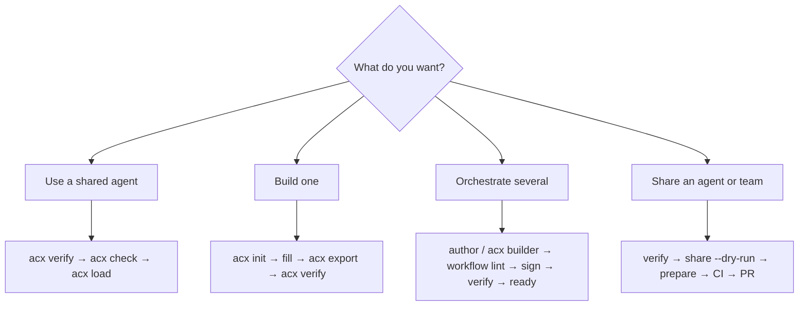

# For AI agents: install & use `acx`

This page is written **for an AI agent** reading the docs. It is imperative and exact — follow it
literally to install and drive the tool. (Humans: the same content lives in `AGENTS.md` at the repo root.)

!!! tip "TL;DR"
    ```bash
    node --experimental-sqlite src/cli.mjs ls
    node --experimental-sqlite src/cli.mjs verify agent.acx
    node --experimental-sqlite src/cli.mjs check agent.acx --all-tools
    node --experimental-sqlite src/cli.mjs load agent.acx --host claude
    node --experimental-sqlite src/cli.mjs workflow verify team.signed.cal.json
    node --experimental-sqlite src/cli.mjs workflow ready team.signed.cal.json --cartridges ./roster
    node --experimental-sqlite src/cli.mjs share workflow team.signed.cal.json --dry-run
    ```

## Install

- Requires **Node ≥ 22**. The bin runs through `node --experimental-sqlite`; you never pass that flag.
- **Current source checkout:** `node --experimental-sqlite src/cli.mjs <command> [args]`
- **After the npm release:** `npx agent-cartridge@latest <command> [args]`
- **Global:** `npm i -g agent-cartridge` → `acx <command>`
- **From a clone:** `node --experimental-sqlite src/cli.mjs <command>`

## The command surface

| Command | Purpose | Docs |
|---|---|---|
| `acx ls [dir]` | Roster overview | [loading](../lifecycle/loading.md) |
| `acx inspect <f.acx>` | Meta, skills, capabilities, memory, attestations | [container](../format/container.md) |
| `acx verify <f.acx>` | Trust taxonomy; non-zero if tampered | [signing & trust](../format/signing-trust.md) |
| `acx spec <f.acx>` | Validate package spec + LanceDB schema | [packages](../format/packages.md) |
| `acx check <f.acx> [--all-tools]` | Harness preflight (tools, binaries, skills) | [harness requirements](../format/harness-requirements.md) |
| `acx load <f.acx> [--host …]` | Verify + install skills; prints a card | [loading](../lifecycle/loading.md) |
| `acx workflow lint <f.cal.json> [--publish]` | Validate the portable graph and publication metadata | [loops (CAL)](../format/loops-cal.md) |
| `acx workflow sign <f.cal.json> --publisher <id>` | JCS-digest and DSSE-sign a shareable workflow | [loops (CAL)](../format/loops-cal.md) |
| `acx workflow verify <f.cal.json>` | Verify digest, signature, identity binding, and trust | [loops (CAL)](../format/loops-cal.md) |
| `acx workflow ready <f.cal.json> --cartridges <dir>` | Staff slots and check local capability readiness | [loops (CAL)](../format/loops-cal.md) |
| `acx workflow inspect <f.cal.json>` | Print a safe discovery card without executing the workflow | [loops (CAL)](../format/loops-cal.md) |
| `acx cal <cal.json>` | Backward-compatible alias for `workflow ready` | [loops (CAL)](../format/loops-cal.md) |
| `acx lance <f.acx>` | Materialize a real LanceDB memory dataset (optional pylance) | [packages](../format/packages.md) |
| `acx init [--from-code <dir>]` | Scaffold an agent / agent set | [init & agent sets](../lifecycle/init-agent-set.md) |
| `acx export <dir> <out.acx> --publisher <id>` | Package + sign | [company loop](../lifecycle/company-loop.md) |
| `acx strip <f.acx> <out.acx>` | Remove SAVE; ROM hash-equality proof | [cartridge model](../concepts/cartridge-model.md) |
| `acx level <f.acx>` | Earn a provable level | [provable level](../leveling/provable-level.md) |
| `acx builder` | Visual CAL/RAC loop builder in the browser | [loops (CAL)](../format/loops-cal.md) |
| `acx share agent/workflow … [--dry-run]` | Verify and prepare canonical registry PR files | [Share ACX](../share.md) |

## Decision tree



## Safety rules — MUST follow

1. **Always `acx verify` before `acx load`.** `tampered` is refused; `portable` = signer not in your trust
   registry (confirm the publisher first). See [signing & trust](../format/signing-trust.md).
2. **The tooling never executes cartridge content.** It reads metadata and verifies signatures. Never
   `eval` or run cartridge-supplied scripts without your own review.
3. **RAC is descriptions only** — [required context](../format/knowledge-okf.md) declares knowledge that
   must be present, never the content.
4. **Private keys never go inside a cartridge or into git.** `acx export` writes the key next to the file.
5. **Treat workflow validity and local readiness as separate gates.** `workflow lint` proves the portable
   contract is coherent; `workflow ready` proves this particular roster can staff it.
6. **Loops must be bounded.** Any reachable cycle requires `limits.maxSteps`; terminal events have no
   outgoing edges; every reachable node must have a path to `end` or `stop`.
7. **External side effects are explicit.** Review each task's `sideEffects` and `approval` before dispatch.
8. **Self-sharing stays reviewable.** Read `skills/acx-share-agent/SKILL.md`; never stage a private key,
   and never push or open a PR without human authority.

## Verify the tool itself

```bash
npm test                                              # 88 conformance, workflow, and sharing tests
node --experimental-sqlite scripts/smoke.mjs          # export → verify → strip → tamper
node --experimental-sqlite scripts/prove-level.mjs    # earn + verify a provable level
```

See the [Proofs](../proofs.md) page for the verbatim output.
