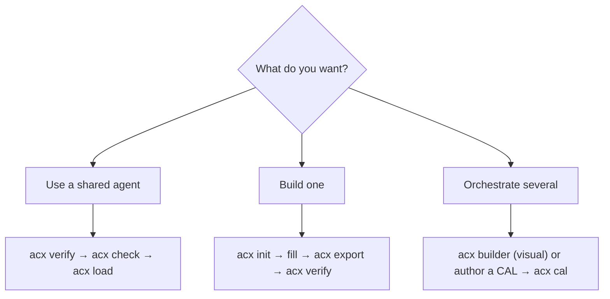

# For AI agents: install & use `acx`

This page is written **for an AI agent** reading the docs. It is imperative and exact — follow it
literally to install and drive the tool. (Humans: the same content lives in `AGENTS.md` at the repo root.)

!!! tip "TL;DR"
    ```bash
    npx agent-cartridge@latest ls                       # see what's available
    npx agent-cartridge@latest verify agent.acx         # check integrity
    npx agent-cartridge@latest check agent.acx --all-tools   # can this host run it?
    npx agent-cartridge@latest load agent.acx --host claude  # install its skills
    ```

## Install

- Requires **Node ≥ 22**. The bin runs through `node --experimental-sqlite`; you never pass that flag.
- **No install:** `npx agent-cartridge@latest <command> [args]`
- **Global:** `npm i -g agent-cartridge` → `acx <command>`
- **From a clone:** `node --experimental-sqlite src/cli.mjs <command>`

## The command surface

| Command | Purpose | Docs |
|---|---|---|
| `acx ls [dir]` | Roster overview | [loading](../lifecycle/loading.md) |
| `acx inspect <f.acx>` | Meta, skills, capabilities, memory, attestations | [container](../format/container.md) |
| `acx verify <f.acx>` | Trust taxonomy; non-zero if tampered | [signing & trust](../format/signing-trust.md) |
| `acx spec <f.acx>` | Validate package spec + LanceDB schema | [packages](../format/packages.md) |
| `acx check <f.acx> [--all-tools]` | Harness preflight (tools, binaries, skills) | [harness requirements](../format/harness-requirements.md) |
| `acx load <f.acx> [--host …]` | Verify + install skills; prints a card | [loading](../lifecycle/loading.md) |
| `acx cal <cal.json>` | Resolve a conditional agentic loop | [loops (CAL)](../format/loops-cal.md) |
| `acx lance <f.acx>` | Materialize a real LanceDB memory dataset (optional pylance) | [packages](../format/packages.md) |
| `acx init [--from-code <dir>]` | Scaffold an agent / agent set | [init & agent sets](../lifecycle/init-agent-set.md) |
| `acx export <dir> <out.acx> --publisher <id>` | Package + sign | [company loop](../lifecycle/company-loop.md) |
| `acx strip <f.acx> <out.acx>` | Remove SAVE; ROM hash-equality proof | [cartridge model](../concepts/cartridge-model.md) |
| `acx level <f.acx>` | Earn a provable level | [provable level](../leveling/provable-level.md) |
| `acx builder` | Visual CAL/RAC loop builder in the browser | [loops (CAL)](../format/loops-cal.md) |

## Decision tree



## Safety rules — MUST follow

1. **Always `acx verify` before `acx load`.** `tampered` is refused; `portable` = signer not in your trust
   registry (confirm the publisher first). See [signing & trust](../format/signing-trust.md).
2. **The tooling never executes cartridge content.** It reads metadata and verifies signatures. Never
   `eval` or run cartridge-supplied scripts without your own review.
3. **RAC is descriptions only** — [required context](../format/knowledge-okf.md) declares knowledge that
   must be present, never the content.
4. **Private keys never go inside a cartridge or into git.** `acx export` writes the key next to the file.

## Verify the tool itself

```bash
npm test                                              # 69 conformance tests
node --experimental-sqlite scripts/smoke.mjs          # export → verify → strip → tamper
node --experimental-sqlite scripts/prove-level.mjs    # earn + verify a provable level
```

See the [Proofs](../proofs.md) page for the verbatim output.
