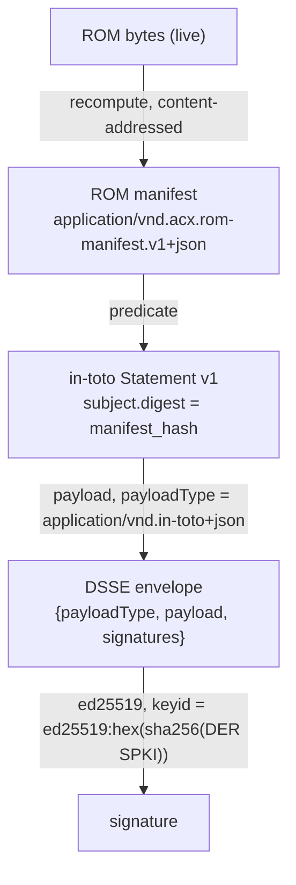
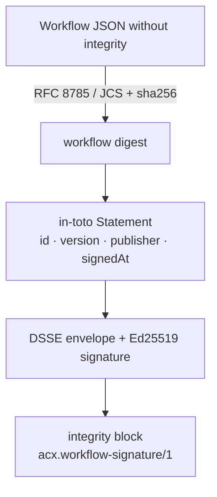

# JSON schemas & media types

The consolidated index of every normative JSON Schema in the Agent Cartridge standard (SPEC §13) and the RFC 6838 vendor-tree media types that name each artifact on the wire.

All 12 schemas use [JSON Schema **draft 2020-12**](https://json-schema.org/draft/2020-12/schema). The `$id` is the stable, canonical identifier a validator resolves — it is a URL *namespace*, not a fetch target. The physical files ship in the repo under `schemas/`.

!!! note "`$id` vs. file path"
    The `$id` (e.g. `https://acx.dev/schema/rom-manifest.v1.json`) is what an in-toto predicate or a `$ref` points at. The file on disk (`schemas/container-amp-integrity.schema.json`) is what you validate against. Every normative schema now uses the single `https://acx.dev/` namespace.

## Schema index

Each row maps a **format block** to its schema **title**, canonical **`$id`**, and the **file** you validate against. Follow the block link for the field-by-field format page.

| Block | Schema title | `$id` | File under `schemas/` |
|---|---|---|---|
| [Container & Integrity](../format/container.md) | ACX ROM Integrity Manifest (DSSE payload) | `https://acx.dev/schema/rom-manifest.v1.json` | `container-amp-integrity.schema.json` |
| [Identity, Signing & Trust](../format/signing-trust.md) | ACX Trust Registry (public keys only) | `https://acx.dev/schema/trust-registry/v1` | `identity-signing-trust.schema.json` |
| [Skill Bundle](../format/skills.md) | ACX Skill Index Descriptor (`acx_skill` row) | `https://acx.dev/schemas/skill-descriptor/1` | `skill-bundle.schema.json` |
| [Capability & Sellable-Claim](../format/capabilities.md) | CapabilityRecord | `https://acx.dev/schema/capability/1` | `capability-sellable-claim.schema.json` |
| [Memory Partition](../format/memory.md) | AcxMemoryRecord | `https://acx.dev/schema/memory-record.v1.json` | `memory-partition.schema.json` |
| [Package Spec](../format/packages.md) | ACX Package Spec (`acx.package-spec/1`) | `https://acx.dev/schema/package-spec.v1.json` | `package-spec.schema.json` |
| [LanceDB Memory](../format/packages.md) | ACX LanceDB Memory Schema (`acx.lance-memory/1`) | `https://acx.dev/schema/lance-memory.v1.json` | `lance-memory.schema.json` |
| [Harness Requirements](../format/harness-requirements.md) | AcxHarnessRequirements | `https://acx.dev/schemas/harness-requirements.v1.json` | `harness-requirements.schema.json` |
| [Loop + Context Policy](../format/loop-context.md) | ACX Loop + Context Policy | `https://acx.dev/schemas/loop-context-policy/1` | `loop-policy-context-policy.schema.json` |
| [ACX Workflow](../format/loops-cal.md) | ACX Workflow — Conditional Agentic Loop (`acx.cal/1`) | `https://acx.dev/schema/cal.v1.json` | `cal.schema.json` |
| [Workflow participation](../format/loops-cal.md) | ACX CAL Skill Set (`acx.cal-skillset/1`) | `https://acx.dev/schema/cal-skillset.v1.json` | `cal-skillset.schema.json` |
| [Provable Character Level](../leveling/provable-level.md) | AcxLevelCredential | `https://acx.dev/schema/level-credential.v1.json` | `provable-character-level.schema.json` |

### Top-level `required` and `$defs`

The nested `$defs` are the reusable sub-schemas the standard reuses across the envelope, trust registry, and harness handshake.

| Schema | Top-level `required` | `$defs` |
|---|---|---|
| ROM Integrity Manifest | `specVersion`, `cartridgeId`, `applicationId`, `userVersion`, `embeddingEngine`, `objects` | — |
| Trust Registry | `schemaVersion`, `keys` | `DsseEnvelope`, `InTotoStatement`, `CartridgePredicate`, `NamespaceProof`, `TrustedKey` |
| Skill Index Descriptor | `name`, `description`, `sqlar_path`, `content_sha256`, `resources`, `schema_version` | — |
| CapabilityRecord | `schemaVersion`, `id`, `taskType`, `stack`, `domain`, `proficiency`, `evidenceRefs`, `sampleCount`, `lastDemonstratedAt`, `createdAt`, `updatedAt` | — |
| AcxMemoryRecord | `id`, `title`, `summary`, `sourceType`, `portable`, `codebaseFingerprint`, `repoId`, `repoLabel`, `projectLabel`, `timestamp`, `impact`, `xpAwarded`, `tags`, `artifactFingerprint`, `zone` | — |
| ACX Package Spec | `schemaVersion`, `artifacts` | — |
| ACX LanceDB Memory Schema | `schemaVersion`, `format`, `table`, `embeddingEngine`, `distanceMetric`, `columns` | — |
| AcxHarnessRequirements | `schemaVersion`, `mcp`, `model`, `requiredTools` | `harnessCompliance`, `toolRoleContract`, `capabilityScope`, `fsScopes`, `netScopes` |
| Loop + Context Policy | `schemaVersion`, `loop`, `context` | `MissionRule`, `ResourceLimits`, `RetrievalStrategy`, `ContextCategory` |
| ACX Workflow | `schemaVersion`, `id`, `participants`, `start`, `nodes`, `edges` | `cartridgeRef`, `slot`, `racItem`, `variable`, `limits`, `task`, `gateway`, `event`, `completion`, `condition`, `edge`, `integrity` |
| ACX CAL Skill Set | `schemaVersion`, `plays` | `play`, `reference` |
| AcxLevelCredential | `@context`, `type`, `issuer`, `validFrom`, `credentialSubject`, `credentialStatus`, `proof` | — |

!!! tip "Validate locally"
    The schemas are plain files — point any draft-2020-12 validator at them. The reference implementation is zero-dependency (Node ≥ 22 `node:sqlite` + `node:crypto`); the test suite asserts real artifacts against these schemas, e.g. *"§8 harness-requirements manifest matches its schema (requiredTools, no forbidden keys)"* and *"§7.6 stored memory payload carries schema-required zone + artifactFingerprint"* (see [Proofs](../proofs.md)).

## Media-type registry

Media types live in the RFC 6838 vendor tree (`application/vnd.acx.*`) plus three borrowed types from adjacent standards: **in-toto**, **DSSE**, and **W3C Verifiable Credentials**. Each names one concrete artifact.

| Media type | Names | Format page |
|---|---|---|
| `application/vnd.acx.cartridge` | The `.acx` cartridge (family type) | [Container & Integrity](../format/container.md) |
| `application/vnd.acx.cartridge.v1` | OCI image `artifactType` for a cartridge | [Distribution](../lifecycle/distribution.md) |
| `application/vnd.acx.cartridge.layer.v1+sqlite` | The single SQLite layer inside the OCI manifest | [Distribution](../lifecycle/distribution.md) |
| `application/vnd.acx.rom-manifest.v1+json` | The content-addressed ROM manifest (in-toto predicate content) | [Container & Integrity](../format/container.md) |
| `application/vnd.in-toto+json` | DSSE `payloadType` — the in-toto Statement v1 wrapping the ROM manifest | [Signing & Trust](../format/signing-trust.md) |
| `application/vnd.dsse.envelope.v1+json` | The DSSE envelope `{payloadType, payload, signatures}` | [Signing & Trust](../format/signing-trust.md) |
| `application/vnd.acx.trust-registry.v1` | The public-keys-only trust registry | [Signing & Trust](../format/signing-trust.md) |
| `application/vnd.acx.harness-requirements.v1+json` | The host handshake requirements manifest | [Harness Requirements](../format/harness-requirements.md) |
| `application/vnd.acx.harness-compliance.v1+json` | The host's compliance response | [Harness Requirements](../format/harness-requirements.md) |
| `application/vnd.acx.loop-context-policy.v1+json` | The loop + context policy document | [Loop + Context](../format/loop-context.md) |
| `application/vnd.acx.workflow.v1+json` | A signed, shareable `acx.cal/1` agent-team workflow | [Loop engineering](../format/loops-cal.md) |
| `application/vnd.acx.level-attestation.v1` | An independent verifier's level attestation | [Provable Level](../leveling/provable-level.md) |
| `application/vnd.acx.benchmark.v1` | A sealed benchmark with held-out slice | [Provable Level](../leveling/provable-level.md) |
| `application/vc` | The W3C VC 2.0 / Open Badges 3.0 level credential | [Provable Level](../leveling/provable-level.md) |

!!! warning "Specified vs. running"
    The crypto, trust-taxonomy, scrub-gate, TrueSkill gating, and credential machinery are fully real and proven. But several media types name artifacts that are **specified normatively and are host-side** in the reference impl: `application/vnd.acx.cartridge.v1` / `…layer.v1+sqlite` (OCI *push* runtime), `application/vnd.acx.harness-requirements.v1+json` / `…harness-compliance.v1+json` (the handshake runtime), and `application/vnd.acx.loop-context-policy.v1+json` (a loop-policy evaluator). The reference benchmark solver is deterministic and **pluggable** — a production verifier plugs in a real sandboxed agent run.

## How the signing types compose

Both cartridges and workflows use the same standards-shaped stack: a JCS-addressed subject, an in-toto
Statement, and a DSSE envelope with `payloadType = application/vnd.in-toto+json`. For a cartridge, the
predicate carries the ROM manifest and the subject digest is `manifest_hash`; for a workflow, the predicate
binds its canonical digest, id, version, publisher, and signing time.





The manifest hash is recomputed from live bytes, never self-declared. From the proof transcript:

```text
rom_manifest_hash: sha256:1726cf1e6025c166e06dc839a5cbae6c900f0ffa3e0b1235be8b78e88ee09943
cartridge ROM digest: sha256:1726cf1e6025c166e06dc839a5cbae6c900f0ffa3e0b1235be8b78e88ee09943
keyid:          ed25519:17bb8c9290fd2a3d0c3a434ad0e99544d809dbff1540d64be0bab2274df14f66
```

`strip-to-ROM` proves the ROM was never mutated by hash equality across a re-export:

```text
rom hash before strip: sha256:f479be021b8ea2e55cc6e3e33b95df9d151196548dfc854dedbe578be7120642
rom hash after  strip: sha256:f479be021b8ea2e55cc6e3e33b95df9d151196548dfc854dedbe578be7120642
```

## Resolved contradictions

The block specs were reconciled during the §13 appendix pass. The load-bearing resolutions:

??? note "Six resolved contradictions (SPEC §13)"
    1. **DSSE `payloadType`** — resolved to in-toto Statement v1 as the `payloadType`; the ROM manifest is the predicate content (not the payloadType). (§4.2)
    2. **`keyid` definition** — resolved to the content-addressed form `ed25519:<hex sha256(DER SPKI)>`; `publisherId` lives in the predicate/registry, not the keyid. (§4.2)
    3. **`artifactFingerprint` slice length** — resolved to **10**; the reference impl re-keys from a live 12. (§7.3)
    4. **`vec0` dimension** — the `vectors` DDL is a per-engine template; dimension comes from `acx.embedding_engine.dim` and the vector index is **never signed**. (§3.5)
    5. **OCI vendor tree** — resolved to `application/vnd.acx.*` normatively (not `application/vnd.agentibus.*`). (§11)
    6. **ROM digest naming** — the ROM `manifest_hash` and `packageHash` are the same value, unified as "the ROM `manifest_hash`, which is this format's `packageHash`." (§3.3, §4.1)

!!! note "Not signed"
    The `vec0` vector index is a per-engine template and is excluded from the ROM manifest — it is re-indexed on import from the always-present JSON baseline. In the reference impl a plain table stands in for `vec0`.

## See also

- [CLI reference](cli.md) — the commands that emit and verify these artifacts.
- [Conformance](conformance.md) — the numbered `§12.x` assertions each schema must satisfy.
- [Proofs](../proofs.md) — the verbatim transcript the hashes above come from.
